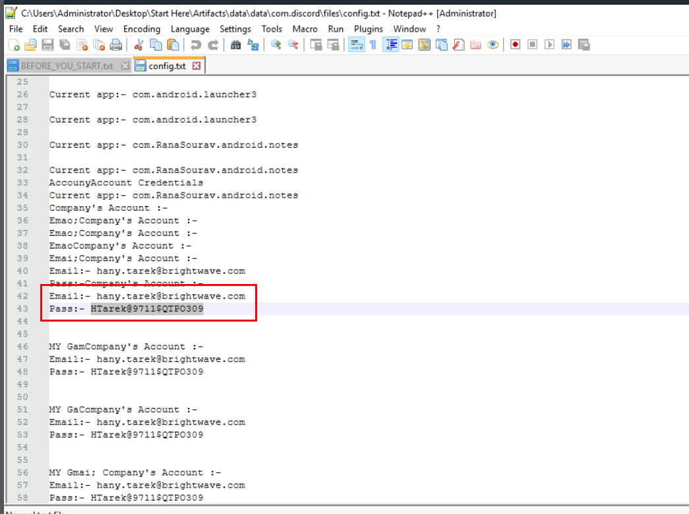

# [CyberDefenders - AndroidBreach](https://cyberdefenders.org/blueteam-ctf-challenges/androidbreach/)
[toc]
* * *
## Scenario
At BrightWave Company, a data breach occurred due to an employee's lack of security awareness, compromising his credentials. The attacker used these credentials to gain unauthorized access to the system and exfiltrate sensitive data. During the investigation, the employee revealed two critical points: first, he stores all his credentials in the notes app on his phone, and second, he frequently downloads APK files from untrusted sources. Your task is to analyze the provided Android dump, identify the malware downloaded, and determine its exact functionality.

**Category**: Endpoint Forensics

**Tools**:
ALEAPP
JADX
DB Browser for SQLite
CyberChef

* * *
## Questions
>Q1: What suspicious link was used to download the malicious APK from your initial investigation?


We have the whole files exported (or can we call it disk image?) from an Android phone as our evidence here.


My go-to tool for android artifacts parser as a whole is ALEAPP with GUI which is located right here on the "Mobile Forensics" folder.


Once the application is started, I need to specify a folder/directory of "data" folder and the output folder to store HTML report which after i created a folder to store HTML report then I can proceed to parse with all modules available with "Process" button.


After parsing process is completed, we can click "Open Report & Close" to open HTML report and close ALEAPP application.


Now after opened the report, we can see that we are investigating the disk image of Galaxy S4.


Then we can go to the "Chrome - Downloads" section which we can see that there is a dangerous file was downloaded from `ufile.io` but target path does not specify the name of a file that was downloaded here.


Website history reveals that the user was downloaded for Discord nitro from this url.

```
https://ufile.io/57rdyncx
```

>Q2: What is the name of the downloaded APK?


We know that the user downloaded a file from `ufile.io` so it should be located in `data\media\0\Download` and we can see the name of this downloaded apk right here.

```
Discord_nitro_Mod.apk
```

>Q3: What is the malicious package name found in the APK?


Now we have to decompile the APK with Jadx tool which is a tool that can decompile JAVA-compiled file including APK file.


After decompiled the APK, we can take a look at `AndroidManifest.xml` under "Resourses" and this file is an XML file which contains important metadata about the Android app. This includes the package name, activity names, main activity (the entry point to the app), Android version support, hardware features support, permissions, and other configurations. 

Which we can see the package name of this APK indicating that this is the Keylogger.

```
com.example.keylogger
```

>Q4: Which port was used to exfiltrate the data?


Leverage the package name we got from Android Manifest file, we can go to "Source Code" -> "com" -> "example.keylogger" to get all decompiled scripts for this keylogger which we can see that this application will check for Accessibility feature which is the most abused permission on the phone, the accessibility feature allows the app to do many things for the sake of "helping disability people" so something like reading the screen and other dangerous things could be leverage using this permission.


To find out about the port used to exfiltrate data, we have to take a look at `SendEmail` class which contains with function related to email handling for exfiltration and we can see that there is a function called `openEmailClient` which will open an email client to `sandbox.smtp.mailtrap.io`, one of the domain of legitimate email delivery platform on port 456 to send an email from the data that was collected to the attacker's email.

```
465
```

>Q5: What is the service platform name the attacker utilized to receive the data being exfiltrated?
```
mailtrap.io
```

>Q6: What email was used by the attacker when exfiltrating data?


To find out about the the attacker's email, we have to find out which function is called the `SendEmail` class and it is `BroadcastForAlarm` class right here and one more thing to notice that is the `config.txt` that was created to store data of the keylogger locally before sending it to the attacker.

```
APThreat@gmail.com
```

>Q7: The attacker has saved a file containing leaked company credentials before attempting to exfiltrate it. Based on the data, can you retrieve the credentials found in the leak?


Knowing the filename, make it's easier to find so we can open any of them to get the answer of this question.  



We can retrieve that company credential that was leaked inside this file right here.

```
hany.tarek@brightwave.com:HTarek@9711$QTPO309
```

>Q8: The malware altered images stored on the Android phone by encrypting them. What is the encryption key used by the malware to encrypt these images?


The hard-coded AES key could be found inside `ENC` function under `MainTask` class right here which is base64 encoded. as you can see that this application will encrypt the image `.jpg` file with this AES key and delete the original file.


We can decode base64 string to get the cleartext key as the answer to this question with CyberChef.

```
9bY$wQ7!cTz465TX
```

>Q9: The employee stored sensitive data in their phone's gallery, including credit card information. What is the CVC of the credit card stored?


One thing I noticed while browsing on ALEAPP is this native downloading files, we can see that 2 credit card images was downloaded by user without using Chrome. 


Unfortunately I could not find both images but there is 1 image located on `data\media\0\Pictures\.aux` that just happened to have CVC of the credit card and turned out, this is the answer to this question as well

```
128
```

https://cyberdefenders.org/blueteam-ctf-challenges/achievements/Chicken_0248/androidbreach/ 
* * *
