# [CyberDefenders - FakeGPT](https://cyberdefenders.org/blueteam-ctf-challenges/fakegpt/)
Created: 07/12/2024 20:14
Last Updated: 16/12/2024 21:10
* * *
>**Category**: Malware Analysis
>**Tactics**: Credential Access Collection Command and Control Exfiltration
* * *
**Scenario:**
Your cybersecurity team has been alerted to suspicious activity on your organization's network. Several employees reported unusual behavior in their browsers after installing what they believed to be a helpful browser extension named "ChatGPT". However, strange things started happening: accounts were being compromised, and sensitive information appeared to be leaking.

Your task is to perform a thorough analysis of this extension identify its malicious components.

**Tools**:
- ExtAnalysis

Link: https://cyberdefenders.org/blueteam-ctf-challenges/fakegpt/
* * *
## What we have
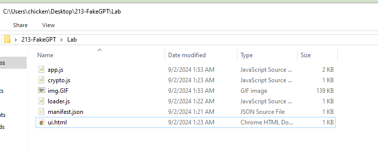

Lets take a look at what we have here, we have 3 js, 1 html, 1 GIF and `manifest.json` file and since we already know that we have to perform an analysis of fake ChatGPT extension then lets start with `manifest.json` which contain metadata of this extension to understand more about this extension and its permission.

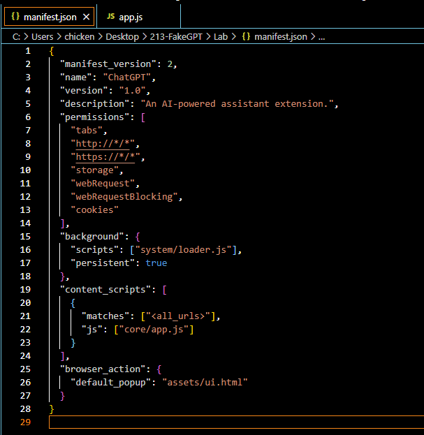

- `manifest_version` telling us that this extension use Manifest V2 which is already deprecated since we are moving to Manifest V3
- `name` telling us the name of this extension
- `permissions` telling us that this extension can access information about browser tabs and interact with them in both HTTP and HTTPS websites. and it also stores and retrieve data locally (`storage`), intercept and modifying network requests including blocking or redirecting them (`webRequest` and `webRequestBlocking`) and lastly, it can access and manipulate browser cookies (`cookies`) 
- `background` telling us that `loaders.js` will be running persistently in the background 
- `content_scripts` telling us that `app.js` will be running on all web pages and interact with DOM of every website user visit.
- `browser_action` telling us that that when click for this extension, `ui.html` will be displayed to user.

Now lets hunt for each js scripts to understand more about this extension.

## Questions
>Q1:Which encoding method does the browser extension use to obscure target URLs, making them more difficult to detect during analysis?

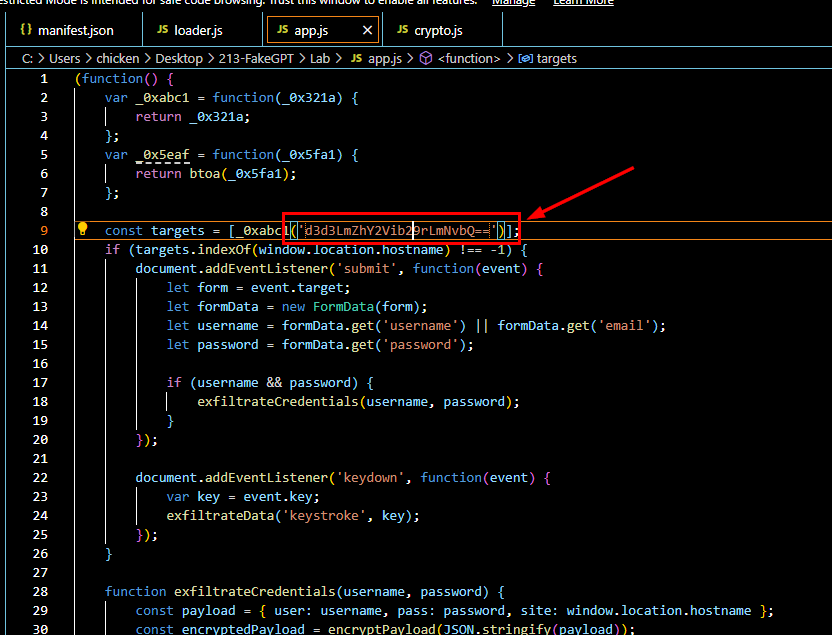

Then upon reading the `app.js`, which responsible for capturing keystroke and exfiltrate data and credential, encrypt then send them to C2

we can clearly see that there is 1 string with `==` padding indicates that it was encoded with base64. 

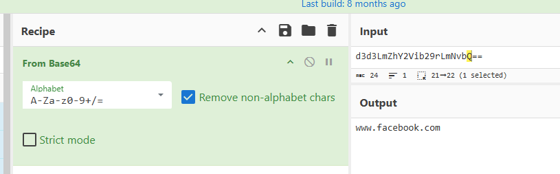

So we can decode it which we can see that it is indeed base64 encoded and the site that was targeted by this extension is facebook.

```
base64
```

>Q2: Which website does the extension monitor for data theft, targeting user accounts to steal sensitive information?
```
www.facebook.com
```

>Q3: Which type of HTML element is utilized by the extension to send stolen data?

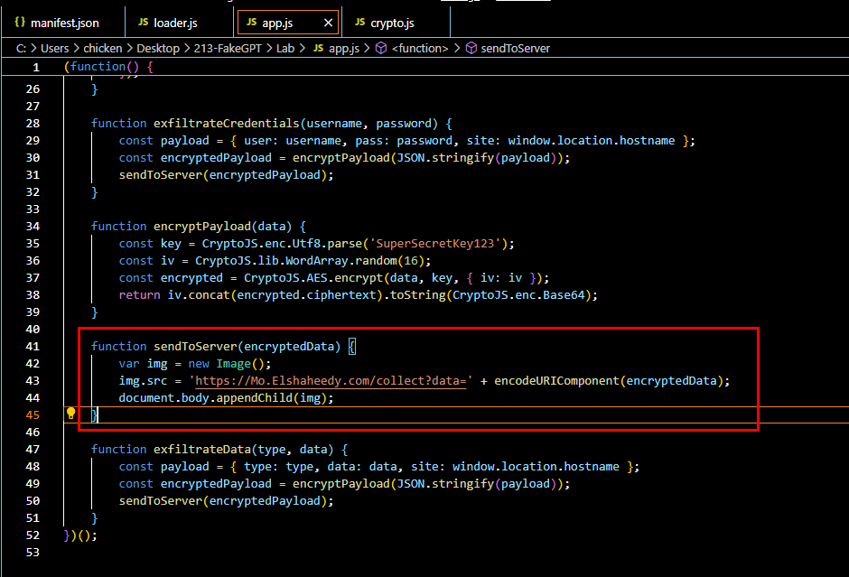

Lets take a look at `sendToServer` function that responsible for sending encrypted data pass from `exfiltrateCredentials` to C2 server, we can see that an image element and the `src` attribute is set to C2 url then an encrypted data will be append to this url before adding the image element to the webpage

```

```

>Q4: What is the first specific condition in the code that triggers the extension to deactivate itself?

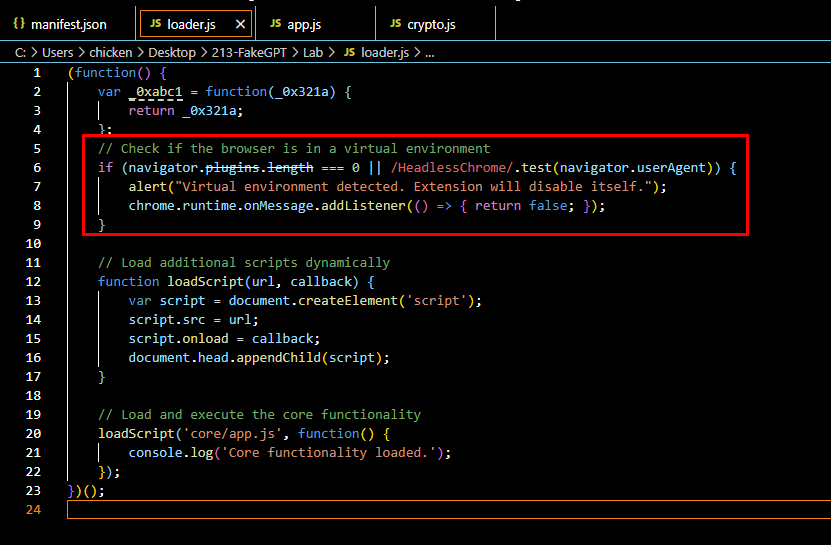

For this one, we have to take a look at `loader.js` file which will check for installed browser plugin and `HeadlessChrome` user plugin which is common in VM so it will alert user with disable itself

This script also loads other additional scripts and core script `app.js` that we just analyzed in previous question.

```
navigator.plugins.length === 0
```

>Q5: Which event does the extension capture to track user input submitted through forms?

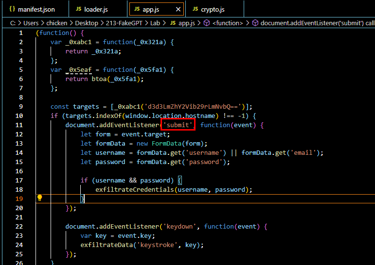

Lets go back to `app.js`, we can see that it create Event Listener on `submit` element which will get `username`, `email` and `password` from a form and if both values exists then it will encrypted both values and send it to C2.

```
submit
```

>Q6: Which API or method does the extension use to capture and monitor user keystrokes?

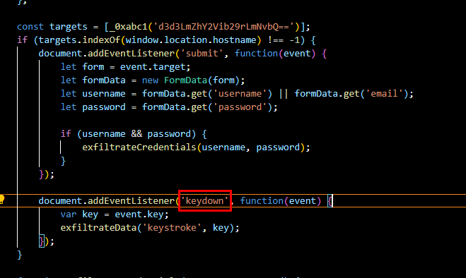

`keydown` event listener will also added to capture a keystroke with which will pass to `exfiltrateData` function to construct json payload before sending to C2.

```
keydown
```

>Q7: What is the domain where the extension transmits the exfiltrated data?

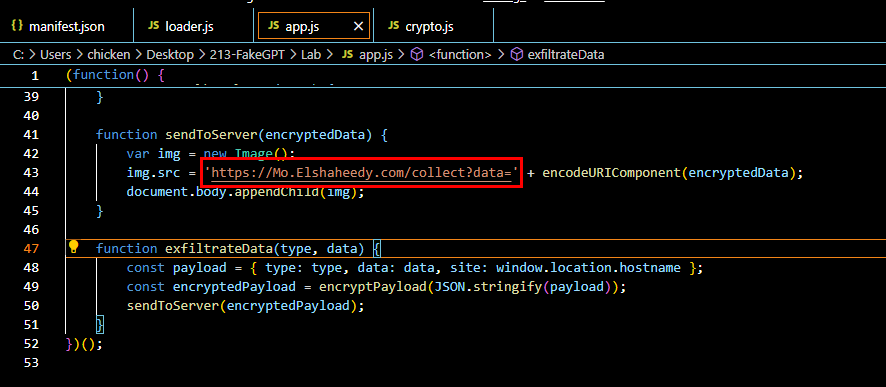
```
Mo.Elshaheedy.com
```

>Q8: Which function in the code is used to exfiltrate user credentials, including the username and password?

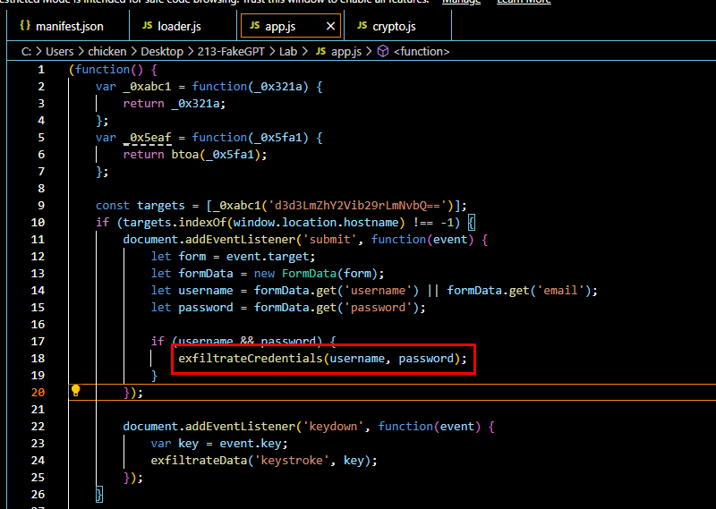
```
exfiltrateCredentials(username, password);
```

>Q9: Which encryption algorithm is applied to secure the data before sending?

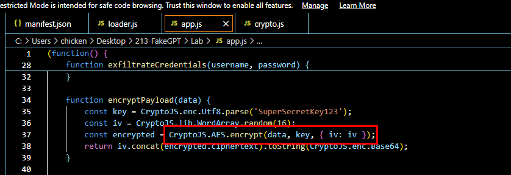

Lets take a look at `encryptPayload` function that responsible for data encryption, which we can see that its use AES with hard-coded key "SuperSecretKey123" with random IV to encrypt data then return iv and base64 encoded of encrypted data to a function that calls for this function.

```
AES
```

>Q10: What critical browser API does the extension use to access and manipulate cookies?

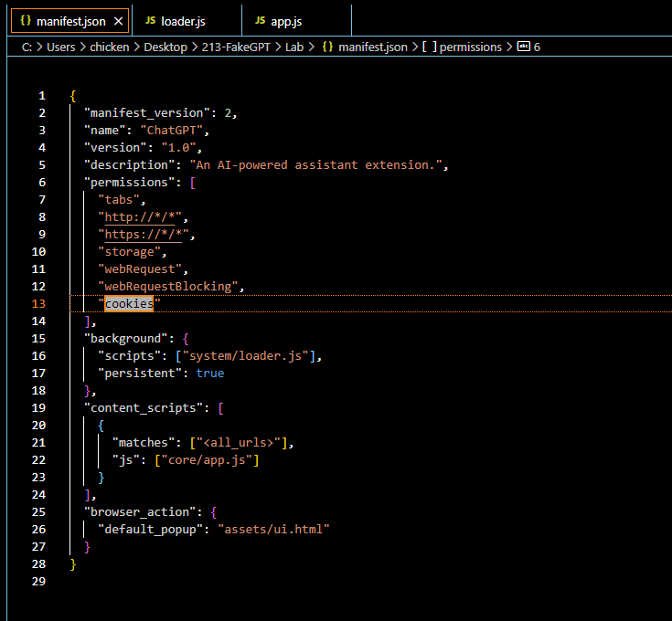
https://developer.chrome.com/docs/extensions/reference/api/cookies
```
chrome.cookies
```

***
This lab also retired with official write-up so if you want to learn more about this lab and how it was intended to be solved then you could go to the following url (https://cyberdefenders.org/walkthroughs/fakegpt/) or access it directly though lab page.

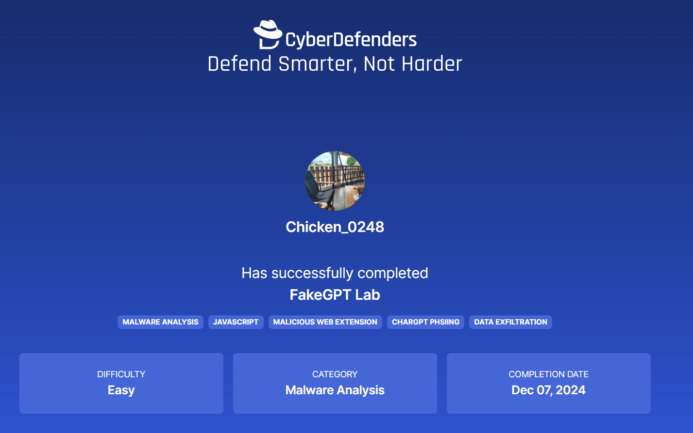
https://cyberdefenders.org/blueteam-ctf-challenges/progress/Chicken_0248/213/ 

* * *
