# [CyberDefenders - GoldenSpray](https://cyberdefenders.org/blueteam-ctf-challenges/goldenspray/)
[toc]
* * *
### Scenario
As a cybersecurity analyst at SecureTech Industries, you've been alerted to unusual login attempts and unauthorized access within the company's network. Initial indicators suggest a potential brute-force attack on user accounts. Your mission is to analyze the provided log data to trace the attack's progression, determine the scope of the breach, and the attacker's TTPs.

**Category**: Threat Hunting

**Tools**:
Splunk
ELK

* * *
## Questions
>Q1: What is the attacker's IP address?

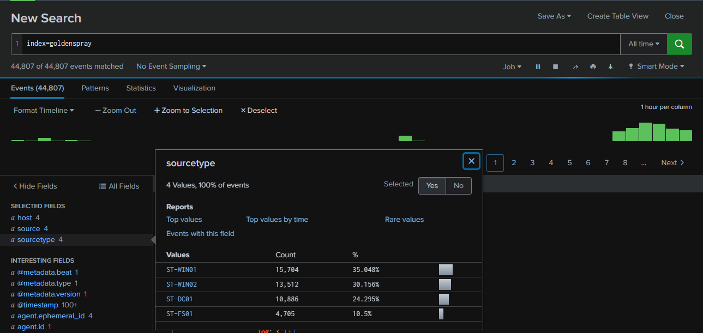

After deploying the Splunk instance for this lab, I first checked the ingested log sources. There were a total of 44,807 events from 4 hosts: WS01, WS02, FS01, and DC01. so even though there are so many hosts but there are very few log to look into.

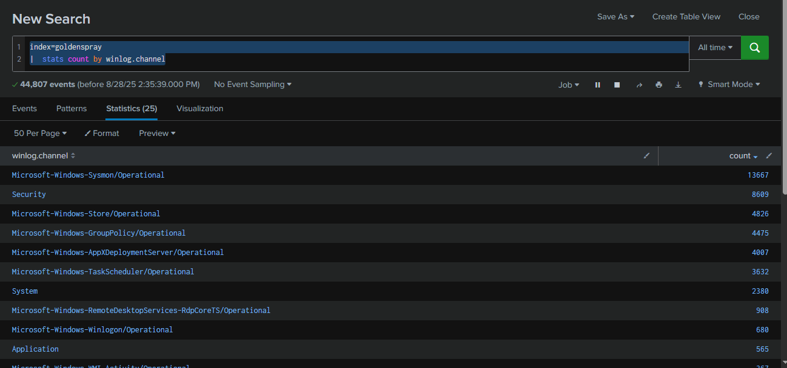

Next, I examined the types of event logs ingested. As expected, Sysmon and Security logs were present, with 13,667 events from Sysmon and 8,609 events from Security, making up the majority of all ingested logs.

Query : `index=goldenspray | stats count by winlog.channel`

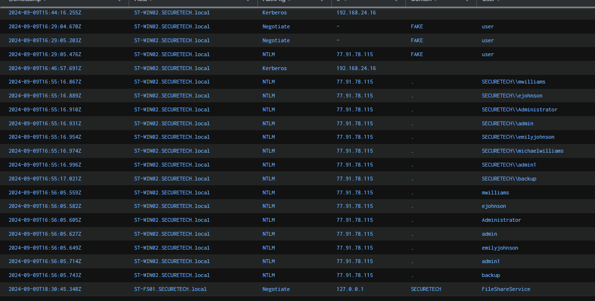

The scenario provides context that a brute-force attack occurred on multiple user accounts. We can leverage Security log event ID 4625 to investigate this activity. the result shows that the attacker, using IP 77.91.78.115, started brute-forcing the WIN02 host from 2024-09-09 16:55:16.

Query : 
```
index=goldenspray winlog.event_id=4625 "winlog.channel"=Security
| sort @timestamp
| rename 
    winlog.computer_name as Host,
    winlog.event_data.AuthenticationPackageName as AuthPkg,
    winlog.event_data.IpAddress as IP,
    winlog.event_data.TargetDomainName as Domain,
    winlog.event_data.TargetUserName as User,
| table @timestamp, Host, AuthPkg, IP, Domain, User
```

```
77.91.78.115
```

>Q2: What country is the attack originating from?

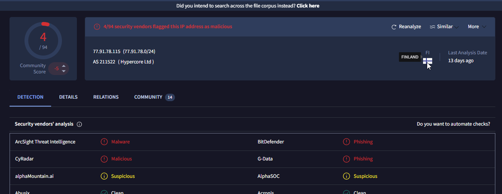

We can look up this IP address using any IP location service, including [VirusTotal](https://www.virustotal.com/gui/ip-address/77.91.78.115). Several vendors have flagged it as malicious, and the IP is located in Finland.

```
Finland
```

>Q3: What's the compromised account username used for initial access?

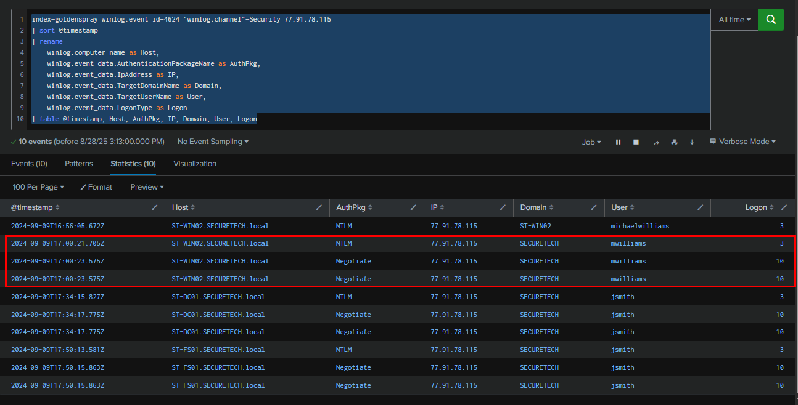

Next, we examined successful logon events from the same IP address. This revealed that the threat actor successfully logged on to the WS02 workstation as mwilliams via RDP, and then moved laterally to DC01 and FS01 using RDP as jsmith.

Query : 
```
index=goldenspray winlog.event_id=4624 "winlog.channel"=Security 77.91.78.115
| sort @timestamp
| rename 
    winlog.computer_name as Host,
    winlog.event_data.AuthenticationPackageName as AuthPkg,
    winlog.event_data.IpAddress as IP,
    winlog.event_data.TargetDomainName as Domain,
    winlog.event_data.TargetUserName as User,
    winlog.event_data.LogonType as Logon
| table @timestamp, Host, AuthPkg, IP, Domain, User, Logon
```


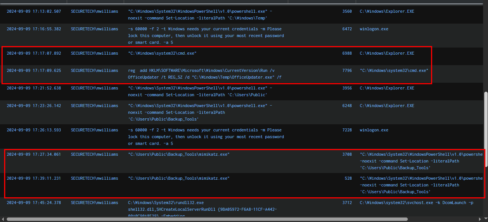

Next, to confirm the malicious activity originating from the first compromised user on WS02, we leveraged Sysmon Event ID 1. The logs show that `cmd.exe` and `powershell.exe` were launched from the Windows Temp folder via `explorer.exe`. Shortly after, persistence was established through a Run registry entry using `OfficeUpdater.exe`, which had been dropped into the Temp directory. The threat actor then executed PowerShell from `C:\Users\Public\Backup_Tools` and ran `mimikatz.exe`, which likely allowed them to obtain the credentials of the jsmith account, enabling further lateral movement to DC01 and FS01.

Query : `index=goldenspray winlog.event_id=1 event.provider=Microsoft-Windows-Sysmon mwilliams
|  sort winlog.event_data.UtcTime 
|  table winlog.event_data.UtcTime,winlog.event_data.User,winlog.event_data.CommandLine,winlog.event_data.ProcessId,winlog.event_data.ParentCommandLine,winlog.computer_name`

```
SECURETECH\mwilliams
```

>Q4: What's the name of the malicious file utilized by the attacker for persistence on `ST-WIN02`?
```
OfficeUpdater.exe
```

>Q5: What is the complete path used by the attacker to store their tools?
```
C:\Users\Public\Backup_Tools\
```

>Q6: What's the process ID of the tool responsible for dumping credentials on `ST-WIN02`?
```
3708
```

>Q7: What's the second account username the attacker compromised and used for lateral movement?

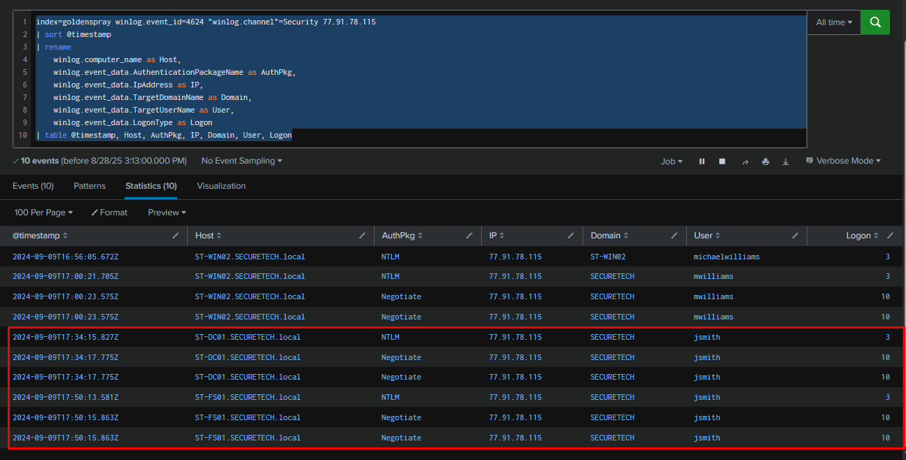
```
SECURETECH\jsmith
```

>Q8: Can you provide the scheduled task created by the attacker for persistence on the domain controller?

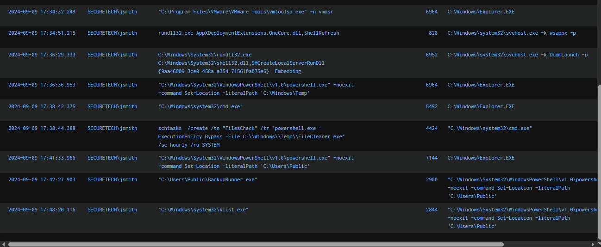

Next, we adjusted our query to focus on DC01 and the "jsmith" account in order to analyze process creation events following the lateral movement via RDP. The logs show that `powershell.exe` was launched from the Windows Temp folder once again, and a scheduled task was created to execute `FileCleaner.exe` hourly under the SYSTEM account. We also observed that `BackupRunner.exe` was executed afterward along with `klist.exe`, which was likely used to enumerate Kerberos tickets and validate available credentials for further privilege escalation or lateral movement.

 Query : `index=goldenspray winlog.event_id=1 event.provider=Microsoft-Windows-Sysmon ST-DC01.SECURETECH.local jsmith | sort winlog.event_data.UtcTime | table winlog.event_data.UtcTime,winlog.event_data.User,winlog.event_data.CommandLine,winlog.event_data.ProcessId,winlog.event_data.ParentCommandLine,winlog.computer_name`

```
FilesCheck
```

>Q9: What type of encryption is used for Kerberos tickets in the environment?

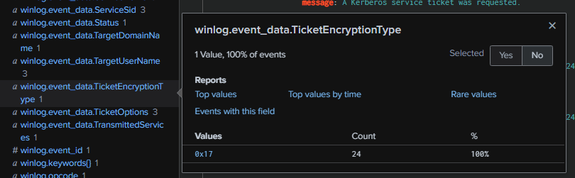
To determine the Kerberos ticket encryption type in Active Directory, we can query for Event ID 4678 or 4679 and review the "TicketEncryptionType" field. In this case, the encryption type is 0x17, which is unusual because, under normal circumstances, Active Directory should use 0x12 (AES).

Query : `index=goldenspray winlog.event_id=4769 "winlog.channel"=Security | sort @timestamp`

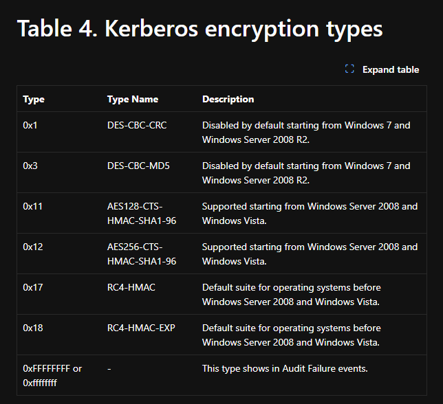

According to the [Kerberos encryption types table](https://learn.microsoft.com/en-us/previous-versions/windows/it-pro/windows-10/security/threat-protection/auditing/event-4768)
, the ticket type 0x17 corresponds to RC4-HMAC, which is weaker than the default AES-based encryption typically used in Active Directory. RC4-HMAC tickets can be cracked using tools such as Hashcat or John the Ripper if the associated account password is weak. This weakness underpins techniques like Kerberoasting and AS-REP Roasting, which attackers commonly use to obtain service account credentials.

```
RC4-HMAC
```

>Q10: Can you provide the full path of the output file in preparation for data exfiltration?

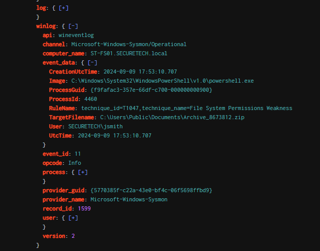


Data exfiltration is often performed by compressing collected files into a single archive, making them easier to transfer without triggering alerts. To investigate this, I searched for ZIP files created by the jsmith user on FS01, which, as a file server, was likely the target for sensitive data. This search revealed the key log we were looking for—the attacker staged an archive file in the Documents folder of the Public user. With this, the core lab scenario is complete, but I plan to dig deeper in the next section.

Query : `index=goldenspray winlog.event_id=11 event.provider=Microsoft-Windows-Sysmon ST-FS01.SECURETECH.local jsmith zip | sort winlog.event_data.UtcTime`

```
C:\Users\Public\Documents\Archive_8673812.zip
```

https://cyberdefenders.org/blueteam-ctf-challenges/achievements/Chicken_0248/goldenspray/ 
* * *

## Rabbit Hole digging with IOCs!

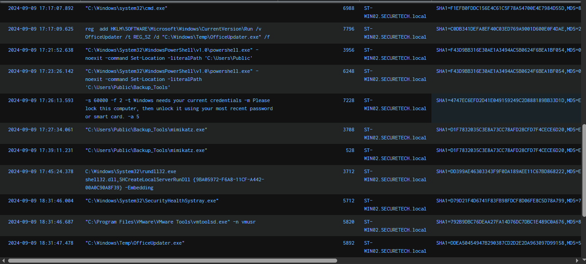

I wanted to verify all suspicious executable files against VirusTotal. To do this, I gathered the file hashes of three different executables that were executed during the attack : 
- `mimikatz.exe` : D1F7832035C3E8A73CC78AFD28CFD7F4CECE6D20 (SHA1)
- `OfficeUpdater.exe` : DDEA50454947B290387CD2D2E2DA963097D99158 (SHA1)
- `BackupRunner.exe` : D1F7832035C3E8A73CC78AFD28CFD7F4CECE6D20 (SHA1)

Query : `index=goldenspray winlog.event_id=1 event.provider=Microsoft-Windows-Sysmon mwilliams | sort winlog.event_data.UtcTime | table winlog.event_data.UtcTime,winlog.event_data.CommandLine,winlog.event_data.ProcessId,winlog.computer_name,winlog.event_data.Hashes`

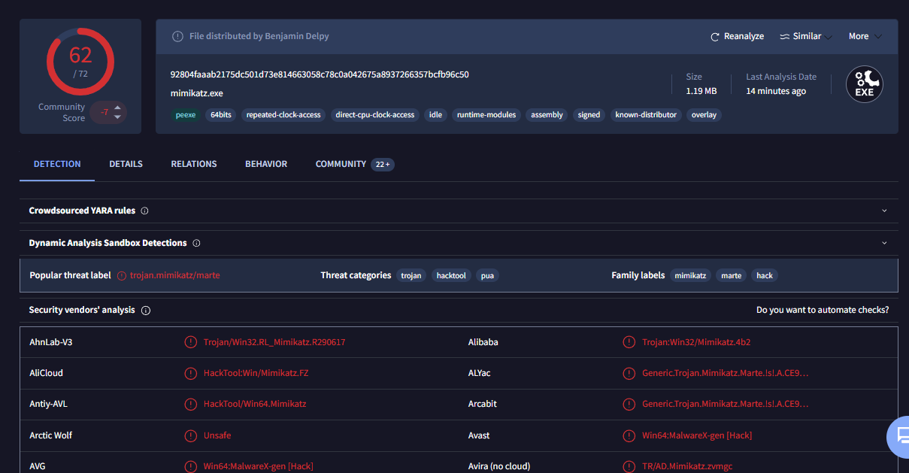

We can see that `BackupRunner.exe` shares the same hash as `mimikatz.exe`, indicating that the attacker executed Mimikatz again on DC01—likely to perform a DCSync attack or to dump credentials for all domain users. However, since the attacker continued to use the jsmith account to RDP into FS01, it suggests that this account already had sufficient privileges, likely as a member of the Domain Admins group.

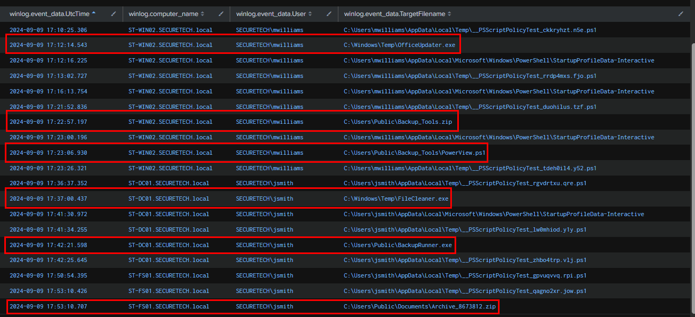

Next, I focused on file creation events from PowerShell, which was the primary process leveraged by the attacker. This query revealed that, in addition to the previously detected files, the attacker also dropped the PowerView script as well so we could go on to search PowerShell event log to find other commands running with PowerView but i am done for now.

Query : `index=goldenspray winlog.event_id=11 event.provider=Microsoft-Windows-Sysmon powershell  "winlog.event_data.User"!="NT AUTHORITY\\SYSTEM" | sort winlog.event_data.UtcTime   | table  winlog.event_data.UtcTime,winlog.computer_name,winlog.event_data.User,winlog.event_data.TargetFilename`

* * *