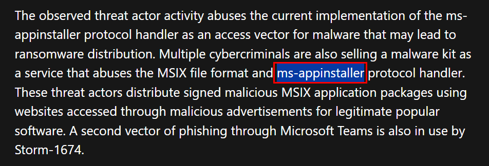

# [CyberDefenders - MSIXPhish](https://cyberdefenders.org/blueteam-ctf-challenges/msixphish/)
Created: 08/10/2024 13:46
Last Updated: 31/12/2024 20:24
* * *
>**Category**: Threat Intel
* * *
**Scenario:**
As a Threat Intelligence Analyst at a major security firm, you play a role in efficiently gathering intel about potential threats. During your work day, an incident responder has provided you with a hash associated with a malicious software installer detected in your organization's network. Your task is to analyze this hash to gather valuable threat intelligence and enhance your organization's defenses.
* * *
## Questions
>Q1: To effectively mitigate the threat, it's important to determine the origin or category of this malware. Can you identify which malware family this sample is associated with to better understand its typical behaviors and associated risks?


Since we only got the file hash then we can search it on VirusTotal then we will see that its a hash of msix installer file which is a new type of packaging format that Windows used to deploy application and we can also see that this file was tagged with **batloader** malware that is a malware that used as a dropper/loader to fetch additional malware/payload from C2 server.

```
batloader
```

>Q2: It's important to identify the malware's first public appearance to effectively track its history and spread. Can you provide the initial submission date and time of this malware on VirusTotal?


Go take a look at "Details" tab on VirusTotal then we will see the submission timestamp of this malware. 

```
12-12-2023 18:08:13
```

>Q3: Recognizing a specific MITRE technique employed by the malware helps develop targeted defense strategies. What's the MITRE ID of the technique used by the malware for data collection?


Go to "Behavior" tab then find "MITRE ATT&CK Tactics and Techniques" section which highlight all MITRE ATT&CK techniques detected by various Sandboxes linked to VirusTotal then we will see that this batloader can also capture keystroke for data collection (T1056)

```
T1056
```

>Q4: Knowing the names of executable files dropped by the malware aids in detecting and isolating infected machines. What is the executable file name dropped by the malware?


Lets take a look at "Processes Tree" then we can see that `Install.exe` must be the executable file that dropped by batloader and conduct some host recon probably to find out that it was being executed under a sandbox or not.

```
Install.exe
```

>Q5: Continuing on the previous question. Can you identify the name of the second execution parent observed in the wild for the executable discovered?


Go to "Relations" tab to find the pivoting point to `Install.exe`


Then go to "Relations" tab of [`Install.exe`](https://www.virustotal.com/gui/file/48aa2393ef590bab4ff2fd1e7d95af36e5b6911348d7674347626c9aaafa255e/relations) which we can see that beside `Installer.msix` we just found then there is one more msix dropped this executable file which is `ZoomInstaller.msix` highlighting what type of user it was targeting.

```
ZoomInstaller.msix
```

>Q6: Identifying the domains used in attacks can help block future malicious communication and understand attacker infrastructure. What domain is used by the threat actor to host the illegitimate application installer?


I don't find any domains from "Relations" tab so I checked "Community" tab of `Install.exe` then we will find that [Microsoft](https://www.microsoft.com/en-us/security/blog/2023/12/28/financially-motivated-threat-actors-misusing-app-installer/) referenced this file so we can use that as our next resourses


Then we will find that many threat actor groups using App installer (msix) as a point of entry but the threat actor that was focused on Zoom Installer is Storm-0569 so we can get the domain from Storm-0569's IOC to answer this question.

```
scheta.site
```

>Q7: We need to identify the access vector abused by the malware to mitigate it. What protocol handler is exploited by the malware?



This is a protocol handler (`ms-appinstaller://`) used by the App Installer application in Windows. It enables users to install MSIX packages directly from a URL, often hosted on a web server or a network location.

```
ms-appinstaller
```

>Q8: Uncovering the threat actor associated with this malware is key to understanding their tactics, techniques, and procedures (TTPs) and bolstering defenses against future attacks. Can you provide the name of the threat actor?


```
Storm-0569
```


* * *
