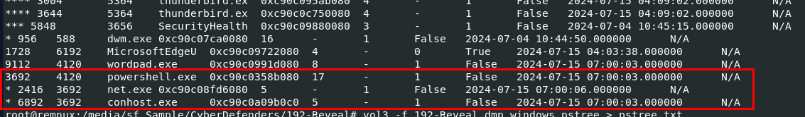
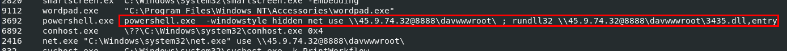
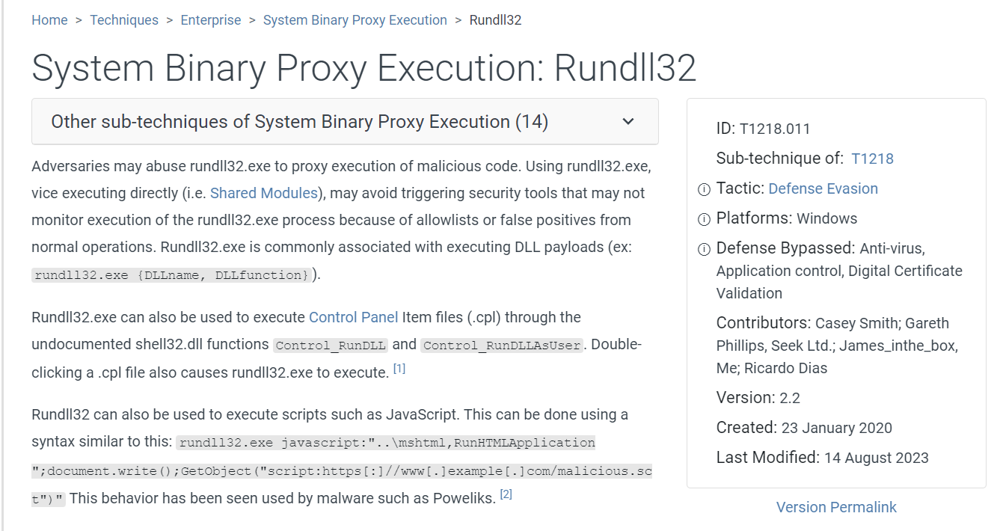
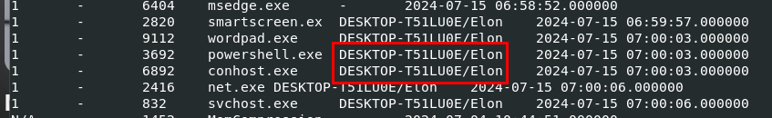
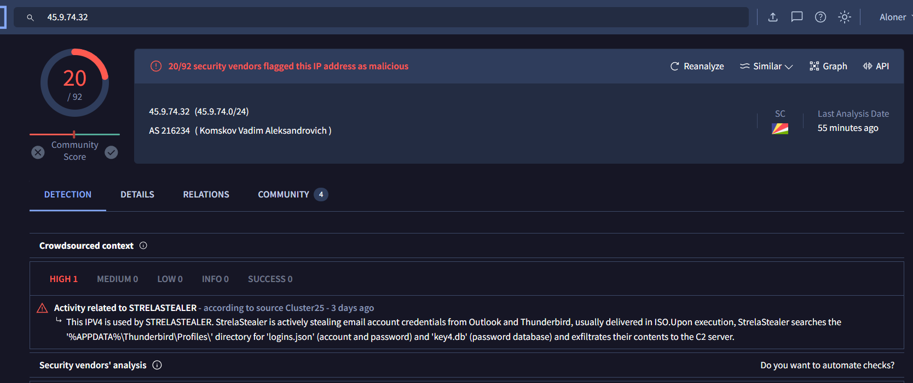
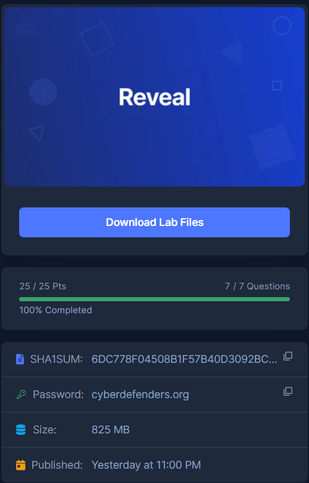

# [CyberDefenders - Reveal](https://cyberdefenders.org/blueteam-ctf-challenges/reveal/)
Created: 17/07/2024 12:42
Last Updated: 28/07/2024 16:27
* * *
>**Category**: Endpoint Forensics
>**Tags**: Memory Forensic, Volatility, Stealer, T1086, T1564, T1082, T1218, T1012
* * *
**Scenario:**
As a cybersecurity analyst for a leading financial institution, an alert from your SIEM solution has flagged unusual activity on an internal workstation. Given the sensitive financial data at risk, immediate action is required to prevent potential breaches.

Your task is to delve into the provided memory dump from the compromised system. You need to identify basic Indicators of Compromise (IOCs) and determine the extent of the intrusion. Investigate the malicious commands or files executed in the environment, and report your findings in detail to aid in remediation and enhance future defenses.

**Tools**:
- [Volatility 3](https://github.com/volatilityfoundation/volatility3)
* * *
## Questions
>Q1: Identifying the name of the malicious process helps in understanding the nature of the attack. What is the name of the malicious process?

We can start by determine if this memory dump was taken from Windows or Linux by using `vol3 -f 192-Reveal.dmp windows.info` / `vol3 -f 192-Reveal.dmp banners.Banners`



After determined that this is a memory image captured from Windows then we can proceed with `vol3 -f 192-Reveal.dmp windows.pstree` to display process tree and find suspicious process that should not be there which we can see that PowerShell and `net.exe` were running on this machine during memory acquisition  

```
powershell.exe
```

>Q2: Knowing the parent process ID (PID) of the malicious process aids in tracing the process hierarchy and understanding the attack flow. What is the parent PID of the malicious process?
```
4120
```

>Q3: Determining the file name used by the malware for executing the second-stage payload is crucial for identifying subsequent malicious activities. What is the file name that the malware uses to execute the second-stage payload?



We already know that `net.exe` that spawned under PowerShell process has something to do with it but lets use `vol3 -f 192-Reveal.dmp windows.cmdline` to get command line argument that was used on this PowerShell process which we can see that it used `net` command to get malicious dll file on shared directory then execute it with `rundll32`

```
3435.dll
```

>Q4: Identifying the shared directory on the remote server helps trace the resources targeted by the attacker. What is the name of the shared directory being accessed on the remote server?
```
davwwwroot
```

>Q5: What is the MITRE sub-technique ID used by the malware to execute the second-stage payload?



It used `rundll32` to execute malicious dll file so it has to be this [technique](https://attack.mitre.org/techniques/T1218/011/)

```
T1218.011
```

>Q6: Identifying the username under which the malicious process runs helps in assessing the compromised account and its potential impact. What is the username that the malicious process runs under?



Lets use `vol3 -f 192-Reveal.dmp windows.sessions` to display all sessions associated with each process which we can see that this PowerShell and other processes were executed with "Elon" account

```
Elon
```

>Q7: Knowing the name of the malware family is essential for correlating the attack with known threats and developing appropriate defenses. What is the name of the malware family?



We can just search for an IP address we found on VirusTotal which we can see that it was used by StrelaStealer

```
STRELASTEALER
```


* * *
