# [CyberDefenders - ShadowRoast](https://cyberdefenders.org/blueteam-ctf-challenges/shadowroast/)
[toc]
* * *
**Scenario:**
As a cybersecurity analyst at TechSecure Corp, you have been alerted to unusual activities within the company's Active Directory environment. Initial reports suggest unauthorized access and possible privilege escalation attempts.

Your task is to analyze the provided logs to uncover the attack's extent and identify the malicious actions taken by the attacker. Your investigation will be crucial in mitigating the threat and securing the network.

**Category**: Threat Hunting

**Tools**:
Splunk
EZ Tools
Event Log Explorer
KAPE
Event Viewer
CyberChef

* * *
## Questions
>Q1: What's the malicious file name utilized by the attacker for initial access?

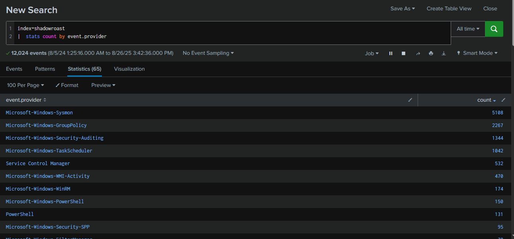

After deployed Splunk instance, I queried with `index=shadowroast |  stats count by event.provider` to see how many event providers were ingested into this instance which we can see that there are only 12,024 events ingested into this instance and we have 5,108 from Sysmon 1,344 from Security, so I will start with Sysmon and utilize Security event log when there are authentication event involves.

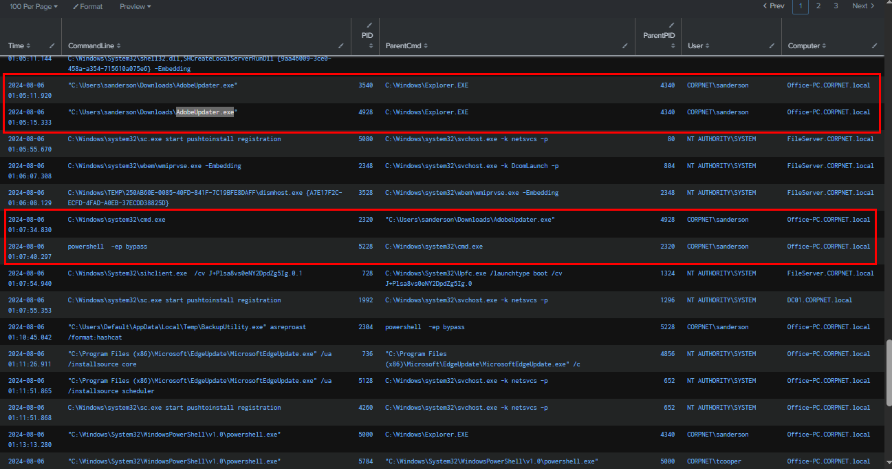

By leveraging Sysmon Event ID 1 to detect suspicious process chains, we observed that on 2024-08-06 at 01:05:11, `AdobeUpdater.exe` executed `cmd.exe`, which in turn spawned `powershell.exe -ep bypass`. This behavior is indicative of reverse shell activity originating from `AdobeUpdater.exe`.

Query : 
```
index=shadowroast "event.provider"="Microsoft-Windows-Sysmon" "event.code"=1
| sort winlog.event_data.UtcTime
| table winlog.event_data.UtcTime, winlog.event_data.CommandLine, winlog.event_data.ProcessId, winlog.event_data.ParentCommandLine, winlog.event_data.ParentProcessId, winlog.event_data.User, winlog.computer_name
| rename winlog.event_data.UtcTime as Time,
         winlog.event_data.CommandLine as CommandLine,
         winlog.event_data.ProcessId as PID,
         winlog.event_data.ParentCommandLine as ParentCmd,
         winlog.event_data.ParentProcessId as ParentPID,
         winlog.event_data.User as User,
         winlog.computer_name as Computer
```

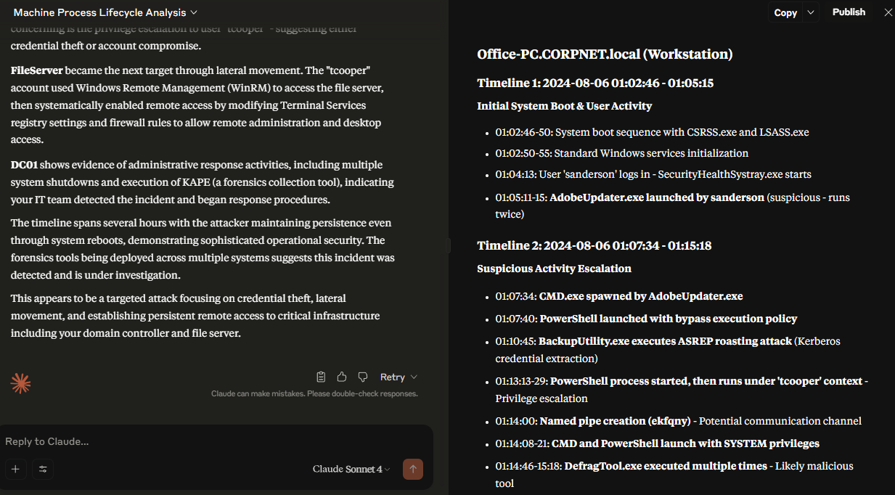

We can export table we just queried as CVE file and upload it to LLM like Claude or Gemini to create process tree, process life cycle or even let it analyze this for us, which we can see that Claude detected this suspicious activity from the same binary and also highlighting AS-REP Roasting activity from `BackupUtility.exe`, privilege escalation to "tcooper" user and multiple execution of `DefragTool.exe`.

```
AdobeUpdater.exe
```

>Q2: What's the registry run key name created by the attacker for maintaining persistence?

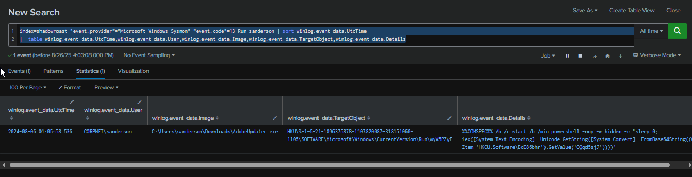

By leveringing Sysmon Event ID 13 and focus on Run registry created by "sanderson" user (compromised user), we can see that wyW5PZyF subkey was created under Run registry key to execute command that will fetch PowerShell payload from `HKCU:Software\EdI86bhr` registry key and execute it. 

Query : `index=shadowroast "event.provider"="Microsoft-Windows-Sysmon" "event.code"=13 Run sanderson | sort winlog.event_data.UtcTime 
|  table winlog.event_data.UtcTime,winlog.event_data.User,winlog.event_data.Image,winlog.event_data.TargetObject,winlog.event_data.Details`

```
wyW5PZyF
```

>Q3: What's the full path of the directory used by the attacker for storing his dropped tools?

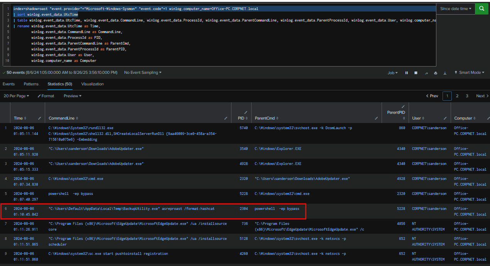

Coming back to our Sysmon Event ID 1 query, we can see that `BackupUtility.exe` was executed from `C:\Users\Default\AppData\Local\Temp\` which is the location that all user have write permission to it and it also make it stand out from the rest as well.

```
C:\Users\Default\AppData\Local\Temp\
```

>Q4: What tool was used by the attacker for privilege escalation and credential harvesting?

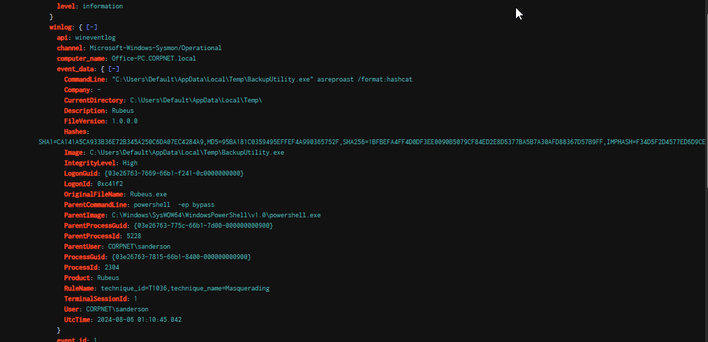

Based on the syntax of `BackupUtility.exe`, it is evident that the tool in question is Rubeus, a well-known Kerberos exploitation utility commonly used by red teamers. This identification is further confirmed by the "OriginalFileName" field, which explicitly indicates Rubeus.

Query : `index=shadowroast "event.provider"="Microsoft-Windows-Sysmon" "event.code"=1 BackupUtility.exe | sort winlog.event_data.UtcTime`

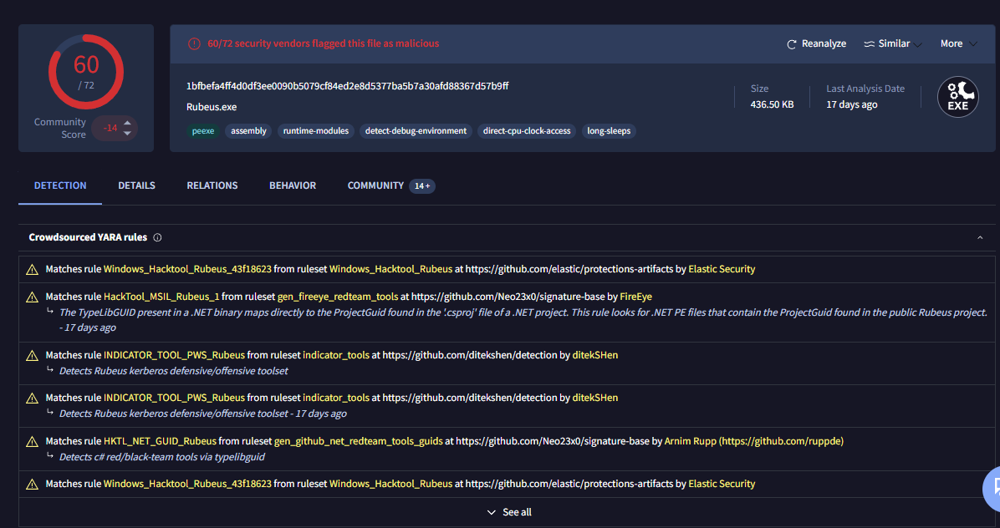

We can double check it wit h [VirusTotal](https://www.virustotal.com/gui/file/1bfbefa4ff4d0df3ee0090b5079cf84ed2e8d5377ba5b7a30afd88367d57b9ff) as well.

```
Rubeus
```

>Q5: Was the attacker's credential harvesting successful? If so, can you provide the compromised domain account username?

An AS-REP Roasting attack was conducted using Rubeus, as identified in the previous finding. This attack targets accounts in an Active Directory environment that have the 'Do not require Kerberos pre-authentication' setting enabled, allowing an attacker to request and obtain a Kerberos AS-REP hash. If the targeted account uses a weak password, the attacker can attempt offline cracking to recover the plaintext credentials. 

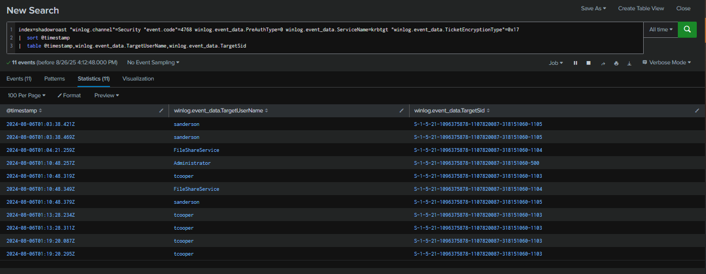

To validate this activity, we analyzed Security Event ID 4768 (Kerberos TGT request) to the krbtgt service account, where `Pre-Authentication=0` was observed. Additionally, the `TicketEncryptionType=17 `indicated RC4-HMAC, a weak encryption algorithm that can be efficiently cracked using tools such as Hashcat or John the Ripper.

The results revealed four AS-REP roastable accounts, including the Administrator. However, since suspicious processes were already detected running under the tcooper account, this suggests that the attacker likely cracked the password for tcooper and leveraged it to further their operations, ultimately aiming to compromise the domain.

Query : `index=shadowroast "winlog.channel"=Security "event.code"=4768 winlog.event_data.PreAuthType=0 winlog.event_data.ServiceName=krbtgt "winlog.event_data.TicketEncryptionType"=0x17 
|  sort @timestamp 
|  table @timestamp,winlog.event_data.TargetUserName,winlog.event_data.TargetSid`

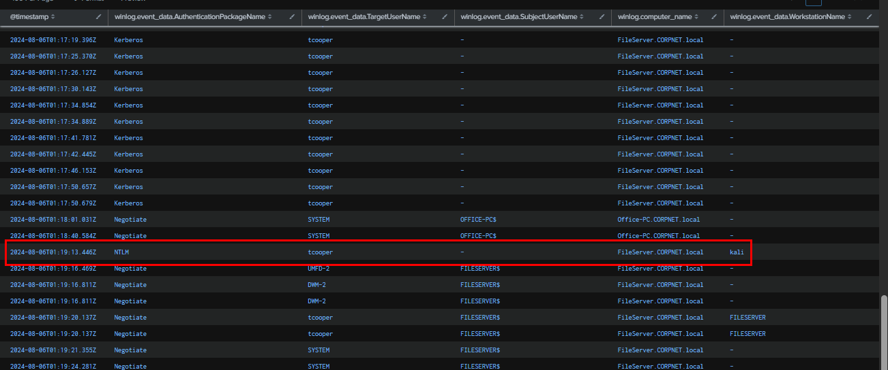

Next I searched for Successful logon event which we can see that there are multiple logon as "tcooper" on FileServer and the one that really stood out is "kali" as computer_name indicates that the attacker using its own workstation to authenticated to the domain controller as "tcooper" at this point.

Query : `index=shadowroast "winlog.channel"=Security "event.code"=4624 
|  sort @timestamp 
| table @timestamp,winlog.event_data.AuthenticationPackageName,winlog.event_data.TargetUserName,winlog.event_data.SubjectUserName,winlog.computer_name,winlog.event_data.WorkstationName`

```
tcooper
```

>Q6: What's the tool used by the attacker for registering a rogue Domain Controller to manipulate Active Directory data?

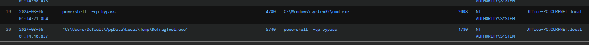

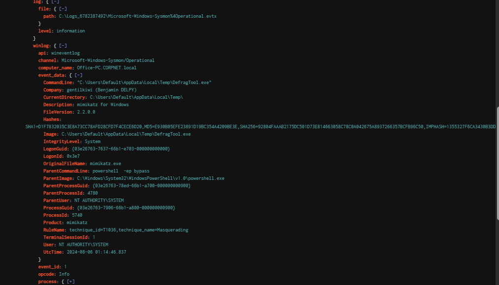

Going back to Sysmon Event ID 1, we observed that on 2024-08-06 at 01:14:21, a `powershell.exe` process was spawned from `cmd.exe`, which subsequently executed `DefragTool.exe`. Examination of the "OriginalFileName" field revealed that this binary is in fact Mimikatz. This indicates that after successfully logging in as "tcooper", the attacker leveraged Mimikatz to perform a DCShadow attack against the domain.

```
mimikatz
```

>Q7: What's the first command used by the attacker for enabling RDP on remote machines for lateral movement?

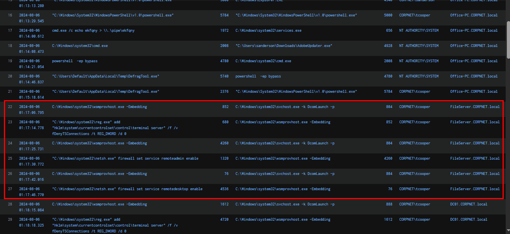
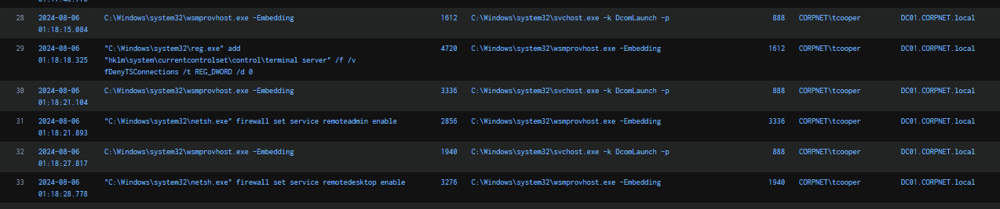

Following the DCShadow attack with Mimikatz, the attacker proceeded to enable Remote Desktop Protocol (RDP) on three hosts within reach: Office-PC, FileServer, and DC01.

```
reg add "hklm\system\currentcontrolset\control\terminal server" /f /v fDenyTSConnections /t REG_DWORD /d 0
```

>Q8: What's the file name created by the attacker after compressing confidential files?

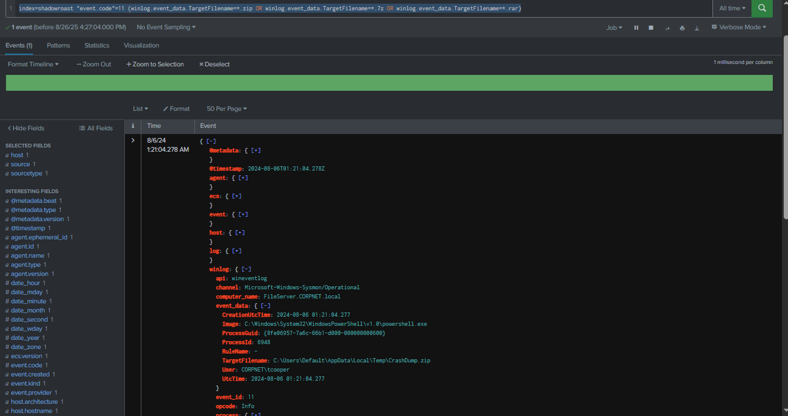

Using Sysmon Event ID 11, I searched for popular archive extensions such as .zip, .7z, and .rar. At 2024-08-06 01:21:04, a file named `CrashDump.zip` was created in the attacker’s staging location by PowerShell process, indicating preparation for data exfiltration activity by the same actor.

Query : `index=shadowroast "event.code"=11 (winlog.event_data.TargetFilename=*.zip OR winlog.event_data.TargetFilename=*.7z OR winlog.event_data.TargetFilename=*.rar)`

```
CrashDump.zip
```


https://cyberdefenders.org/blueteam-ctf-challenges/achievements/Chicken_0248/shadowroast/ 
* * *

## Persistence execution (bonus)

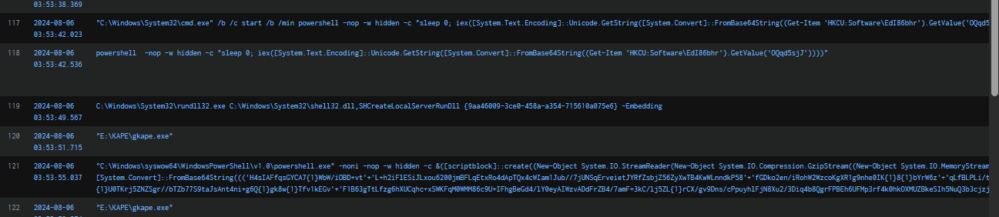

After completing the lab, I continued reviewing the process execution table and noticed a persistence command had been executed. To investigate further, I examined the associated Run registry key to determine what was being executed.

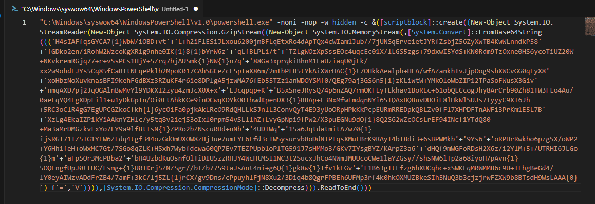

I copied the PowerShell command into VSCode for analysis. The command contains a Base64-encoded payload with some obfuscation. To decode it, we replace `{0}` with `=` (only at the last character), `{1}` with `V`, and remove all occurrences of `'+’` (which were used to concatenate strings). Applying these replacements reconstructs the full Base64-encoded string.

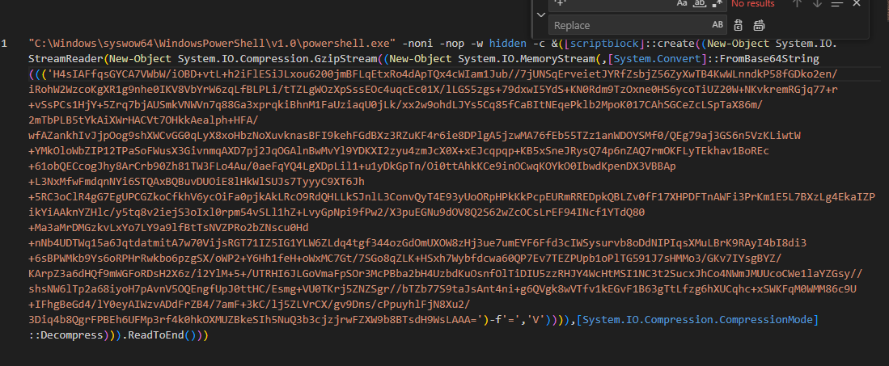

Now we should have this base64 strings to decode and gunzip it with CyberChef.

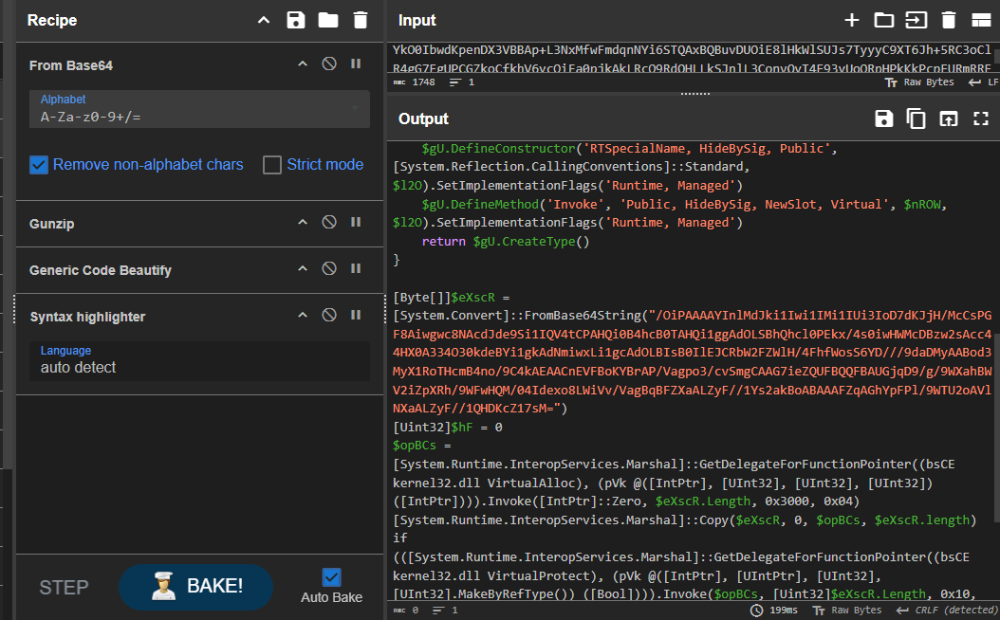

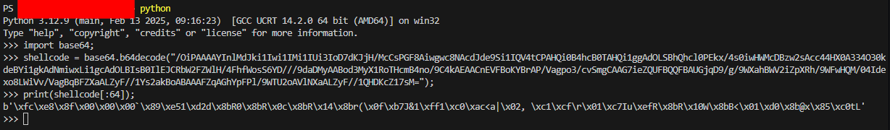

After decoding and gunziping, it reveal that will inject Shellcode into the memory upon execution but I was too lazy to run shellcode debugger on it so I concluded my investigation here.

***