# [HackTheBox Sherlocks - APTNightmare-2](https://app.hackthebox.com/sherlocks/APTNightmare-2)

## Scenario

Upon completing the server recovery process, the IR team uncovered a labyrinth of persistent traffic, surreptitious communications, and resilient processes that eluded our termination efforts. It's evident that the incident's scope surpasses the initial breach of our servers and clients. As a forensic investigation expert, can you illuminate the shadows concealing these clandestine activities?
* * *
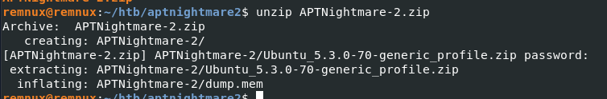

We got memory dump along with profile so we can import this profile first then we cab start doing memory forensics with Volatility 2

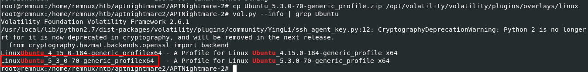

I'm using Remnux so I used `cp Ubuntu_5.3.0-70-generic_profile.zip /opt/volatility/volatility/plugins/overlays/linux` command to import this profile then after confirmed with `vol.py --info | grep Ubuntu` then we should be able to see this profile thats mean we are ready to use this profile with given memory dump

>Task 1: What is the IP and port the attacker used for the reverse shell?

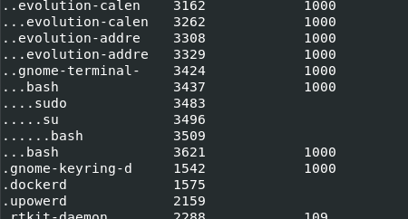

First I used `vol.py -f dump.mem --profile=LinuxUbuntu_5_3_0-70-generic_profilex64 linux_pstree` to display process tree and expect for low hanging fruit such as obviously uncommon process name but I only found this which I think it should be process call to dump the memory image.

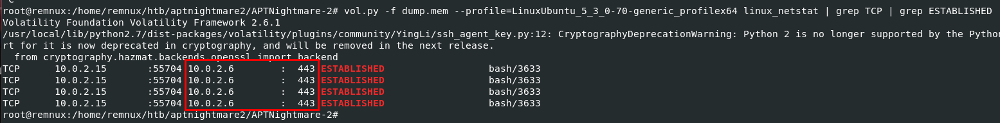

I got to the point after failing to determine suspicious process with `vol.py -f dump.mem --profile=LinuxUbuntu_5_3_0-70-generic_profilex64 linux_netstat | grep TCP | grep ESTABLISHED` command then we can see that bash process with PID 

```
10.0.2.6:443
```

>Task 2: What was the PPID of the malicious reverse shell connection?

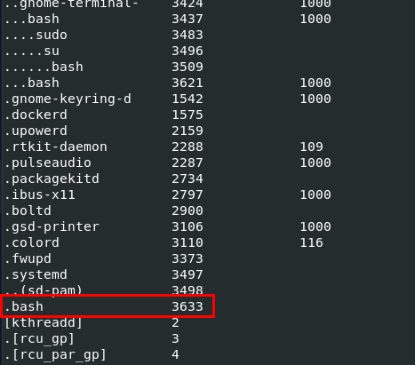

I went back to process tree again to find out that this plugin could not get the parent process of this process.

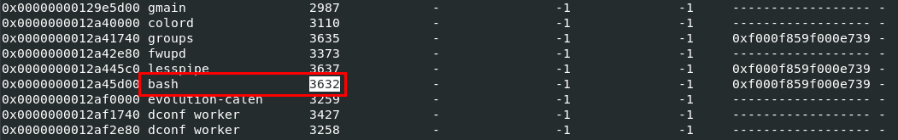

Then I went with `linux_psscan` that will list all processes that existed on the system even terminated one which I finally found that there was a bash with PID 3632 running on this system and this PID is the one we are looking for.

```
3632
```

>Task 3: Provide the name of the malicious kernel module.

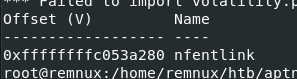

I used `vol.py -f dump.mem --profile=LinuxUbuntu_5_3_0-70-generic_profilex64 linux_hidden_modules` command to find hidden modules first and if it didn't find anything then I would go with `linux_modscan` but the result from the command shows that there is 1 hidden module on this system while it was running 

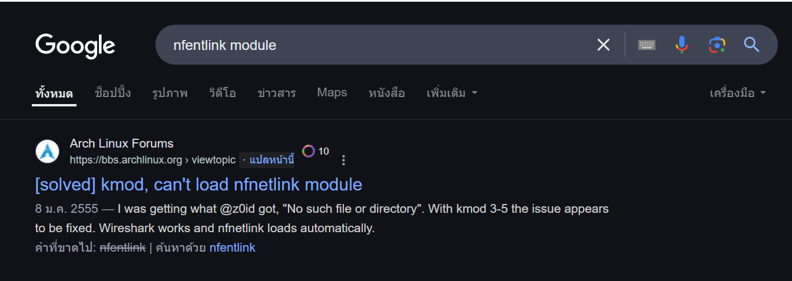

By looking at its name and conducted a little bit of research then we could tell that this module tried to masquerade as nfnetlink module which is a legitimate module of netfilter.

```
nfentlink
```

>Task 4: What time was the module loaded?

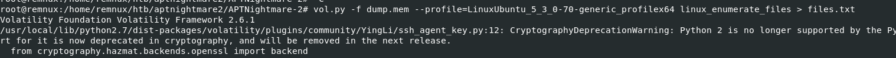

`vol.py -f dump.mem --profile=LinuxUbuntu_5_3_0-70-generic_profilex64 linux_enumerate_files > files.txt`

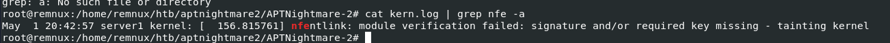

To find out about this, I used `vol.py -f dump.mem --profile=LinuxUbuntu_5_3_0-70-generic_profilex64 linux_find_file -i 0xffff98ea5a732fa8 -O kern.log` to dump `kern.log` file which contains log kernel-related event including module loaded 

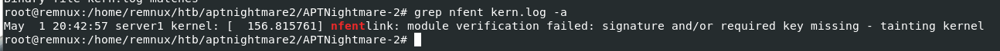

...

```
2024-05-01 20:42:57
```

>Task 5: What is the full path and name of the malicious kernel module file?

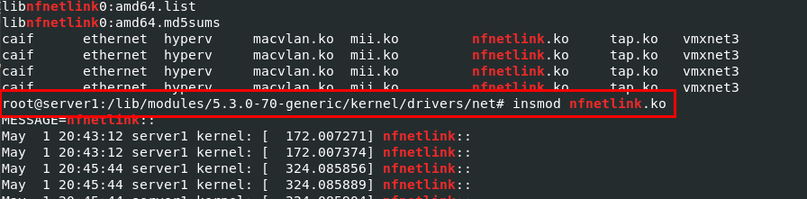
`strings dump.mem | grep nfnetlink`

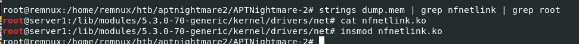

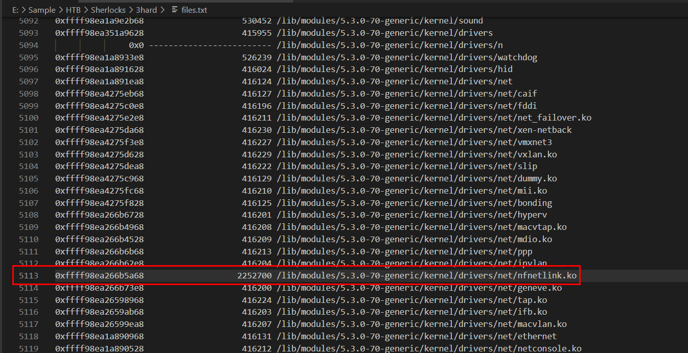

```
/lib/modules/5.3.0-70-generic/kernel/drivers/net/nfnetlink.ko
```

>Task 6: Whats the MD5 hash of the malicious kernel module file?

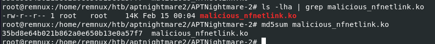

I used `vol.py -f dump.mem --profile=LinuxUbuntu_5_3_0-70-generic_profilex64 linux_find_file -i 0xffff98ea266b5a68 -O malicious_nfnetlink.ko` to dump malicious module from the memory then use `md5sum` to get the MD5 hash of this file

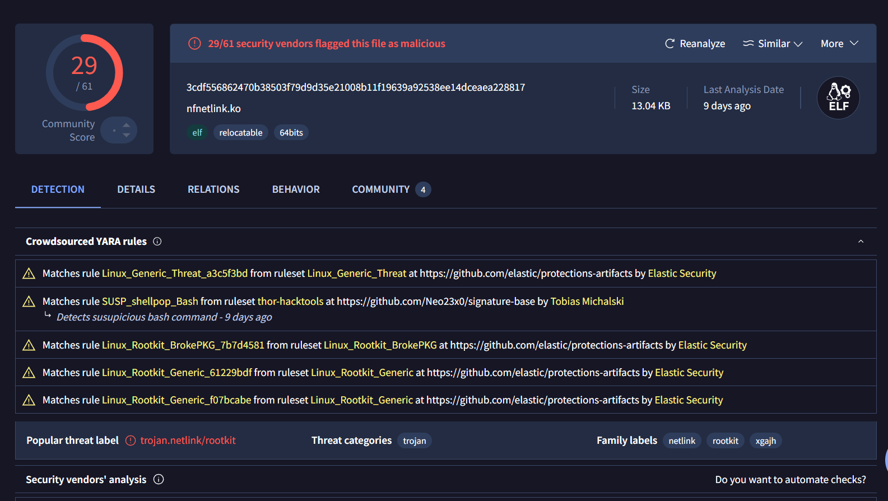

Then if we searched for this hash on [VirusTotal](https://www.virustotal.com/gui/file/3cdf556862470b38503f79d9d35e21008b11f19639a92538ee14dceaea228817), we can see that we got the right module

```
35bd8e64b021b862a0e650b13e0a57f7
```

>Task 7: What is the full path and name of the legitimate kernel module file?

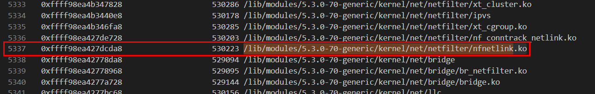

We know that there are 2 `nfnetlink.ko` on this system and we already got the malicious one so the other one is definitely the legitimate one.

```
/lib/modules/5.3.0-70-generic/kernel/net/netfilter/nfnetlink.ko
```

>Task 8: What is the single character difference in the author value between the legitimate and malicious modules?

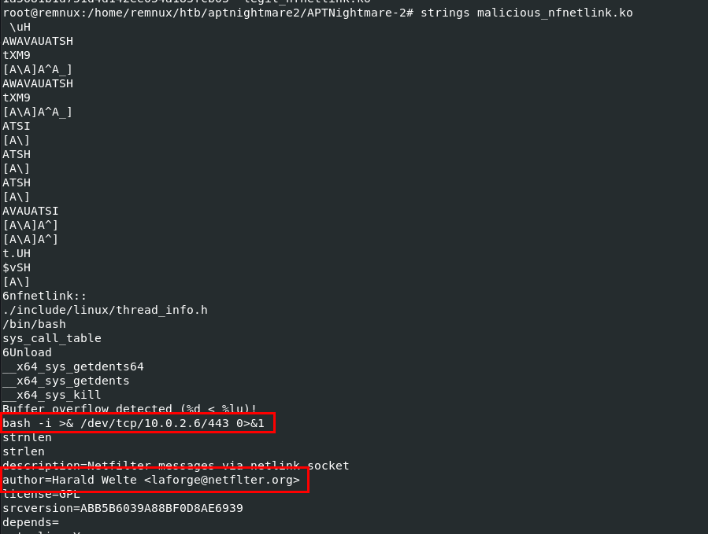

I used `strings` to find interesting strings from this module which we can see the bash command responsible for reverse shell and the author of this module and if we take a look carefully at the email part then we would see that its missing an i for netfilter 

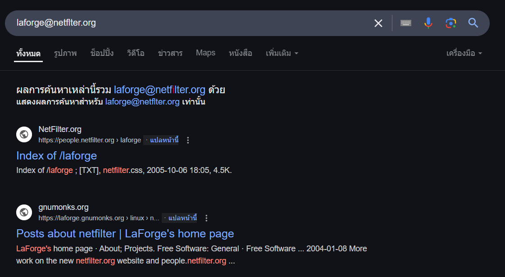

Even google putted this character for us when we searched it.

```
i
```

>Task 9: What is the name of initialization function of the malicious kernel module?

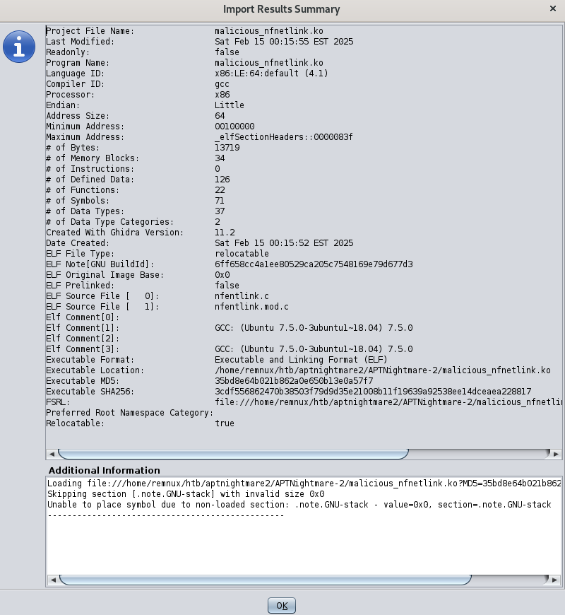

Lets decompile this module on Ghidra which reveal that source file with `nfentlink.c` and `nfentlink.mod.c` as an attempted to masquerade as legitimate netfilter module.

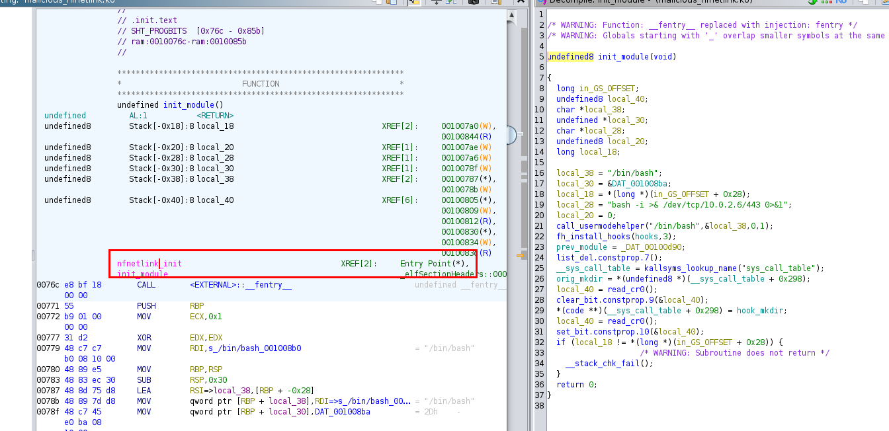

Then after Ghidra successfully decompiled `init_module` function, we could 

```
nfnetlink_init
```

>Task 10: There is a function for hooking syscalls. What is the last syscall from the table?

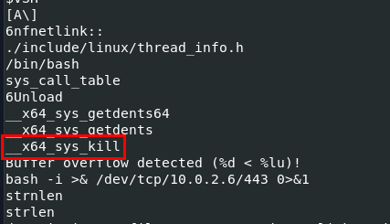
```
__x64_sys_kill
```

>Task 11: What signal number is used to hide the process ID (PID) of a running process when sending it?

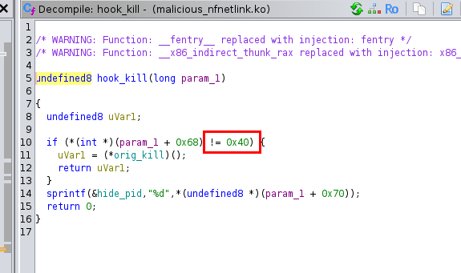
```
64
```

https://labs.hackthebox.com/achievement/sherlock/1438364/857
* * *
