# [HackTheBox Sherlocks - Compromised](https://app.hackthebox.com/sherlocks/Compromised)


**Scenario:**
Our SOC team detected suspicious activity in Network Traffic, the machine has been compromised and company information that should not have been there has now been stolen – it’s up to you to figure out what has happened and what data has been taken.

* * *
>Task 1: What is the IP address used for initial access?

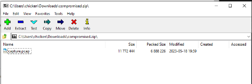

We have a single pcap file on this sherlock so I'll use Wireshark to open this pcap file and start the investigation. 

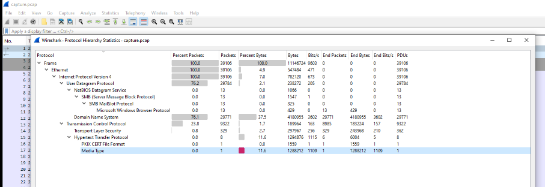

We have the total of 39,106 packets that were captured on this pcap file, the majority of them is DNS and HTTP so we will take a look at HTTP first since it is unencrypted protocol and we could get so much juices from it.

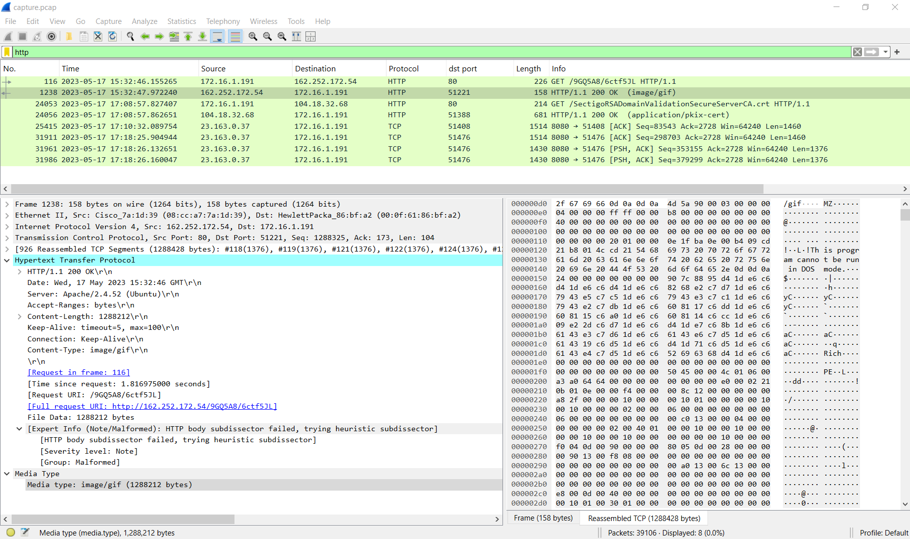
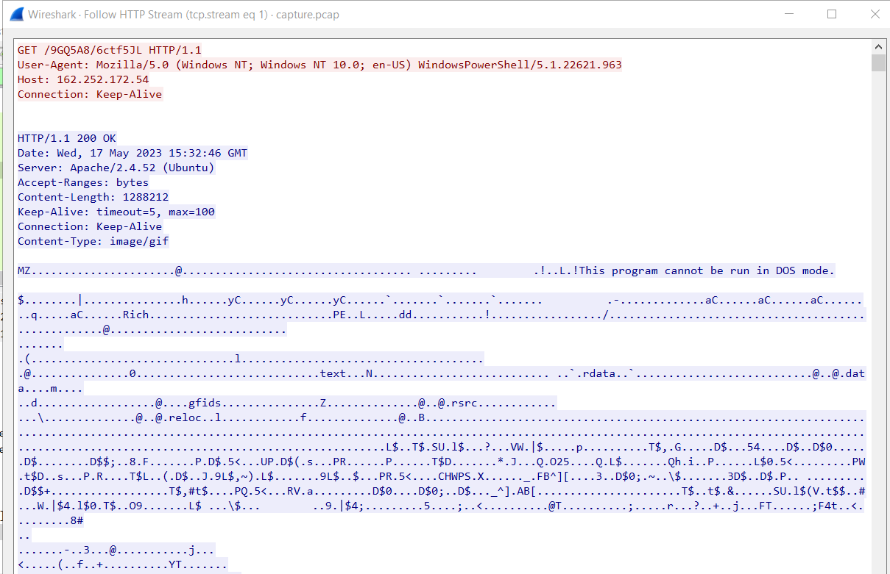

As soon as I applied the `http` filter, I immediately spotted suspicious activity — the first HTTP GET request from 172.16.1.191 to 162.252.172.54 returned a response with the MIME type image/gif, but the actual content was a PE32 executable file.

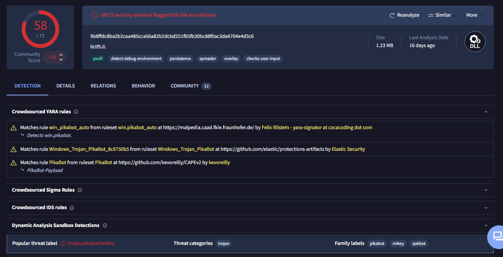

After exported file using Export Object feature, I calcucated SHA256 hash to answer next task and search it in [VirusTotal](https://www.virustotal.com/gui/file/9b8ffdc8ba2b2caa485cca56a82b2dcbd251f65fb30bc88f0ac3da6704e4d3c6) which reveals that this file is actually a Pikabot malware.

```
162.252.172.54
```

>Task 2: What is the SHA256 hash of the malware?
```
9b8ffdc8ba2b2caa485cca56a82b2dcbd251f65fb30bc88f0ac3da6704e4d3c6
```

>Task 3: What is the Family label of the malware?
```
Pikabot
```

>Task 4: When was the malware first seen in the wild (UTC)?

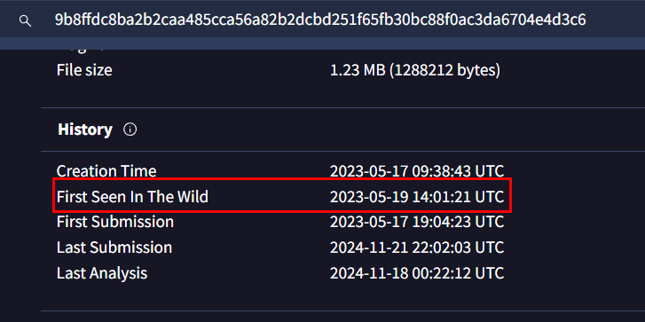

First Seen in The Wild is only timestamp that could be provide on VirusTotal, no one really understand what this field really mean. at least for people I know of but to answer this, we can get this timestamp right here.

```
2023-05-19 14:01:21
```

>Task 5: The malware used HTTPS traffic with a self-signed certificate. What are the ports, from smallest to largest?

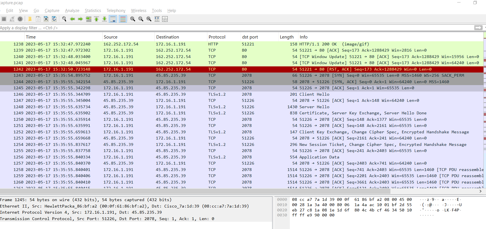

Going back to the PCAP file, we now need to examine the traffic that occurred after Pikabot was downloaded. The first HTTPS connection from the infected machine is observed on port 2078.

To determine if a certificate is self-signed in Wireshark, examine the certificate exchanged during the communication. If the Issuer and Subject fields are identical, the certificate is self-signed.

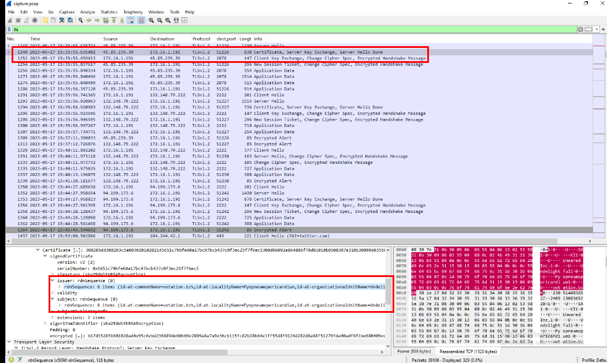
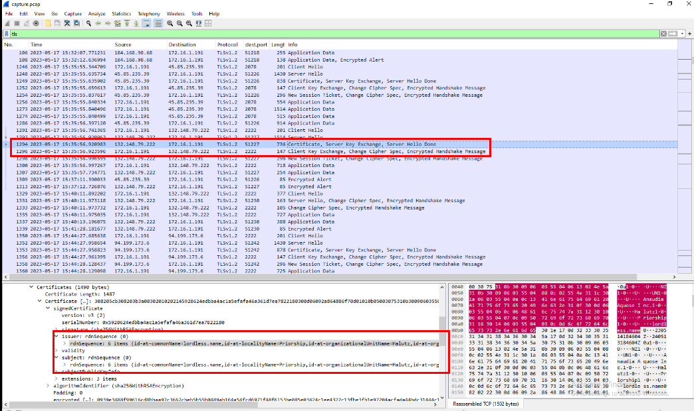
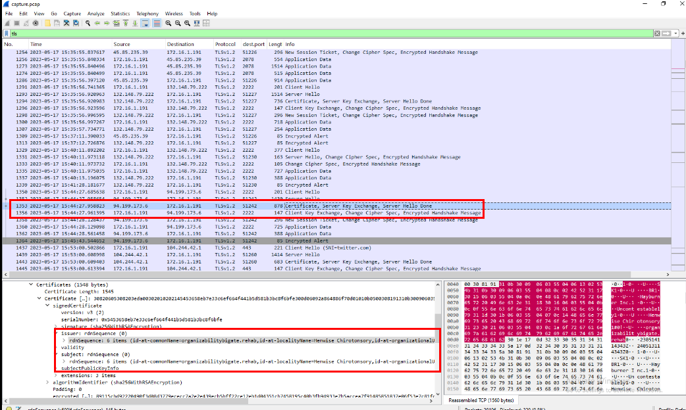
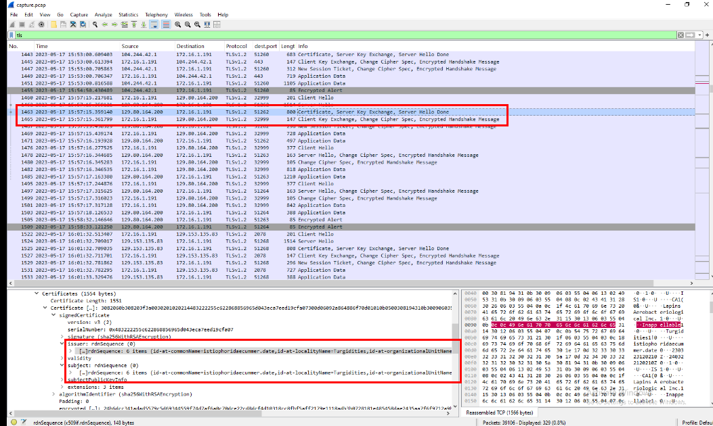

Then after taking a look at these TLS traffic, we can see that there are communication on 3 ports (2078,2222 and 32999) that exchanged with self-signed certificate and they are the answer of this task. 

```
2078, 2222, 32999
```

>Task 6: What is the id-at-localityName of the self-signed certificate associated with the first malicious IP?

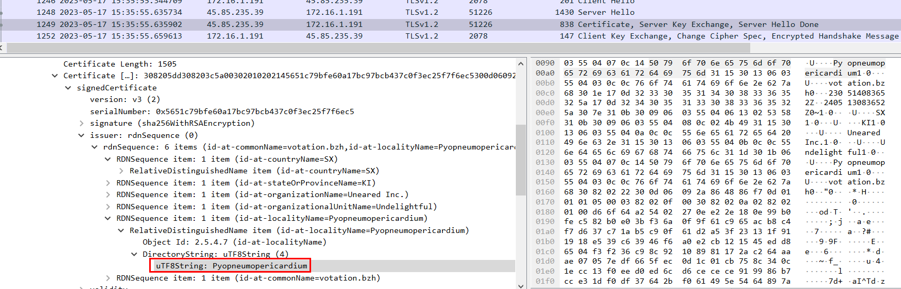

The first TLS communication after the compromised machine requested Pikabot occurred on port 2078, and the `id-at-localityName` value of the exchanged self-signed certificate was "Pyopneumopericardium".

```
Pyopneumopericardium
```

>Task 7: What is the notBefore time(UTC) for this self-signed certificate?

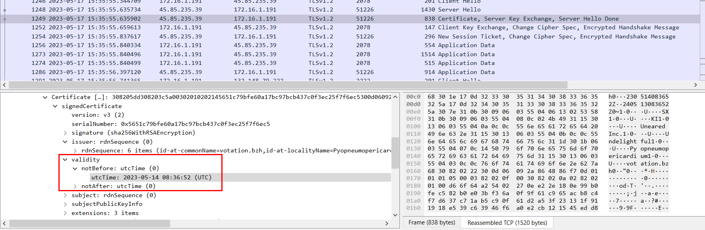

We can find the `notBefore` time of this self-signed certificate in the Validity field of the certificate header, right here.

```
2023-05-14 08:36:52
```

>Task 8: What was the domain used for tunneling?

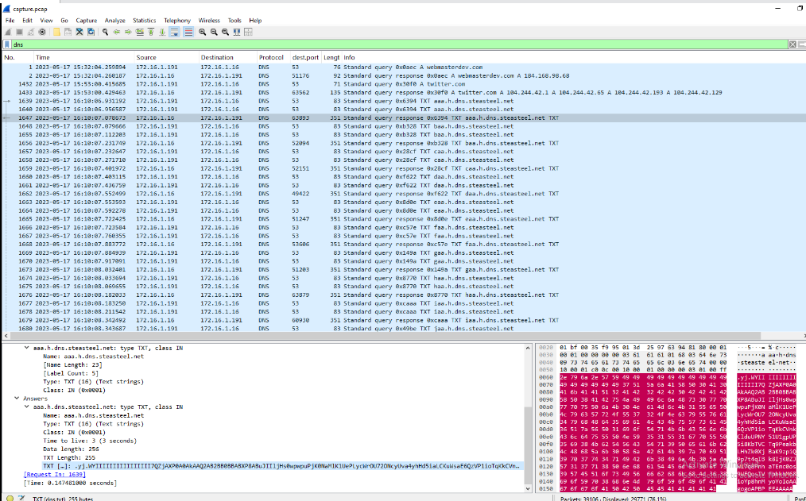

We previously identified an unusually high volume of DNS traffic in this pcap file, which is atypical for normal operations. Further analysis revealed that this activity was the result of DNS tunneling conducted by Pikabot, leveraging the domain steasteel[.]net. This concludes our Sherlock investigation; however, for those interested in learning more about [Pikabot](https://attack.mitre.org/software/S1145/), MITRE ATT&CK provides a dedicated software page: S1145 – Pikabot, which contains detailed analysis and related resources.

```
steasteel.net
```

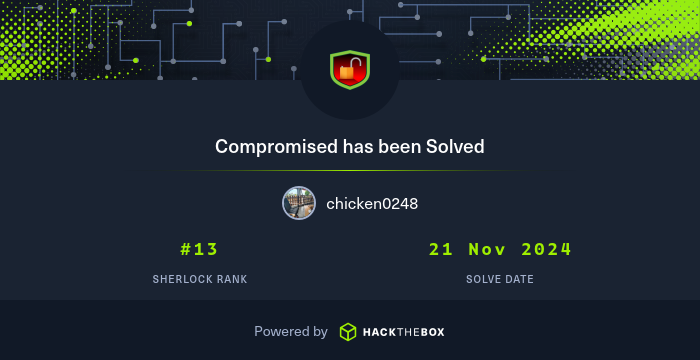
https://labs.hackthebox.com/achievement/sherlock/1438364/758
* * *
