# [LetsDefend - Malicious Chrome Extension](https://app.letsdefend.io/challenge/malicious-chrome-extension)
Created: 25/04/2024 10:32
Last Updated: 30/11/2024 18:28
* * *
<div align=center>

**Malicious Chrome Extension**
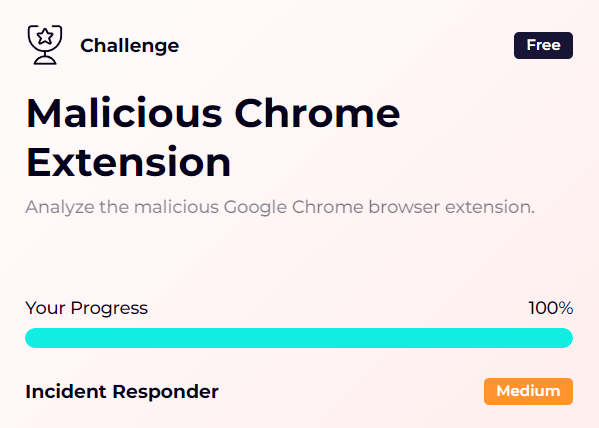
</div>
The victim found out their private info was out there for everyone to see, and things got worse – the bad guys got into their money stuff, social media, and personal emails. We got an image of his machine so you can tell us what happened.

**File Location:** `/root/Desktop/ChallengeFile/Extension.7z`
* * *
## Start Investigation
> What is the ID of the malicious extension?

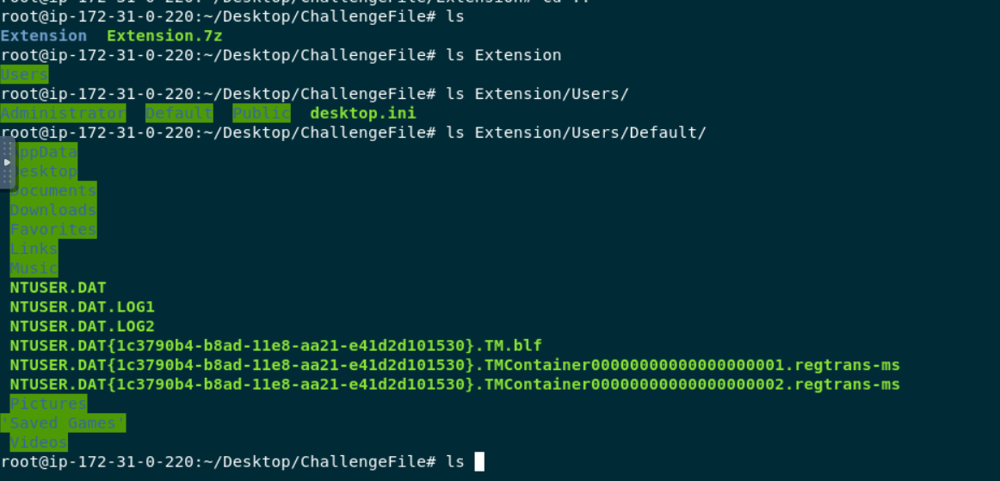
After extracted sample 7z file and after taking a look at folder structure ,this is `Users` folders which copied from Windows system.
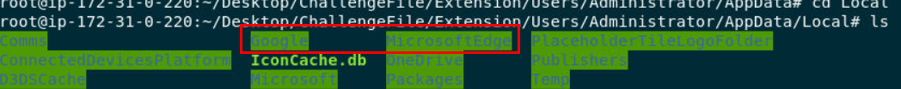
Inside `Administrator` user, this system got 2 browsers which are Chrome and Edge but based on Challenge name that pretty clear about Chrome Extension so I went to `/Users/Administrator/AppData/Local/Google/Chrome/User Data/Default/Extensions` which is where extensions are stored
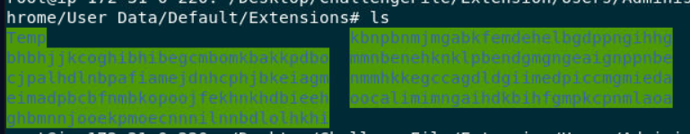
We can see that there are 8 extensions was installed on this user's browser and to make it quick, i'll search all extensions to [Chrome-Stats](https://chrome-stats.com/) instead of reading all `manifest.json` of all extensions and my reason is if any Chrome extension was flagged as malicious by Google, it will be removed from Web Store immediately
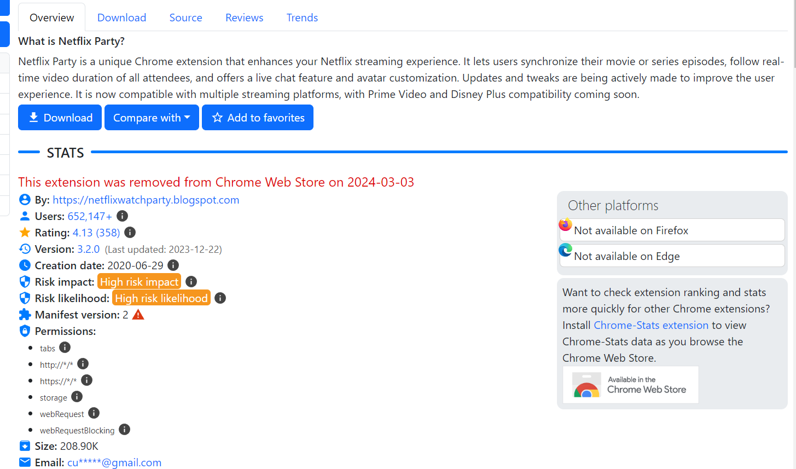
Then I found this `mmnbenehknklpbendgmgngeaignppnbe` extension id to be very suspicious since it was removed from Chrome Web Store so I have to do research on this one
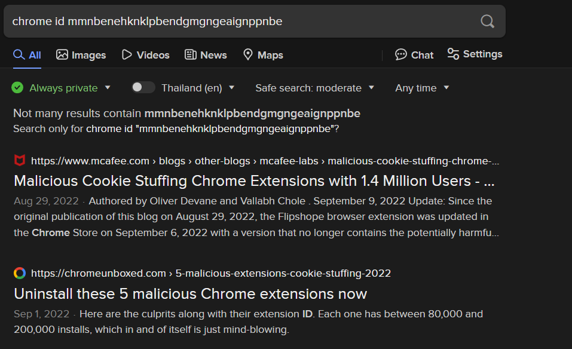
[My first search result](https://www.mcafee.com/blogs/other-blogs/mcafee-labs/malicious-cookie-stuffing-chrome-extensions-with-1-4-million-users/) is the one that confirmed that this extension is malicious and its the one we're looking for
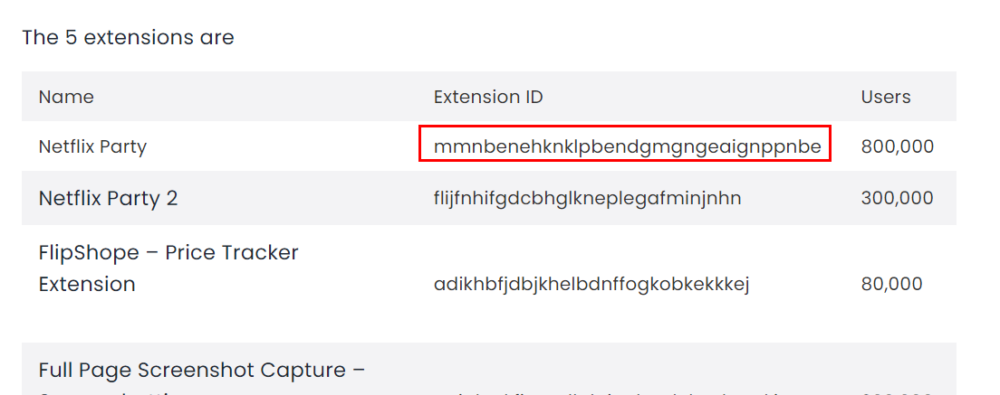
There are 5 extensions that were used to conduct this malicious activity, and one of them was installed on Administrator Chrome's browser
```
mmnbenehknklpbendgmgngeaignppnbe
```

> What is the name of the malicious extension?

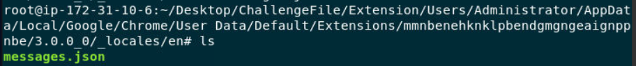
Go to `/_locales/en/`, there is a file that store a name of this extension since a name from `manifest.json` couldn't be used as an answer
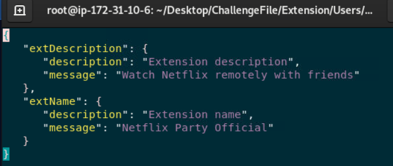
```
Netflix Party Official
```

> How many people were affected by this extension?

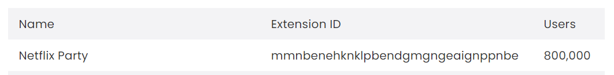
Based on McAfree blog, 800k user installed this extension
```
800,000
```

> What is the attacker's domain name?

According to McAfree's blog, these extensions are tracking user browsing activity and send to extension creator then it can insert code into eCommence site that user visited which is modifying cookie of those eCommence site so "authors receive affiliate payment for any items purchased".    
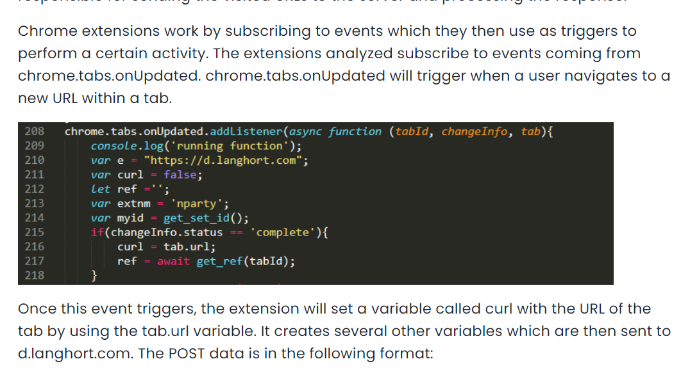
Here is the port of `e` varible declaration, its different from infected system we got so we have to read `b0.js` ourselves
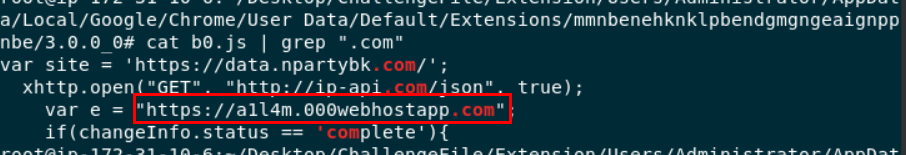
```
a1l4m.000webhostapp.com
```

> What is the full URL the attacker uses to exfiltrate the data?

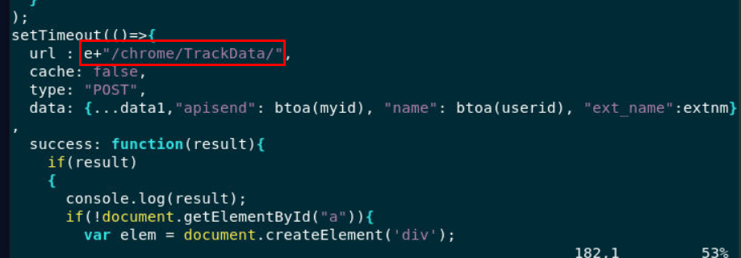
to send any data that was being tracked, this extension need to use HTTP POST method which I also found that `url` variable was consist of `e` variable and other string which is a directory of C2 
```
https://a1l4m.000webhostapp.com/chrome/TrackData/
```

> What is the function name responsible for getting the victim's location?

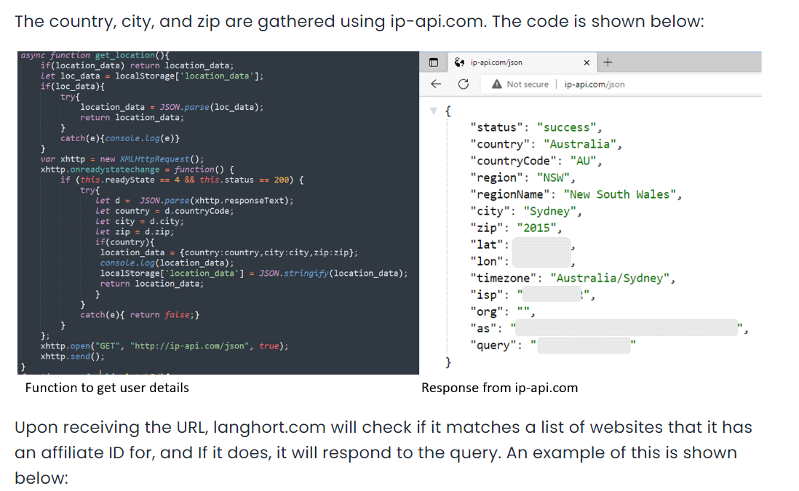
According to blog, this extension also collected user location
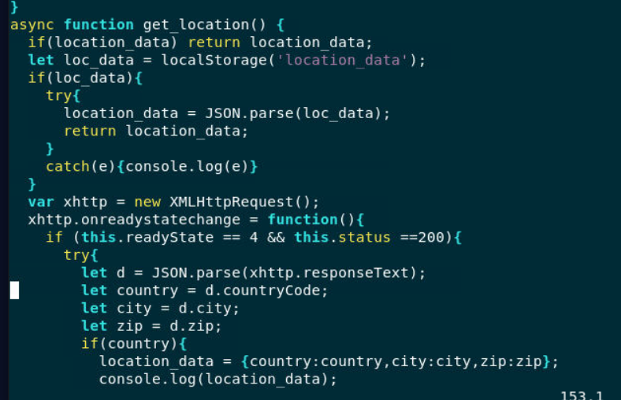
Which is presented inside `b0.js` file, an attacker used `ip-api.com` to get user location which will responsed back in JSON
```
get_location
```

> What is the variable name that is responsible for storing the zip code of the victim?

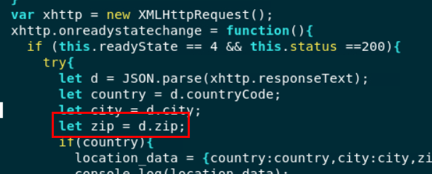
you can see that zip code will be assigned to `zip` variable
```
zip
```

* * *
## Summary

This challenge goal is to make us dig into Google Chrome Extension and find the suspicious extension by any means whatever you read `manifest.json`, reading js code or doing online research then we can also used that search result to guide us to the rest of challenge.

This challenge also reminds us user that knowledge of JavaScript can be useful when it comes to any investigation like this.
<div align=center>


https://app.letsdefend.io/my-rewards/detail/118e150f513f4dd8b15df809aacae018
</div>

* * *
