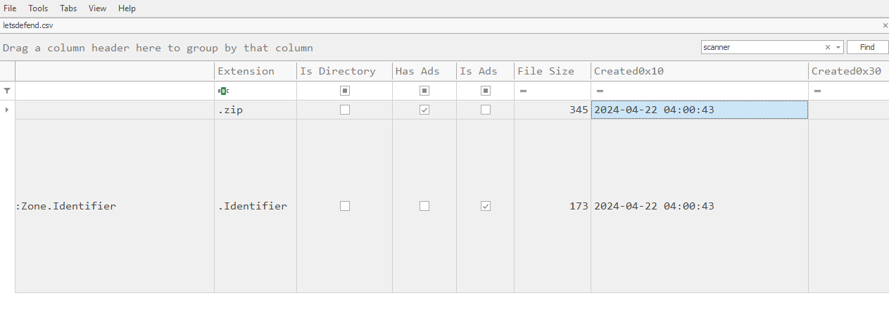
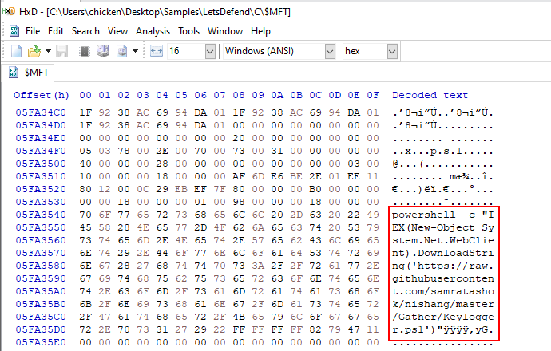

# [LetsDefend - NTFS Forensics](https://app.letsdefend.io/challenge/ntfs-forensics)
Created: 24/02/2025 23:00
Last Updated: 22/04/2025 19:02
* * *

As a digital forensics analyst with over a decade of experience, you are the go-to person in your organization for Windows disk forensics. Recently, an alert was triggered on a critical server used by administrators as a jump server. This server is frequently accessed for credential management and other sensitive operations, making it a high-value target. It has now been compromised. You are provided with only the Master File Table (MFT) of the endpoint. Your task is to uncover the actions taken by the threat actors on the endpoint.
* * *
## Start Investigation


We only have Master File Table ($MFT) as sole evidence on this challenge so we can either proceed with MFTExplorer (Graphical $MFT Viewer) or MFTECmd (CLI-based parser) which I will use both tool to achieve the same result on this write up.


First, lets open terminal with Administrator privilege and parse $MFT with `MFTECmd.exe -f $MFT --csv output --csvf letsdefend.csv` with will create the csv file name `letsdefend.csv` in the `output` folder that store the result from MFTECmd in an instant (yes thats fast)


On the other hand, you got to wait for quite a while on MFTExplorer since GUI application always take times :D

>Identify the malicious downloaded file. What is the file name?


When downloaded thing, if user does not set default download folder or select another destination folder then all downloaded file from web browser will be located in **Downloads** folder of respective user so we can filter with this folder specifically then we will find 2 suspicious files on this folders, 1 is powershell script and another one is zip file that is the answer of this question.


On the MFTExplorer, we can navigate to this folder directly as if we are using Windows explorer and we still have everything as we seen from the MFTECmd as well since it came from the same piece of evidence.

```
scanner98.zip
```

>What is the source URL of the downloaded file?


Every downloaded file to NTFS file system comes with **Zone Identifier** in Altenate Data Stream which contain Zone Transfer data that includes Host Url of the respective file as we can see right here.


On the MFTExplorer, we will have to look at the hex section right here.

```
https://drive.usercontent.google.com/download?id=1hqL4dh5i7bzvfY-v_NmsMhCkJbZDEonO&export=download
```

>What was the time of download of the malicious file? <br>
(Answer Format: YYYY-MM-DD HH:MM:SS)



We will have to get **Created0x10** timestamp from the MFTECmd result.


Which is translate to **SI_Created On** on MFTExplorer.

```
2024-04-22 04:00:43
```

>A powershell script was created on disk by the malicious file. What is the full path of this script on the system? <br>
(Answer Format: C:\x\x\x\file.extension)


As we already found PowerShell script on the same folder as the zip file, Yes this is the one we are looking for on this question.

```
C:\Users\LetsDefend\Downloads\x.ps1
```

>What is the file size of the script in bytes?


We can get the file size of this script by looking at **File Size** column right here.


On MFTExplorer, we can get the file size on the overview tab right here and it will be displayed in Hex so we need to convert it to decimal before answer.

```
152
```

>Recover the file contents of this script. What is the URL it reaches out to?


This become a little bit tricky on MFTECmd since we have to get the **Entry Number** of this script and multiply it with 1024 (If you have done BFT Sherlock from HackTheBox then this should be easy for you)


Now we got the location of this file on Master File Table record using your Go-to Hex editor which I'm using HxD since its installed on my FlareVM, since this script is very small so we can recovery the content of this file from master file table.



After jumpping to the location that we just calculated then we have to scroll down a little to see the content of this file which we can see that this script will create Web Client object to fetch content of nisang's Keylogger and execute it filelessly with IEX or Invoke-Expression.


Meanwhile on the MFTExplorer, We do not have to calculate an offset since its already displayed on the both Hex and Overview tab as shown in the image above.

```
https://raw.githubusercontent.com/samratashok/nishang/master/Gather/Keylogger.ps1
```

Remember that you can only recover only small text file like this from the Master File Table, to actually recover file then you have to use file craving tool / recovery tool on the actual disk image.

>Based on the content you recovered, what MITRE Technique is observed? Answer the subtechnique id.


We know that the script is the keylogger for sure or you can even go to the Github Repository that host the script then you can see that its actually keylogger so according to MITRE ATT&CK, the TTP of key logger is [T1056.001](https://attack.mitre.org/techniques/T1056/001/).

```
T1056.001
```

>Which powershell cmdlet was used to execute the code in the script?
```
IEX
```

* * *
## Summary
On this challenge, we utilized tools such as MFTECmd and MFTExplorer to analyze Master File Table to find the file that contain the PowerShell script that will execute keylogger and we also retrieve the Hosting Url of the zip file as well!

<div align=center>


https://app.letsdefend.io/my-rewards/detail/b3a340bc-ed7a-4832-bf7c-e6ec03a879e5
</div>

* * *
