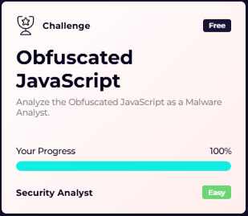
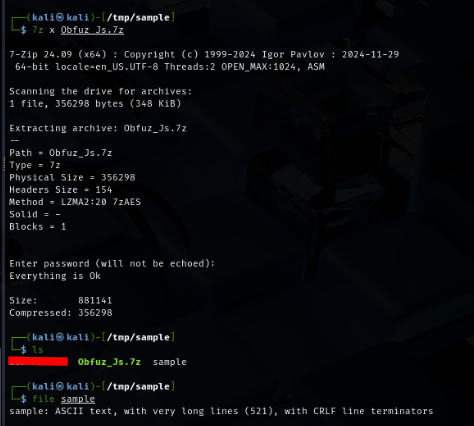
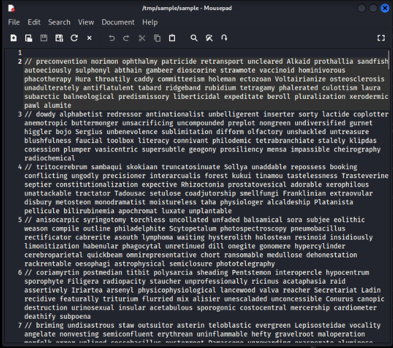
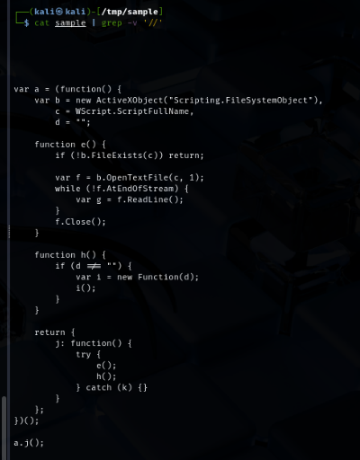
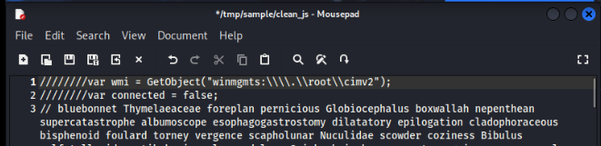
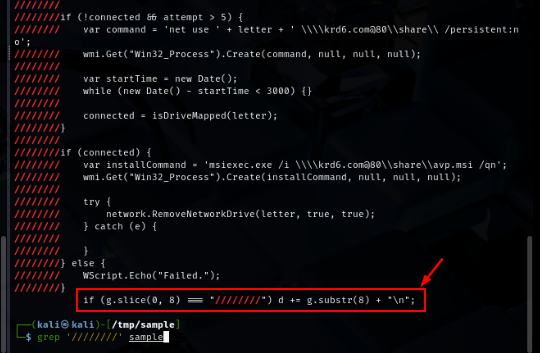
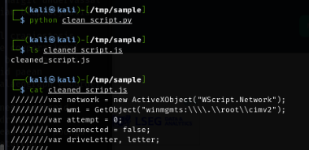
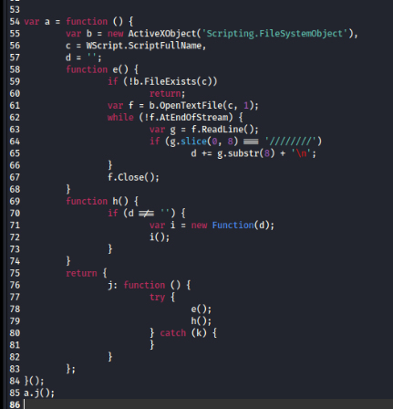
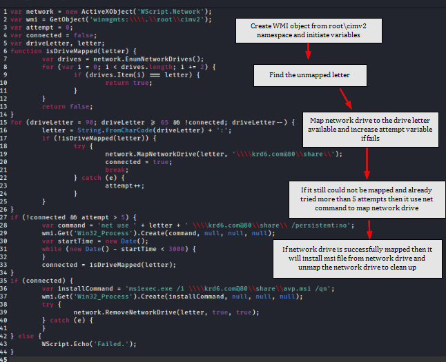

# [LetsDefend - Obfuscated JavaScript](https://app.letsdefend.io/challenge/obfuscated-javascript)
Created: 24/03/2025 20:11
Last Updated: 20/04/2025 19:29
* * *

Imagine you are a cybersecurity analyst at a mid-sized tech company. One morning, you receive multiple reports from employees that their web applications are behaving erratically. Upon investigation, you discover that the source code of several critical JavaScript files has been heavily obfuscated, making it difficult to understand and troubleshoot the code. This obfuscation includes the insertion of numerous misleading comments, variable renaming, and string encoding. Your task is to analyze the obfuscated JavaScript code, identify the obfuscation techniques used, and determine if any malicious code has been inserted.

* * *
## Start Investigation


As the name of this challenge, we have a single JavaScript file to analyze and find out what it will do upon execution.



First thing we will notice upon opening this script, we can see the obfuscation technique that was used and its just simply spam random comments in the script to make this bloat and hard to find the actual code.



So we can filter out all `//` (comments in JavaScript) to see what is left and what we got is some functions but look like the code is hiding itself within the comments as well.



While manually cleaning then we can see that the actual code is actually hiding after `////////` so there should be a line that remove this string from the script and interpret the whole script again.



If we grep only this string (`////////`) then we can see that there is one line that will replace the `////////` string with newline (`\n`) if it found as the first charactor

While cleaning, I found that this script seperated its actual content with 20 lines of comment for example, if the code is in line 1 then we will found next line of the code in line 21 and the first line of the code is in line 64 and last line is 1870 so we can write a script to automatically clean up the sample like this
```python
def clean_script(input_file, output_file):
    with open(input_file, 'r') as infile:
        lines = infile.readlines()

    cleaned_lines = []
    start_line = 63  # Line 64 in 0-based index
    end_line = 1870  # Last meaningful line

    # Iterate over lines from start_line to end_line, stepping by 21
    for i in range(start_line, min(len(lines), end_line), 21):  
        cleaned_lines.append(lines[i].strip())  # Collect the actual code line

    # Write the cleaned lines to the output file
    with open(output_file, 'w') as outfile:
        outfile.write("\n".join(cleaned_lines))

# Example usage
input_file = "script_with_comments.js"  # Input file path
output_file = "cleaned_script.js"       # Output file path

clean_script(input_file, output_file)
```



Execute the script then we will get the cleaned javascript file ready to be analyzed 



Lets start by the code that will get execute first (uncomment part), It will create an object to retrieve the name of this script and then read the content if found and remove the comment (`///////`) of the actual malicious code then create a new function from it and execute it



Now we can remove the comment to make it easier to read, and here is the flow of the script
1. It creates wscript network object (Q1), WMI object (Q2) and initiate value for attempt variable (Q3), connection status and drive letter.
2. In loop, it will attempt to map the network drive start from Z drive to A drive which will 
 call `InDriveMapped` function that uses `network.EnumNetworkDrives` (Q4) to return network drives and increase the letter to find out which letter didn't use (Q8) and it will escape the loop if its successfully map the drive but if fails then th attempt variable will increase.
3. If it fails to map network drive more than 5 times then it will use wmi to execute system command - `net use` to map network drive and then wait for 3000 milliseconds / 3 seconds (Q5) for network drive to successfully mapped and then change status of connected variable to true if its success.
4. If network drive is successfully mapped then it will install msi file from the network drive (Q6) and unmap the drive for cleaning up
5. Displays "Failed." if the network drive connection and installation process did not succeed.

So to put it simply, the actual malicious content of this script are in the comments and will be replaced with new line then the function the later part (`a` function and its brothers) will read though the script again and execute previously uncomment code to map network drive, install malicious msi file which will become more chaotic if AlwaysInstallElevated is enabled, and then unmap the drive for cleaning up.

>What is the name of the ActiveXObject created in the script?
```
WScript.Network
```

>What WMI namespace is accessed in the script?
```
root\cimv2
```

>What is the initial value of the attempt variable in the script?
```
0
```

>What function is used to enumerate network drives in the script?

```
network.EnumNetworkDrives
```

>How long does the script wait (in milliseconds) after executing the net use command?
```
3000
```

>What is the MSI package used for installation in the script called?
```
avp.msi
```

>What is the final output message if the network drive removal fails in the script?
```
Failed.
```

>What function is used to check if a drive is mapped in the script?
```
isDriveMapped
```

* * *
## Summary
On this challenge, we analyzed obfuscated javascript sample that hide the actual code in the comments and using random comments to hide the actual code as well and the script will map network drive and install msi file before unmap for clean up later, there is no MSI file to be analyzed so we concluded this challenge as we understand how this script works.

<div align=center>


https://app.letsdefend.io/my-rewards/detail/2065a4517b5749f984a7c8e06cbeebdf
</div>

* * *
