# [LetsDefend - Serpent Stealer](https://app.letsdefend.io/challenge/serpent-stealer)
Created: 11/04/2024 12:59
Last Updated: 30/04/2024 19:08
* * *
<div align=center>

Serpent Stealer

</div>
Located in the heart of the financial district, a leading multinational company was hit by a sophisticated data theft. Over several months, confidential customer data, proprietary software, and sensitive financial information were stolen. The company's cybersecurity team recently discovered that a "stealer" malware was responsible for the breach. They are analyzing the stealer and trying to protect the company from future attacks.

**File Location:** C:\Users\LetsDefend\Desktop\ChallengeFile\sample.7z
* * *
## Start Investigation
>What is the md5 hash for the malware?

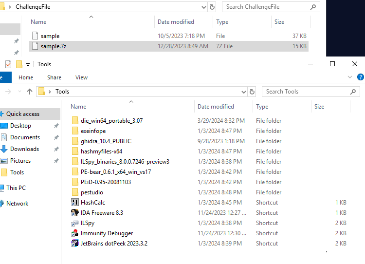
We got many tools to work with and it gave us a hint that this malware has to be a PE file
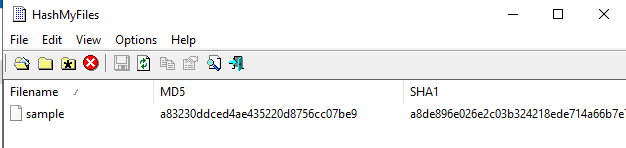
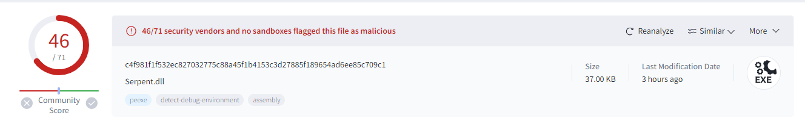
First, I calculated hash and confirmed its maliciousness and VirusTotal confirmed that this is Serpant Stealer.
```
a83230ddced4ae435220d8756cc07be9
```

>What is the name of the list the malware uses to evade detection by the VirusTotal check?

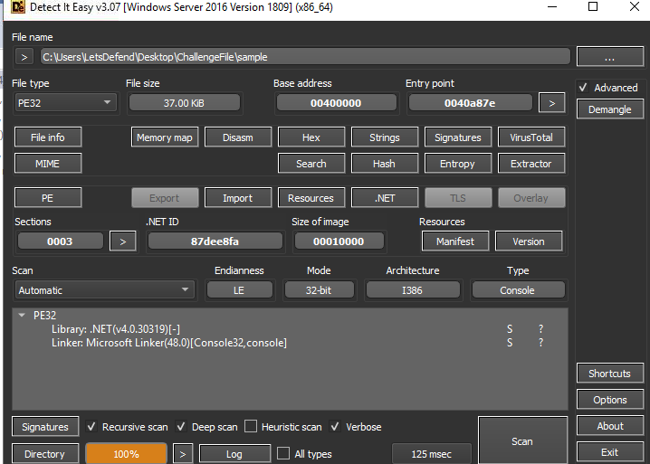
Before we putted it into any decompiler, I used DIE to scan this file 
As you can see that this malware is .NET based, and it's 32-bit PE library
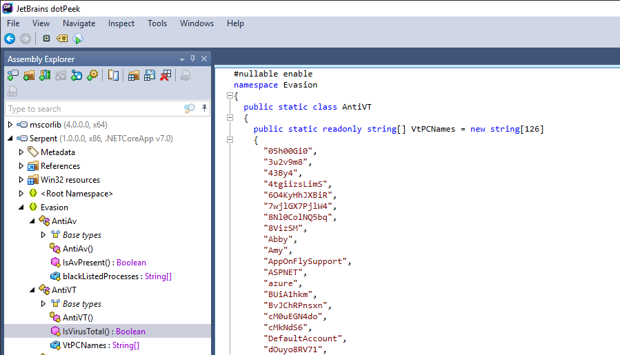
JetBrains dotPeek can help us decompile .NET based malware

Inside the Evasion namespace, there is a AntiVT function which has a list of VirusTotal PC name which when one of them was detected, this malware will sleep for 1 minute before exit 
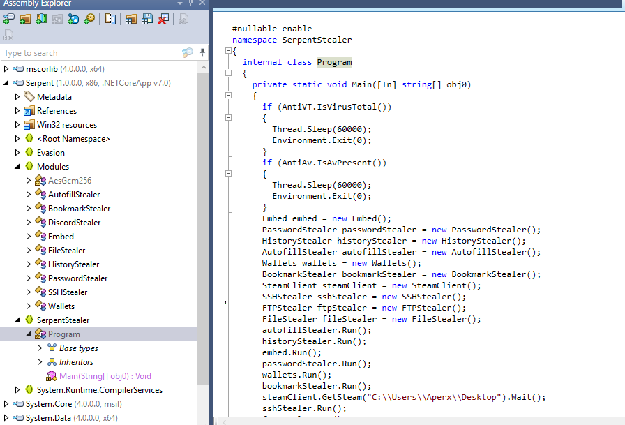(based on main function)
```
VtPCNames
```

>What is the name of the folder that was used by the malware to collect the password on it?

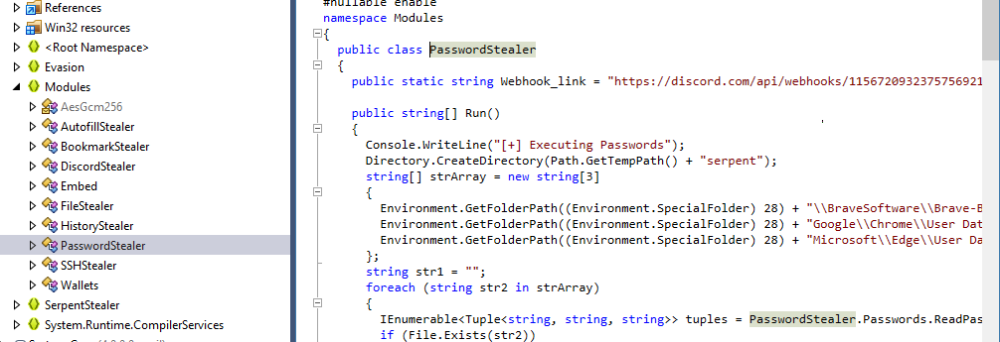
This malware will create directory inside temp directory then creates text file inside of it to store password collected on infected system
```
serpent
```

>What is the first command that the malware uses to bypass the User Account Control (UAC)?

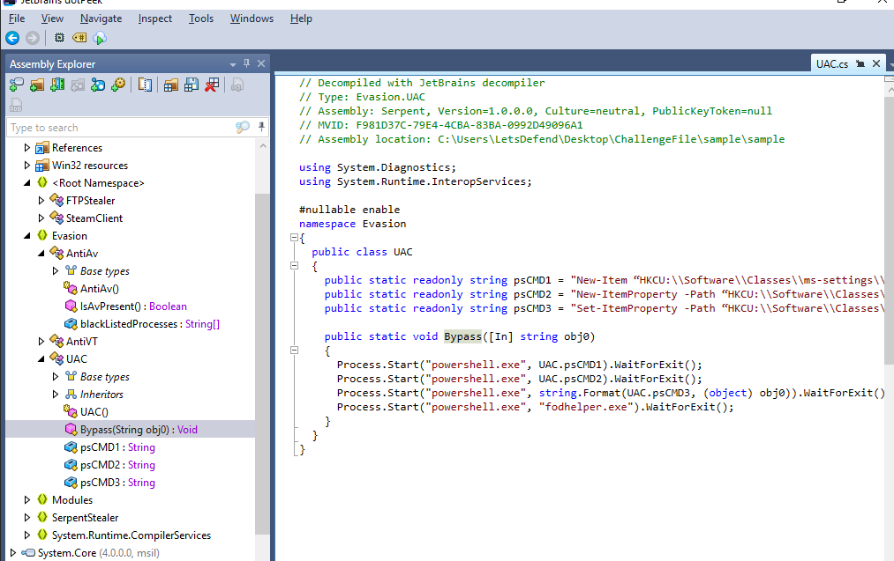
There is a function called Bypass inside Evasion.UAC and as you can see that there are 3 powershell commands that were declared on this class
```
New-Item “HKCU:\\Software\\Classes\\ms-settings\\Shell\\Open\\command” -Force
```

>How many file extensions does the malware target?

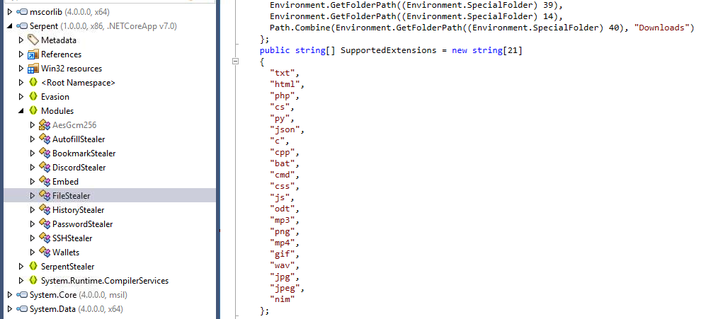
Go to FileStealer, you can see that a list of extensions was declares here with 21 extensions in total
```
21
```

>What is the first process listed in the blacklisted processes used by the malware?

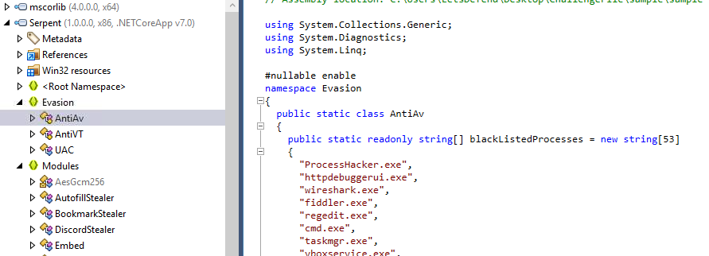
Inside AntiAv class, there is a list called `blackListedProcesses` that keep all processes that will detected this malware and if it detected anyone of them, it will exit after sleep for a minute
```
ProcessHacker.exe
```

>What is the last wallet name that is targeted by the malware on the list?

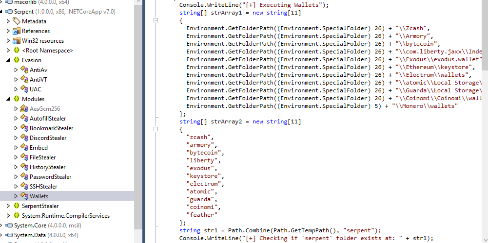
Inside Wallets, there are 2 lists were declared on this class
First one is the path of wallets and second is wallet name
```
feather
```

>After getting the current user, what is the subkey used by the malware to dump FTP credentials?

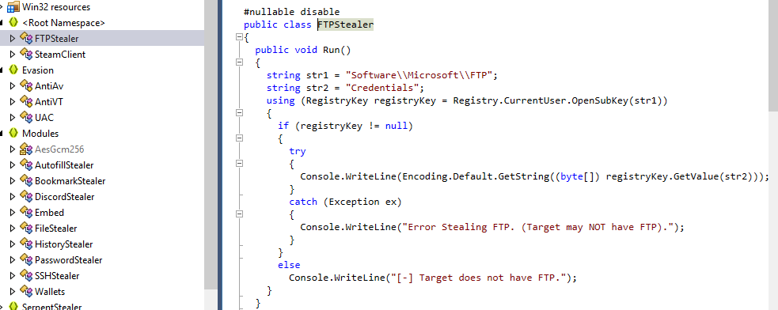
Inside Run function under FTPStealer class, there is a registry key that was assigned to a string and if this registry key is not null (exists), it will get the value of that key which hold credentials for FTP service
```
Software\\Microsoft\\FTP
```

* * *
## Summary

On this challenge, we got to analyze Serpent stealer which is .NET based malware that could be decompiled using JetBrains dotPeek then this challenge will walk us though many function that was created to evade detection and steal sensitive information on infected system.
<div align=center>


</div>

Here is a [resource](https://labs.k7computing.com/index.php/uncovering-the-serpent/) and analysis of serpent malware

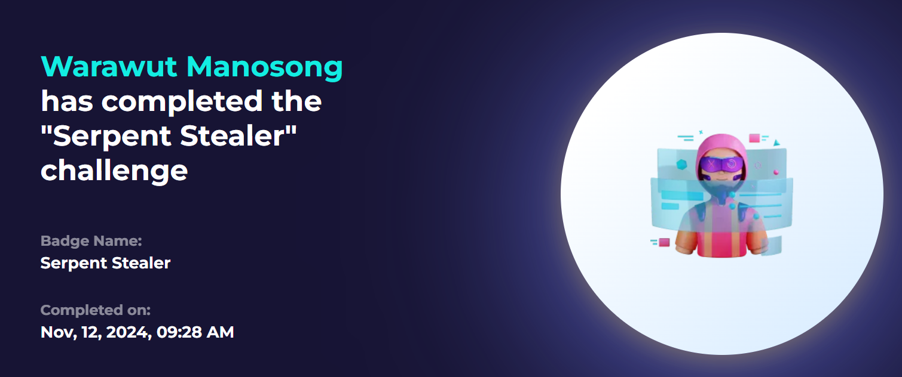
https://app.letsdefend.io/my-rewards/detail/deba5654-02a1-4e49-a91c-65ee076eeea0
* * *
