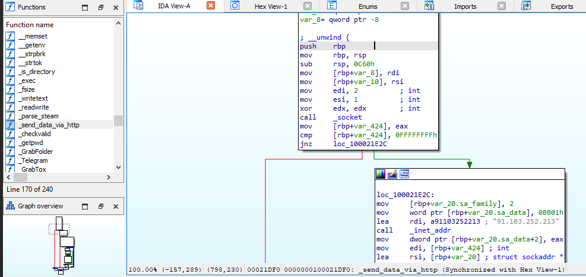

# [LetsDefend - macOS Malware](https://app.letsdefend.io/challenge/macos-malware)
Created: 02/04/2024 10:27
Last Updated: 02/04/2024 12:02
* * *
<div align=center>

**macOS Malware**

</div>
Mac StealthWare has recently emerged as a new and formidable threat in the world of MacOS security. Unlike typical malware, Mac StealthWare is highly sophisticated and uses advanced evasion techniques to avoid detection by traditional security measures.

The malware is typically distributed through malicious email attachments, fake software updates, or compromised websites. Unsuspecting users inadvertently download and run the malware, believing it to be legitimate software.

**File Location**: C:\Users\LetsDefend\Desktop\ChallengeFile\sample.7z

**File Password**: infected

* * *
## Start Investigation
>How many web browsers does this malware target for data extraction?

Lets start by looking at what we have before tackle sample file

We got **Detect It Easy** and 3 Debuggers here

I used Ghidra to decomplie so I can read C code which on main() function there are several string concatenates and string copy here 

After take a look at some function calls, this sample file/malware is some kind of a file grabber malware and its target several things on infected system.

These are 7 browsers I found from this function
- Google Chrome
- Firefox
- Brave
- Vivaldi
- Edge
- Opera
- OperaGX
```
7
```

>How many different cryptocurrency wallets are targeted by malware?


Still on main() function
After scroll down for a bit, I found 4 crypto wallets listed here so this malware targeting crypto wallets too
- Electrum
- Coinomi
- Exodus
- Atomic

```
4
```

>What is the specific part of the file path that follows the user's home directory that is related to Coinomi and is used by the malware?


```
Coinomi/wallets/
```

>What is the Telegram identifier that is used by malware?


There is a Telegram identifier here which mean after this malware gather all informations it designed for, maybe it will send them to a specific telegram chat
```
6N38VWS5BX.ru.keepcoder.Telegram
```

>What IP address is used by malware to send data over HTTP?

On Ghidra, you can go to Windows then Defined Data or Defined Strings to see which data or strings that have been assigned to varibles


Which I found an IP address from `send_data_via_http` function which indicate that it will use HTTP POST method and send data to this IP address.
```
91.103.252.213
```

>What is the offset of the function used to grab chromium?
**Answer Format**: 0x*********


I used `Chro` in a Filter inside Ghidra and found `SearchAndGrabChromium` function which explains itself what it will do 

I opened sample file on IDA Freeware and find this function, which will be easier to get an offset than Ghidra in my opinion.
```
0x100022DF0
```

>What is the offset of the “send_data_via_http” function used by the malware?
**Answer Format**: 0x*********


Just find this function on IDA Freeware and then you're good to go
```
0x100021DF0
```
>What command is used by the malware to obtain information about hardware components on the MacOS system?


There is a function called `userinfo`, I was curious what it is and then I found that this malware execute this command to get handware information on executed host.
```
system_profiler SPHardwareDataType
```
* * *
## Summary

After take a look at this malware, look like its an infostealer malware that targeted macOS by grabing files and cryptocurrency wallets from specific browsers then compress it and send to specific IP address.
<div align=center>


https://app.letsdefend.io/my-rewards/detail/83079f762a61485390bf7be5287752a7
</div>

* * *
