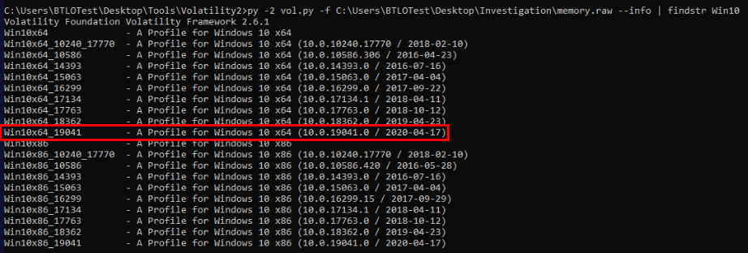
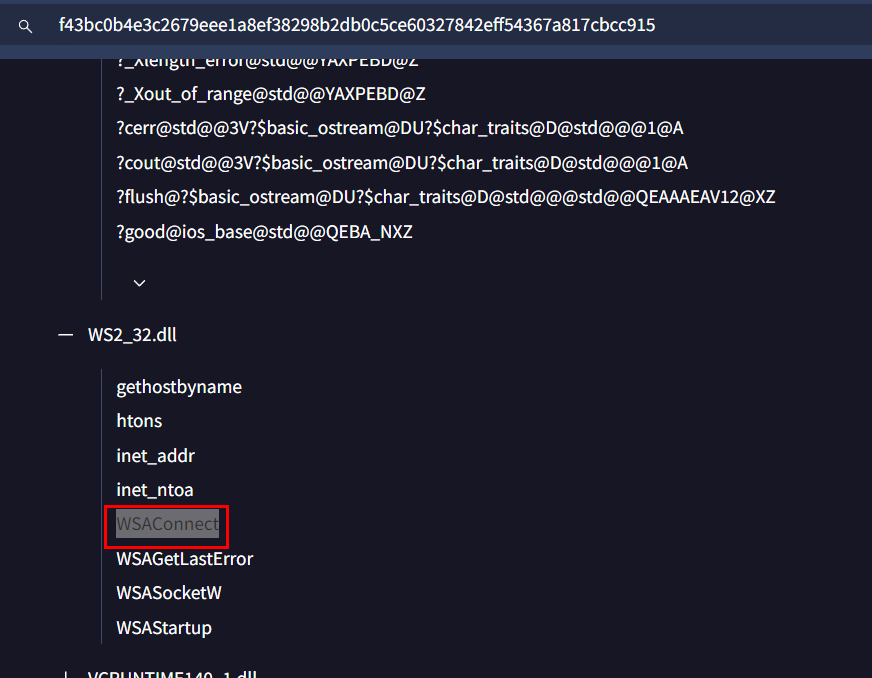
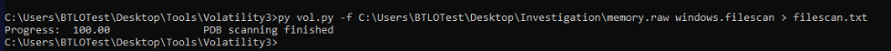

# [Blue Team Labs Online - Masquerade](https://blueteamlabs.online/home/investigation/masquerade-d41fa429f3)

Omar's USB drive might be the cause of the breach; Your task is to analyze these artifacts and determine exactly what happened.

>Digital Forensics

>**Tags**: Volatility 3, Registry Explorer, ShellBags Explorer, MFTECmd, Timeline Explorer, CyberChef, Notepad++, IDA, Strings, T1071, T1486, T1059.001, PR010.001,
* * *
**Scenario**
Allam, a senior infrastructure engineer at EZ-CERT, is known for hosting his annual "Haunted Festival" every Halloween. This year, during the event, a man named Omar approached Allam, asking if he could project something from his USB drive to enhance the party's spooky atmosphere. A day or two after the festival, Allam discovered that all his files had been encrypted, leaving him unable to access his data. Suspecting Omar's USB drive might be the cause; Allam has provided several digital artifacts for investigation. Your task is to analyze these artifacts and determine exactly what happened.
* * *
## Investigation Submission
>Q1) As you start piecing together the events from the festival, you notice that a USB device was connected to Allam's machine. What is the serial number of this USB device? (Format: XXXXXXXX)

We were provided with artifacts from C drive and memory dump of infected machine and we have several tools to use but as the note on the desktop telling us that not all tools will be used, just pick your favorite/handy one. 

To find out serial number of USB device, we have to read a specific key (USBSTOR) from SYSTEM registry hive and if we use registry explorer then it already bookmarked this registry for us which we can get serial number of the only USB storage device connected to this system right here.

  
Answer

<pre><code>UM2I126E</code></pre>

>Q2) To narrow down the timeline. When Omar’s USB drive was first plugged into Allam’s computer. What exact time does it show? (Format: YYYY-MM-DD HH:MM:SS UTC)

Get Installed or Last Connected time to answer this question.

  
Answer

<pre><code>2024-08-21 08:50:12 UTC</code></pre>

>Q3) Digging deeper into the details of the connected USB, you’ll need to identify its manufacturer. What is the vendor ID of this device? (Format: XXXX)

At first, I used this [website](https://the-sz.com/products/usbid/index.php?v=&p=&n=JetFlash) to search for vendor ID

Then I also find out that we can also find this value from USB registry key right here.

  
Answer

<pre><code>8564</code></pre>

>Q4) Knowing which drive letter was assigned to the USB can help trace its activity on the system. Which drive letter did the operating system assign to Omar’s USB? (Format: X:\)

We can check value inside "MountedDevices" key which also stores the drive letter of each mounted storage on Windows.

  
Answer

<pre><code>E:\</code></pre>

>Q5) Upon examining the contents of the USB drive, you find several files and directories. Name two folders that were present on Omar's USB. (Format: Folder1, Folder2)

Time for ShellBag which used to store information about user preferences and interactions with folders in the file system so if user opened any folders inside that USB devices then it will be stores in ShellBag and that ShellBag is stored in UsrClass registry hive for each user right here. 

Then we can see 2 folders that were present of this USB.

  
Answer

<pre><code>Backup,Images</code></pre>

>Q6) It seems Allam opened a file from Omar’s USB, mistaking it for a harmless video. What is the name of the file he opened? (Format: File Name)

Next artifacts that could be utilized is Jump Lists located here.

Use `JLECmd.exe` to parse "AutomaticDestinations" folder

Then we could see a PowerShell script mimic as MP4 video was opened by this user.

  
Answer

<pre><code>Scary_Videos.mp4.ps1</code></pre>

>Q7) To see when Allam interacted with the USB. When did he open the suspicious file, believing it to be just a video? (Format: YYYY-MM-DD HH:MM:SS)

Go to Target Accessed field to get the answer of this question

If you prefered GUI, you can use JumpList Explorer to find out the answer like this.

  
Answer

<pre><code>2024-08-21 09:33:04</code></pre>

>Q8) Analyzing the method used to disguise the malicious file, refer to the MITRE ATT&CK framework. What is the ID for the technique the attacker utilized? (Format: TXXXX.XXX)

This is a [technique](https://attack.mitre.org/techniques/T1036/005/) utilized by this malicious file 

  
Answer

<pre><code>T1036.005</code></pre>

>Q9) After opening the deceptive file, Allam’s machine initiated a download. Trace the network activity to find the full URL of the downloaded file. What is the full URL of the downloaded file? (Format: Full URL)

This is a little bit tricky, I started from parsing prefetch with PECmd then open it with Timeline Explorer.

Which I found certutil was executed after PowerShell and conhost so the malware might use certutil to download file from C2. 

Cerutil stores both content and metadata inside CryptnetUrlCache folder under `%AppData&\LocalLow\Microsoft\` so lets navigate to this folder.

There, we will found 2 files with has 43 KB and 71 KB size so lets confirm which one appear more suspicious.

I started with 43 KB file which we can see that it has MZ header which mean this file is PE32 executable file.

Go take a look at metadata of this file but we have to used strings or put it in CyberChef to make it appear more friendly to us.

And there we got URL that resemble C2 address which is the correct answer of this question.

  
Answer

<pre><code>http://3.121.78.204/ntshrul.dll</code></pre>

>Q10) Now that you have the URL, where did this file end up on the system? provide the full path. (Format: Full Path)

Next artifact I utilized is $MFT. 

Then we can see that this file was renamed and place it inside XPS Card Printer folder probably for DLL hijacking.

  
Answer

<pre><code>C:\ProgramData\Datacard\XPS Card Printer\Service\DEVOBJ.dll</code></pre>

Upon opening result from MFTCmd, we could see a lot of this weird note which might be a ransom note. 

>Q11) To ensure the integrity of your findings, calculate the SHA1 hash of the downloaded file on Allam’s system. What is the hash value? (Note: if you got the hash from anywhere else than the triage image, it won’t work.) (Format: SHA1 Hash)

Lets calculate this hash using lolbas like certutil.

  
Answer

<pre><code>309550407116c6d0f68dfd62d014e4a33001dac5</code></pre>

Then if we searched this on VirusTotal, we could see its metasploit payload so this might actually be DLL hijacking attack.

>Q12) The attacker here exploited a vulnerable service on the machine to escalate his privilege on the machine. What is the CVE that he used? (Format: CVE-XXXX-XXXXX)

Upon searching for this service [CVE](https://github.com/pamoutaf/CVE-2024-34329/blob/main/README.md), its quite new but it is indeed confirm that its DLL  that lead to local privilege escalation to SYSTEM.

  
Answer

<pre><code>CVE-2024-34329</code></pre>

>Q13) Reviewing the privilege escalation technique used by the attacker, What is the MITRE ATT&CK technique ID that describes this method? (Format: TXXXX.XXX)

This technique is known as "[DLL Search Order Hijacking](https://attack.mitre.org/techniques/T1574/001/)" by MITRE ATT&CK

  
Answer

<pre><code>T1574.001</code></pre>

>Q14) To analyze the memory dump effectively, identify the profile image that matches the system’s configuration. What profile image does the memory dump correspond to? (Format: WinXXxXX_MinorVersion)

Its time to analyze memory dump and to make our profile searching easier, we can use `windows.info` plugin from volatility 3 to determine architecture, major and minor version of Windows.

Which we will have this profile perfectly matched the result found from volatility 3

  
Answer

<pre><code>Win10x64_19041</code></pre>

>Q15) During your investigation, you find that the malicious file was injected into a legitimate process. What is the Process ID (PID) of this process? (Format: XXXX)

Upon running any command with volatility 2, you will find this errors so just to make sure you don't use any of these plugins and if you have to then you will need to find the plugin equivalent to them in volatility 3.  

And well.. `malfind` did not work on this one so I had to use another plugin.

Then the plugin that saved me on this one is `netscan` which we can see suspicious connection to C2 on port 1234 and the process responsible for this action is PID 2620 

  
Answer

<pre><code>2620</code></pre>

>Q16) Trace the timeline further to pinpoint, When the malicious file was loaded into the legitimate process? (Format: YYYY-MM-DD HH:MM:SS)

Since we already knew which DLL that was loaded and the process that connected C2 that we can use `dllist` plugin and specific PID 2620 to find loaded time of this dll right here.

  
Answer

<pre><code>2024-08-21 14:17:24</code></pre>

>Q17) What is the memory address representing the starting point of the malicious file loaded into the legitimate process? (Format: 0xXXXXXXXXXXXX)

We have to use `vadinfo` plugin for this one which we can see both starting point and ending point of this malicious file right here.

  
Answer

<pre><code>0x7ff8500a0000</code></pre>

>Q18) What is the IP address and port number of the Command and Control (C2) server the malware connects to? (Format: IP Address:Port)

  
Answer

<pre><code>3.17.35.28:1234</code></pre>

>Q19) What is the name of the function within the malicious file that initiated the connection to the C2 server? (Format: Function Name)

Since we already have the payload from certutil then we could use IDA to find out the function that was used to initiate connection to C2 and to reduce our scope of finding, WSAConnect is the API used to establish a connection between a client socket and a remote server

Then after find out this API, right click then click "Xrefs graph to.." to find cross reference to this API

Then we could see a function that calls this API which is `extern_c`

There we will find weird string along with C2 IP address in this function.

  
Answer

<pre><code>extern_c</code></pre>

>Q20) What was the first command the attacker executed after gaining SYSTEM access on Allam's machine? (Format: Command Name)

Used the output of prefetch parser to find the any executable that was executed after malicious dll was loaded which is `systeminfo.exe` 

  
Answer

<pre><code>systeminfo</code></pre>

>Q21) Lucky for us, the machine that Allam was using for projecting at the festival wasn’t connected to the EZ-CERT Network. Unable to find valuable data, the attacker downloaded another file which resulted in the encryption of the entire system. What is the full URL of this file? (Format: Full URL)

This one is a little bit tricky but when we use `pstree` plugin, we could see `conhost.exe` and `cmd.exe` under injected process so we have to dump `conhost.exe` (not process dump but memory dump) since conhost stores all command executed by `cmd.exe` in its memory.

After using `strings` on dumped file, then we will find this PowerShell executed base64 command which is why we couldn't use strings with regex to get url from memory dump directly. 

Decode it then we will have URL that hosted ransomware.

  
Answer

<pre><code>http://3.71.5.114/LBB.exe</code></pre>

>Q22) Identify the exact moment the ransomware was executed on Allam’s system. When did this happen? (Format: YYYY-MM-DD HH:MM:SS)

Looking at this process tree again then you will find this weird process with `.tmp` extension was executed after the threat actor obtained SYSTEM privilege so it has to be this process.

  
Answer

<pre><code>2024-08-21 14:24:09</code></pre>

>Q23) Tracking the ransomware process in Allam’s machine. What is the PID of the ransomware process? (Format: XXXX)

  
Answer

<pre><code>2148</code></pre>

>Q24) Dump the ransomware process to the disk, What is the SHA256 hash of the .img file that is associated with the ransomware process that was active on the machine? (Format: SHA256 Hash)

We could not use `filescan` right away due to Unicode encoder error so we will have to check this Beta box for UTF-8 encoding then restart the machine (not terminate but restart)

Then we could be able to use `filescan` plugin to find the path of this file 

along with physical offset of this file right here.

Generate filehash of this file to submit.

  
Answer

<pre><code>328786bf6dba5b29008e0469e0b972ce6062a08e37e02c5739c297466214db11</code></pre>

>Q25) Determine the type of ransomware that was used in this attack. What is the family name of the ransomware? (Format: Family Name)

Search this filehash on VirusTotal then we can see that it is an infamous lockbit ransomware!

  
Answer

<pre><code>lockbit</code></pre>

https://blueteamlabs.online/achievement/share/52929/238

And that's concluded my BTLO Halloween right here! Thanks for reading !
* * *