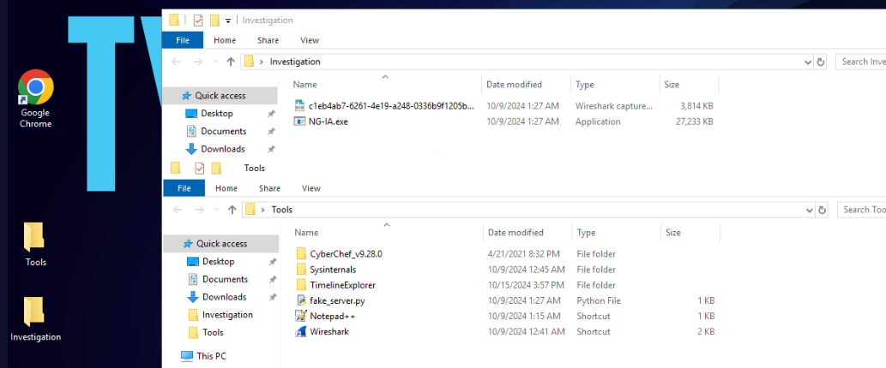
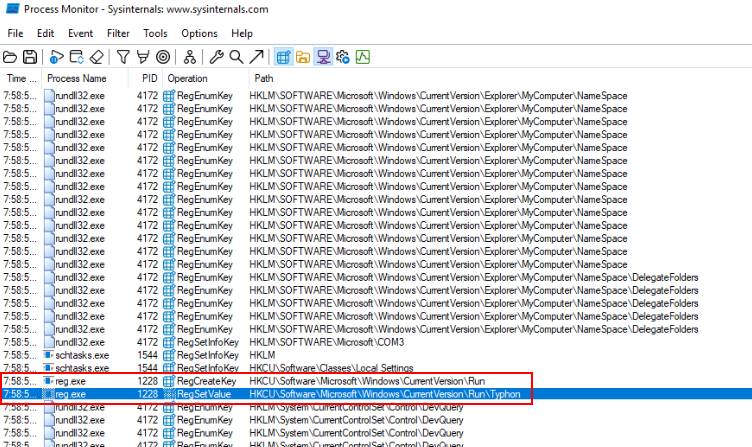

# [Blue Team Labs Online - Typhon](https://blueteamlabs.online/home/investigation/typhon-339cc99cba)

A few nights ago, I downloaded a program called NG-IA.exe from a sketchy forum. If anyone knows how to stop the pop-ups, please help me. I’m running out of options.

>Indicent Response

>**Tags**: Procmon, Timeline Explorer, Wireshark, Process Explorer, TA0003, T1569.002, T1567, T1564.001
* * *
**Scenario**
I made a terrible mistake. A few nights ago, I downloaded a program called NG-IA.exe from a sketchy forum. It was advertised as a ‘Next-Gen AI tool’ that could automate my tasks. But ever since I ran it, things have changed in ways I can't explain. One time, when I ran it, nothing seemed to happen—luckily, I managed to capture the network traffic during that attempt. Now, it reappears every time I think I’ve removed it like it knows exactly what I’m trying to do. If anyone knows how to stop this, please help me. I’m running out of options.
* * *
## Investigation Submission

This challenge provides with pcap file and malware inside "Investigation" folder and we have sysinternals to use which mean its dynamic malware analysis time. 

Upon executed provided malware, There are a lot of ghost pop-up appeared and the only way to kill it is to kill `svchost.exe` process that is not the legitimate one.

But is that all? I don't think so, Shall we start our investigation for real?

>Q1) What is the domain and the IP address that the program attempts to connect to? (Format: Domain,IP)

Then lets get the domain and IP address this program attempts to connect to from pcap file first.

  
Answer

<pre><code>www.b4s1lisk.xyz, 159.65.12.25</code></pre>

>Q2) What is the HTTP request path and the encoded string returned in the response when the program communicates with the server? (Format: Path,String)

Then we could see a path along with body that was sent from C2

FYI, its base64 encoded but this question just asked for base64 string.

  
Answer

<pre><code>/join, U3RvbmVHbGFyZSA=</code></pre>

>Q3) Try to mimic the server response. There is a script under the Tools section that you can use, but you will need to make some modifications before it works. Consider how the program locates the server and how you might redirect it to your script. Once this is done, the binary will extract multiple files. What is the name of the DLL that is extracted? (Format: Filename)

First lets analyze this script first, then we can see that it will mimick C2 server by sending HTTP 200 response with string we found back to malware (this is edited script, you need to edit these 2 yourselves)

Then do not forget to add this domain to our hosts file.

Execute this script then execute malware again (this time with ProcMon capturing events), we could see that this script worked as intended.

And we can also see `conhost.exe` under `spoolsv.exe` which is impossible in normal circumstance which make this a process created by malware.

To make our life easier, add malware process ID and malware process name to our filter so we can only find it from those million events.

Lets add PID of malware as parent process ID filter.

Then we can finally see `rundll32.exe` (Q4) were used to executed `typhon.dll` under user temp folder.

  
Answer

<pre><code>typhon.dll</code></pre>

>Q4) Which LOLBAS is leveraged to execute the DLL? (Format: LOLBAS Name)

  
Answer

<pre><code>rundll32.exe</code></pre>

>Q5) During the first execution of the DLL, a specific function is called, and a file is dropped. What is the name of this function, and what is the name of the dropped file? (Format: Function,Filename)

Since malicious dll was dropped on user temp folder than should the other files too which we can see other 2 files dropped on the same directory

Navigate to this folder, we will see more files that were actually dropped by this malware.

Inside "vipera" folder is a text file that log our keystroke (keylogger)

Lets go back to see which command dropped `spoolsv.exe` then we can see a function that dropped this malware right here.

  
Answer

<pre><code>yurei, spoolsv.exe</code></pre>
<pre><code></code></pre>

>Q6) The program replicates itself in a hidden directory. What is the name of the replicated file, and what is its MD5 hash? (Format: Filename,Hash)

From user temp directory, We also found `dwm.exe` file that has the identical size of the malware and after calculated hash of both files, we can confirm that `dwm.exe` is indeed a replica of malware.

  
Answer

<pre><code>dwm.exe, 2C21D810BDD449C3668092AC62B3B896</code></pre>

>Q7) Which LOLBAS does the binary use to execute the DLL in the background repeatedly, and what is the name of the scheduled task it creates? (Format: LOLBAS, TaskName)

We can open Task Scheduler window to find out the answer of this question right away then we will see this task will execute every 2 minutes and the exe that responsible for task is `schtasks.exe`

  
Answer

<pre><code>schtasks.exe, TenguTask</code></pre>

>Q8) After the command is executed repeatedly in the background, the program attempts to upload a file to a specific online storage service. What is the name of this service? (Format: Storage Service Name)

Intended way probably used strings on `typhon.dll` but I solved it by guessing😂, it was a dropbox

  
Answer

<pre><code>dropbox</code></pre>

>Q9) To maintain persistence, under which registry key does the binary create an entry? (Format: Registry Key)

Then we will see the registry key that will be added which is HKCU run key and the name of the key created under this key is "Typhoon" (Q10)

The executable that added to this key is a replica of the malware inside user temp folder.

  
Answer

<pre><code>HKEY_CURRENT_USER\Software\Microsoft\Windows\CurrentVersion\Run</code></pre>

>Q10) What is the name of the registry entry added? (Format: Entry Name)

  
Answer

<pre><code>Typhon</code></pre>

Another way that could aid this investigation is to install sysmon provides in Sysinternals folder.

Which we could see that it also logged commands executed by this malware. so choose the tool you know might be the way that make this investigation easier.

https://blueteamlabs.online/achievement/share/52929/241
* * *