# [TryHackMe - Benign](https://tryhackme.com/room/benign)
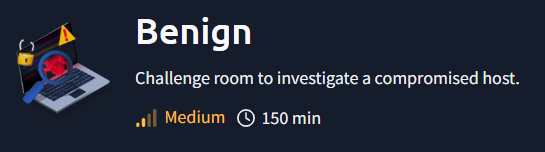
***
One of the client’s IDS indicated a potentially suspicious process execution indicating one of the hosts from the HR department was compromised. Some tools related to network information gathering / scheduled tasks were executed which confirmed the suspicion. Due to limited resources, we could only pull the process execution logs with Event ID: 4688 and ingested them into Splunk with the index **win_eventlogs** for further investigation.

**About the Network Information**

The network is divided into three logical segments. It will help in the investigation.

IT Department
- James
- Moin
- Katrina

HR department
- Haroon
- Chris
- Diana

Marketing department
- Bell
- Amelia
- Deepak
* * *


After deploying the machine and attackbox, we can access the Search page of the Splunk web interface on http://$IP/en-US/app/search/search directly and now we are ready for an investigation.

>How many logs are ingested from the month of March, 2022?

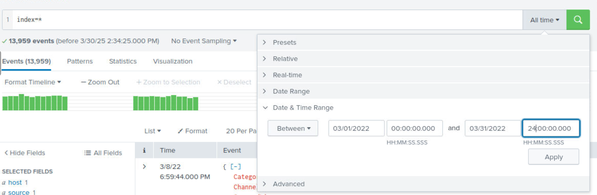

Since we only have `win_eventlogs` as log source so we can just query with `index=*` to display everything and then we can specify the time range like this to focus on all the events occurred during March 2022 

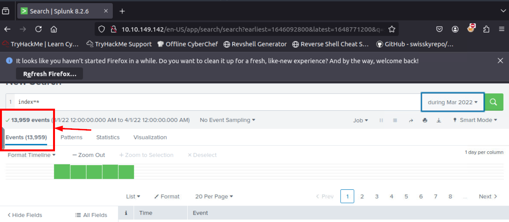

And turn out, all 13,959 events are happened during March 2022 

```
13959
```

>Imposter Alert: There seems to be an imposter account observed in the logs, what is the name of that user?

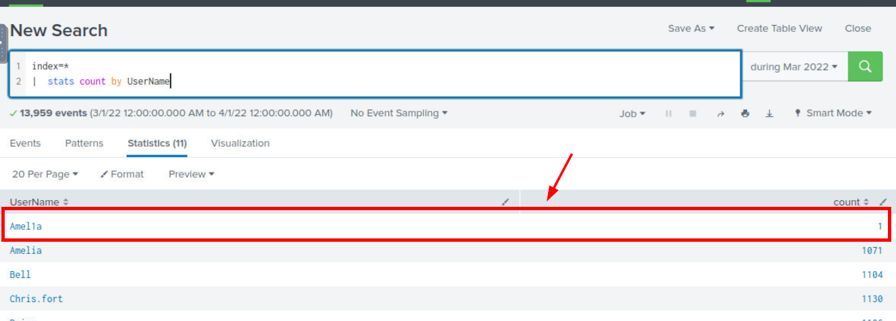

With `index=* | stats count by UserName` that will count all **UserName** and display in the table as shown in the image above, we can see that there is Imposter account that mimick Amelia user with the name **Amel1a**

```
Amel1a
```

>Which user from the HR department was observed to be running scheduled tasks?

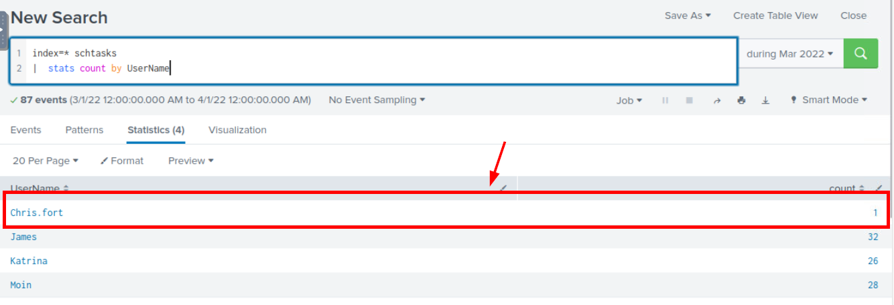

With `index=* schtasks | stats count by UserName` query which reduced our scope to event with "schtasks" keyword only which is the process/execuable name of schedule task on Windows and display total number of **UserName** presented by this query and we can see that there is only a single user from HR department that executed schedule task which is uncommon behavior that needed to be investigate further

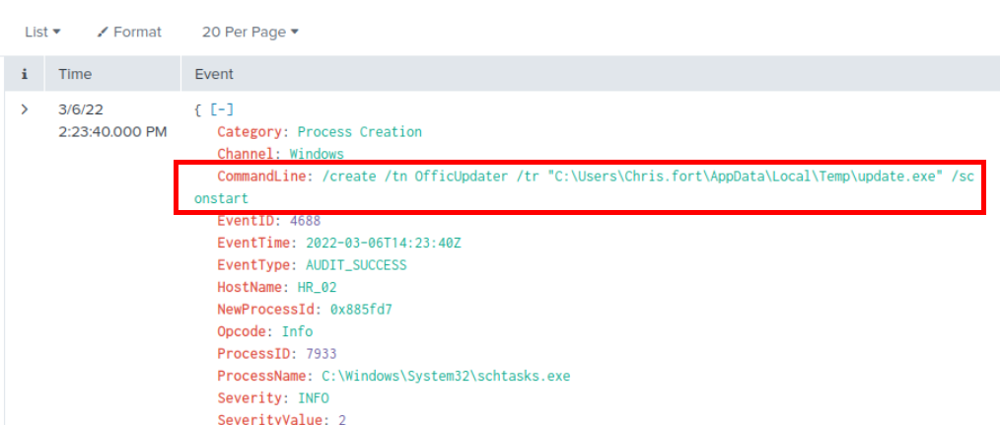

Using `index=* schtasks UserName=Chris.fort` query, we can see that schedule task executable was executed to create **OfficeUpdater** task which will execute `C:\Users\Chris.fort\AppData\Local\Temp\update.exe` on startup and this path is common path for malware to be dropped and executed.

```
Chris.fort
```

>Which user from the HR department executed a system process (LOLBIN) to download a payload from a file-sharing host.

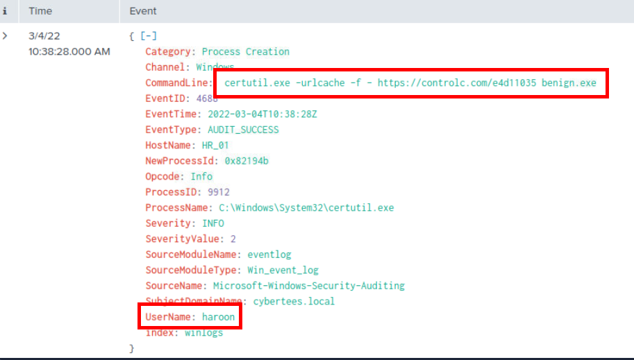

When it comes to LOLBIN that can be used to download file on Windows, [certutil.exe](https://lolbas-project.github.io/lolbas/Binaries/Certutil/) has to be the most favorite and the most popular one out there which after we queried with `index=* certutil.exe` then we will have a single event from this query which is the one we are looking for.

From the event, we can see that haroon user from HR department executed certutil to download file from `https://controlc.com/e4d11035` and saved file as `benign.exe`

```
haroon
```

>To bypass the security controls, which system process (lolbin) was used to download a payload from the internet?
```
certutil.exe
```

>What was the date that this binary was executed by the infected host? format (YYYY-MM-DD)
```
2022-03-04
```

>Which third-party site was accessed to download the malicious payload?

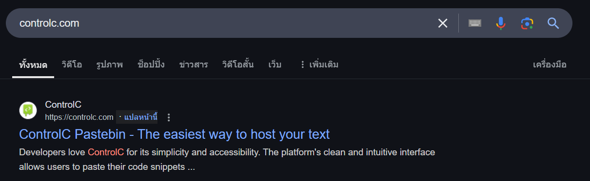

ControlC is the website that can host text which mean whatever host on this website is not malicious binary so what being download then?

```
controlc.com
```

>What is the name of the file that was saved on the host machine from the C2 server during the post-exploitation phase?
```
benign.exe
```

>The suspicious file downloaded from the C2 server contained malicious content with the pattern THM{..........}; what is that pattern?

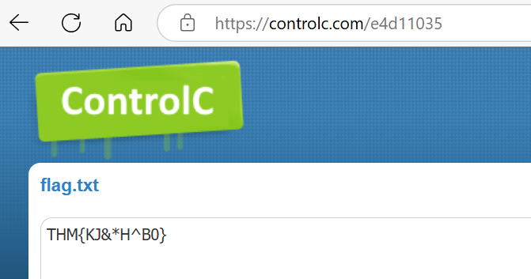

By accessing the [url](https://controlc.com/e4d11035) directly, we will see that this website host a flag of this room which just happened to be the answer of this question.

```
THM{KJ&*H^B0}
```

>What is the URL that the infected host connected to?
```
https://controlc.com/e4d11035
```

And... we are done? no more digging? alright..
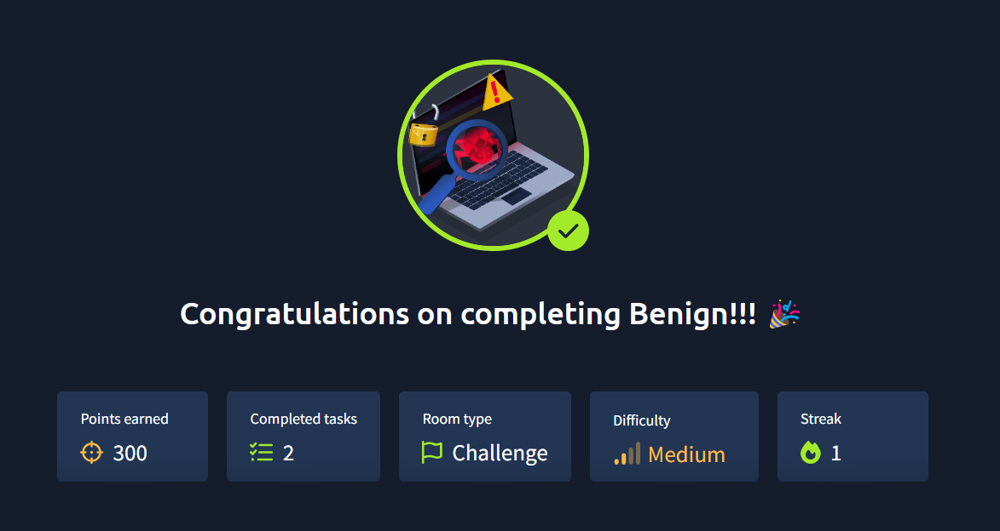
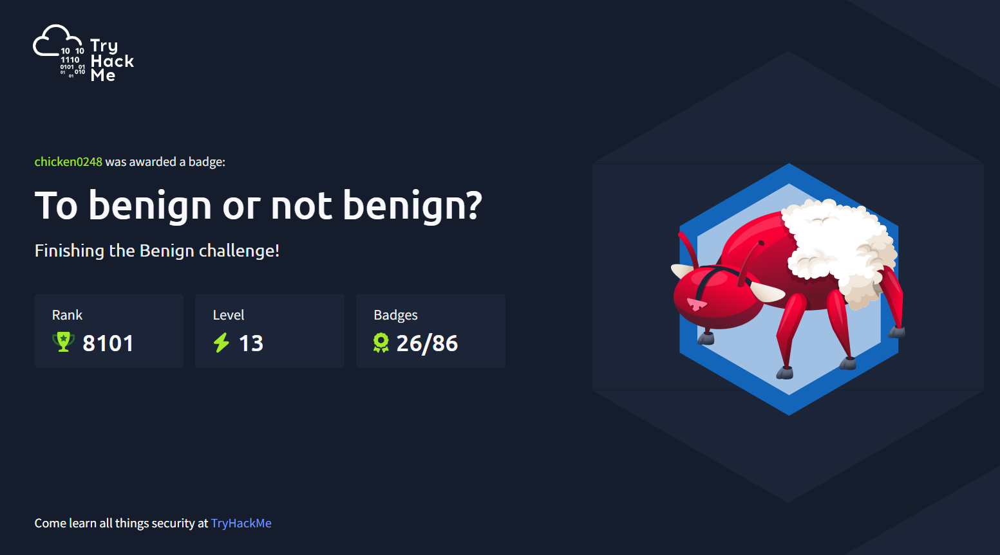
https://tryhackme.com/chicken0248/badges/to-benign-or-not-benign
***