# [TryHackMe - Blizzard](https://tryhackme.com/room/blizzard)

***
[toc]
***
## Introduction: Analysing the Impact
Health Sphere Solutions, a healthcare systems provider on the path to expansion, is taking its first steps towards fortifying its infrastructure security. With the rise of cyber threats, particularly the emergence of Midnight Blizzard, a sophisticated threat group targeting the healthcare sector, the company recognizes the urgent need to protect sensitive customer data.

Midnight Blizzard, a notorious threat group, has been implicated in cyber-attacks against healthcare providers. Employing ransomware and phishing tactics, this group has successfully breached healthcare systems, causing significant data loss and operational interruptions.

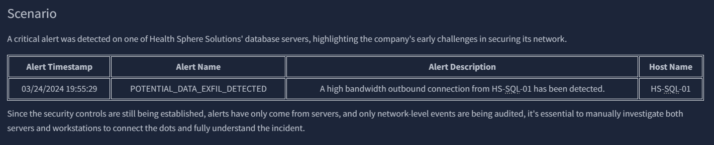

**Investigation Guide**

As part of your playbook, you are tasked to determine the following information during the investigation:

- Determine any unusual login attempts to the database server.
- Note any suspicious binaries executed within the server.
- Look for typical persistence mechanisms deployed in the server.

The IT team has also shared that the infected database server is set up for internal access only and is not yet linked to other systems, as it is still in the setup phase. This information could help narrow down potential sources of the threat.

> When did the attacker access this machine from another internal machine? (format: MM/DD/YYYY HH:MM:SS)

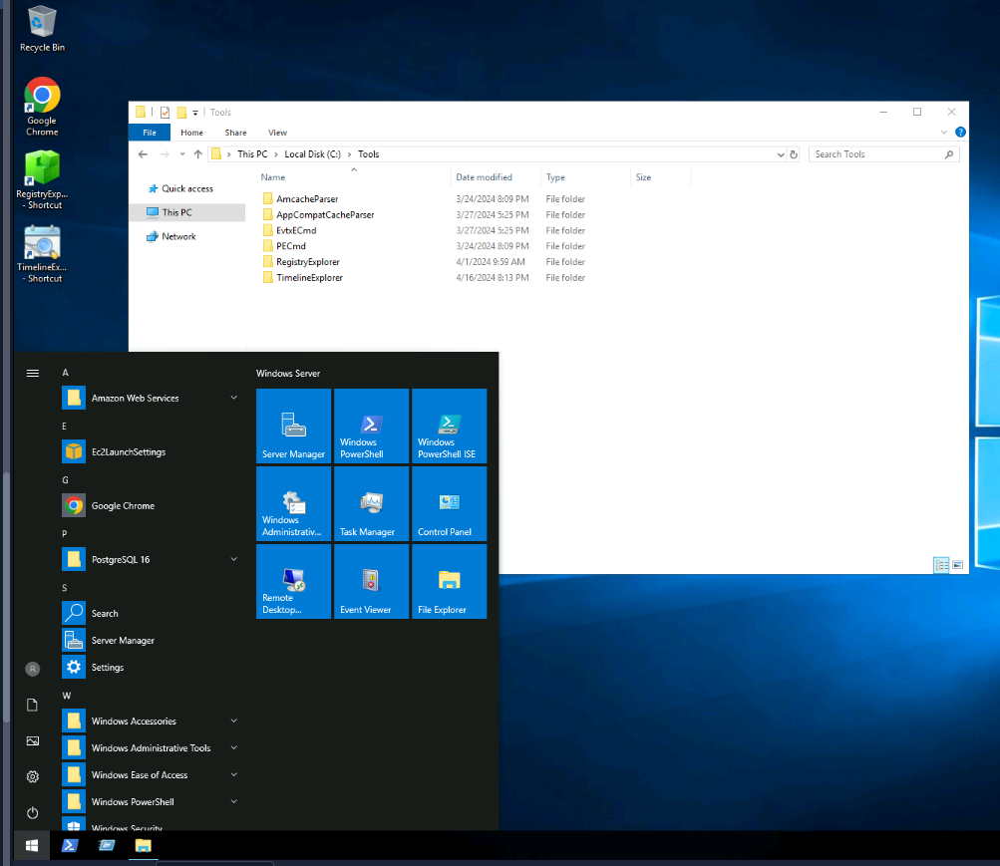

In this room, we have to investigate 3 separated compromised machine and in this section, we are going to investigate database server based on the alert that triggered on 24 March 2024 

And by looking at all the tools available for us, seem like we have to parse some registry, get evidence of execution, as well as log parsing.

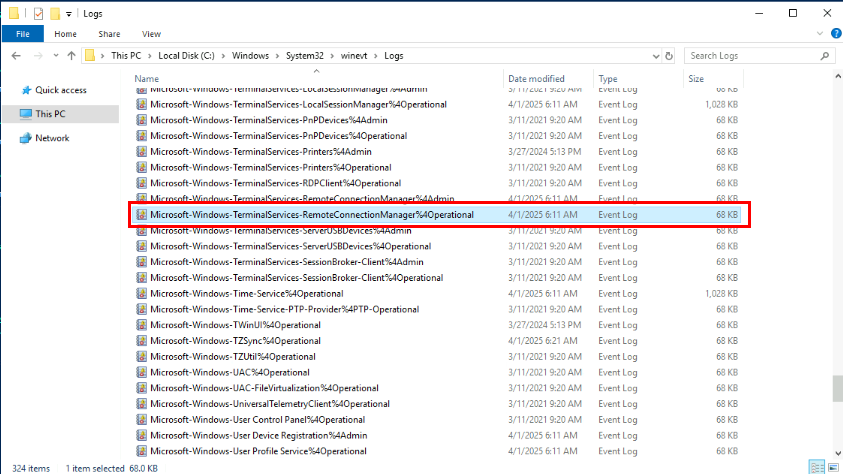

Since I could not differentiate between normal authentication and malicious one yet so i shifted my focus on RDP log right here.

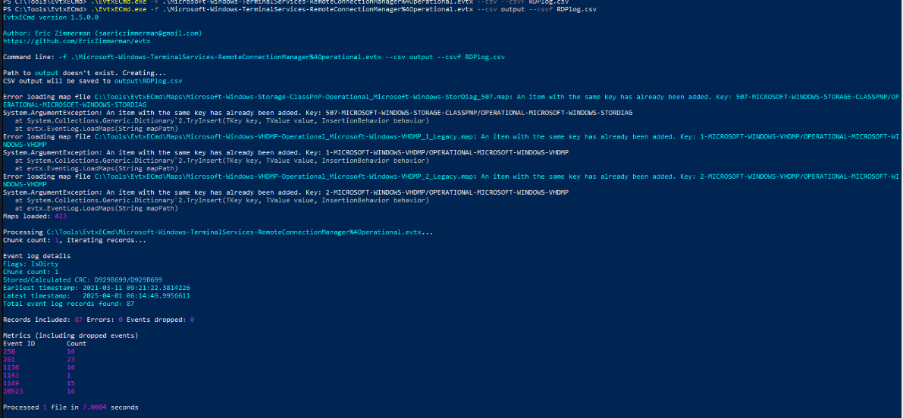

To make life easier, I used EvtxECmd with ` .\EvtxECmd.exe -f .\Microsoft-Windows-TerminalServices-RemoteConnectionManager%4Operational.evtx --csv output --csvf RDPlog.csv` command to parse RDP log to csv file which I can use Timeline Explorer to open it.

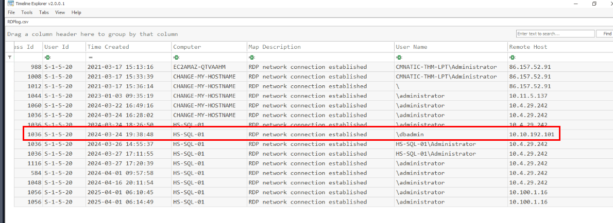

Then I filtered for Event ID 1149 for RDP connection establishment events which we can see that there is only 1 event associated with "dbadmin" user which was connected from 10.10.192.101 and it just happened to be around the time that the alert was triggered as well.

```
03/24/2024 19:38:48
```

> What is the full file path of the binary used by the attacker to exfiltrate data?

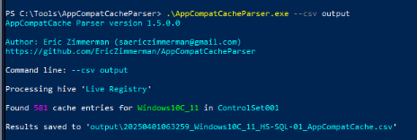

I used ` .\AppCompatCacheParser.exe --csv output` command to parse shimcache from the live SYSTEM registry and the result from this can be served as evidence as evidence of execution just like Amcache and Prefetch.

Normally, Prefetch is always my go-to but not a single prefetch file (pf) was found on this machine so I went with shimcache.

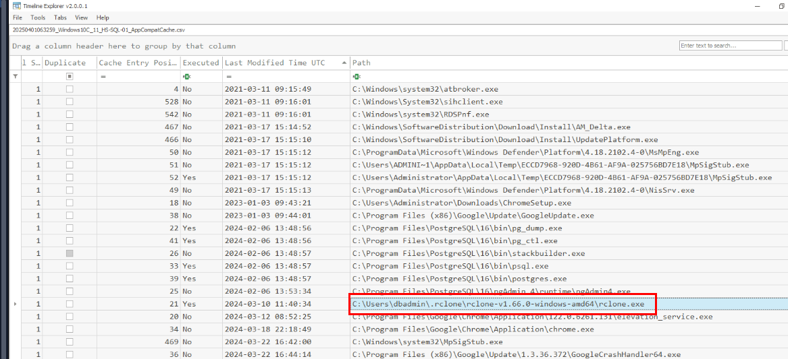

Then we will see that `rclone` was once executed and it could be used to manage files on cloud storage which not limited to file uploading so this has to be the one we are looking for. 

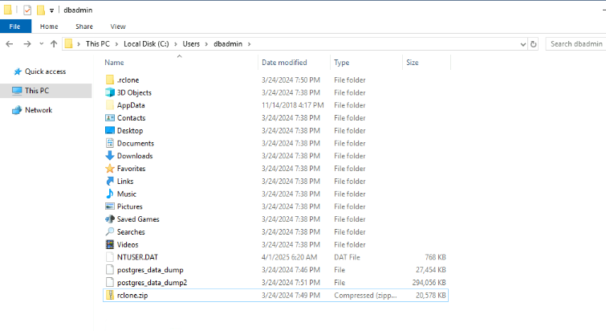

We can see that rclone binary is located inside `.rclone` folder which mimic the hidden directory on Linux and we can also see the archive file of rclone and postgres data dump as well so the data that were exfiltrated are probably these 2 files.

```
C:\Users\dbadmin\.rclone\rclone-v1.66.0-windows-amd64\rclone.exe
```

> What email is used by the attacker to exfiltrate sensitive data?

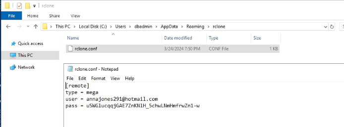

When upload/cloning file to cloud storage, the configuration has to be done first and we could find the configuration file on the path shown in the image above which we can also see that the storage used for data exfiltration is Mega and we also got pair of credential used from this file as well.

```
annajones291@hotmail.com
```

> Where did the attacker store a persistent implant in the registry? Provide the registry value name.

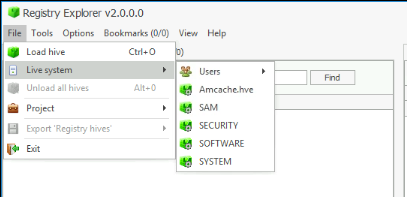

To inspect live registry, I don't like doing it from Registry Editor so I loaded it via Registry Explorer like this. 

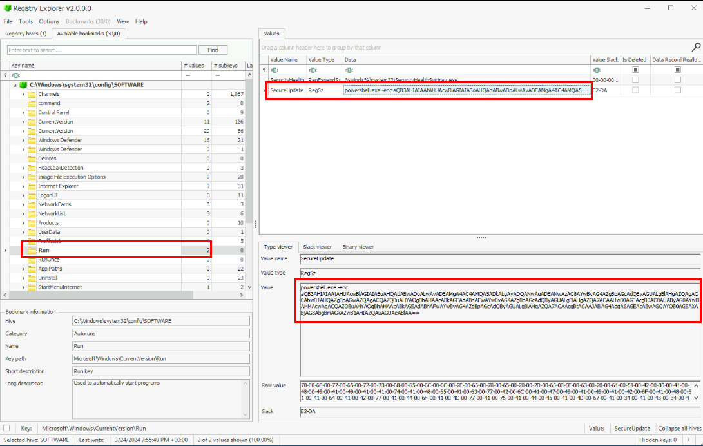

I do not find any persistence from user's registry hive but I found the run persistence registry from the SOFTWARE hive and this registry key will execute PowerShell command every user logon.

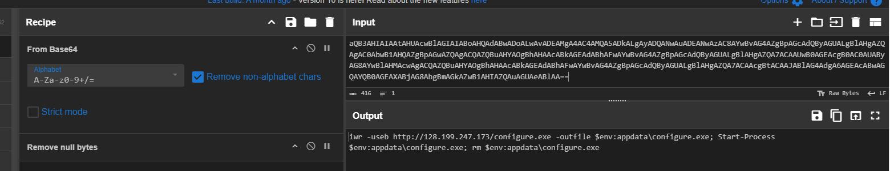

When we decoded base64 string, we can see that it will download binary from C2 to AppData folder, execute it and remove the file afterward.

```
SecureUpdate
```

> Aside from the registry implant, another persistent implant is stored within the machine. When did the attacker implant the alternative backdoor? (format: MM/DD/YYYY HH:MM:SS)

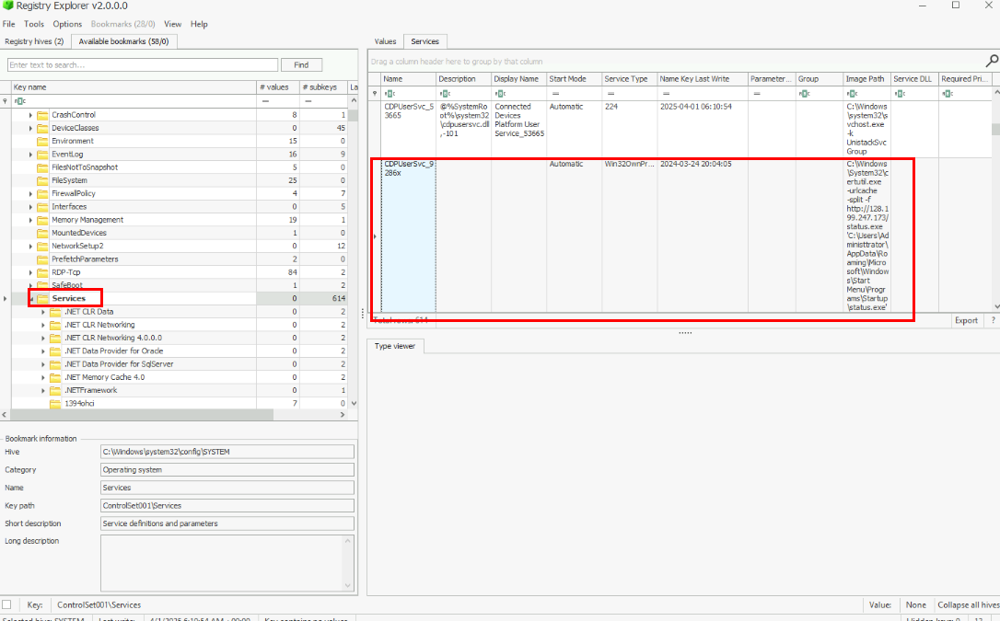

I do not find any other persistence on schedule task, run registry and start up folder of "dbadmin" user so I dug into services which I found that "CDPUserSvc_9286x" service was configured to execute certutil to download suspicious binary file to the startup folder of "Administrator" user and this is the one we are looking for.

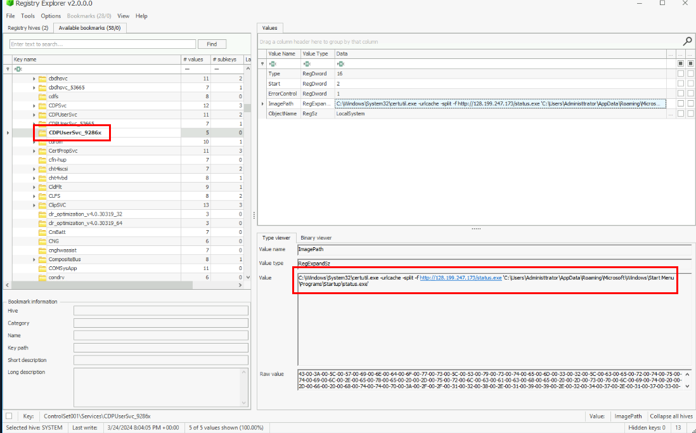

We can easily read the full command here.

```
03/24/2024 20:04:05
```

So we are done with the first machine, lets shutdown and start second machine.

***
## Lateral Movement: Backtracking the Pivot Point
Following the detection of unusual login attempts on the database server, the investigation has pivoted towards examining a specific workstation used by an IT employee, which has been identified as the potential origin of the suspicious login to the database server.

**Investigation Guide**

Your task is to meticulously analyse the workstation's artefacts by following your incident response playbook.

- Determine any unusual emails or chats to cover the social engineering attack vectors.
- Inspect the user's browser activity and determine if any malicious files have been downloaded or links have been accessed.
- Note any suspicious binaries executed within the workstation.
- Look for typical persistence mechanisms deployed in the workstation.
- Review the network connections made by the workstation and see if there are potential C2 connections invoked.

>When did the attacker send the malicious email? (format: MM/DD/YYYY HH:MM:SS)

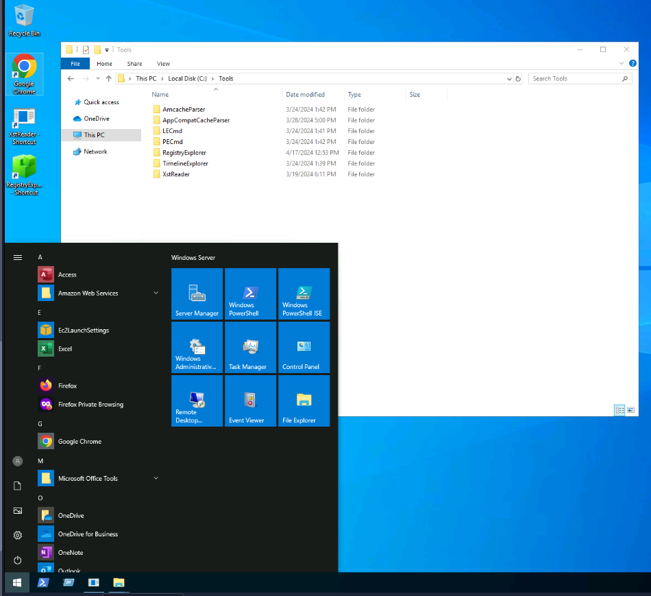

After started the second machine, we have a slightly different set of tools that we can use and look like we have to use XstReader to read ost (outlook data files) file and use LECmd to analyze shortcut file which mean the malicious attachment will likely to be the shortcut file. 

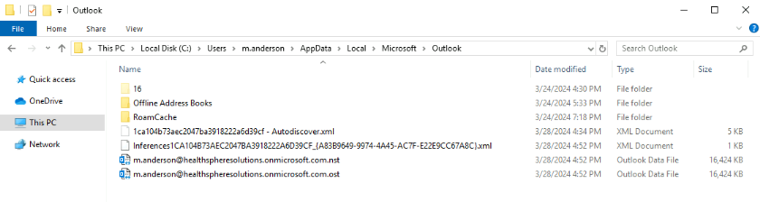

There is a single non-default user on this machine and we could get the ost file belong to this user right here (`C:\Users\m.anderson\AppData\Local\Microsoft\Outlook`)

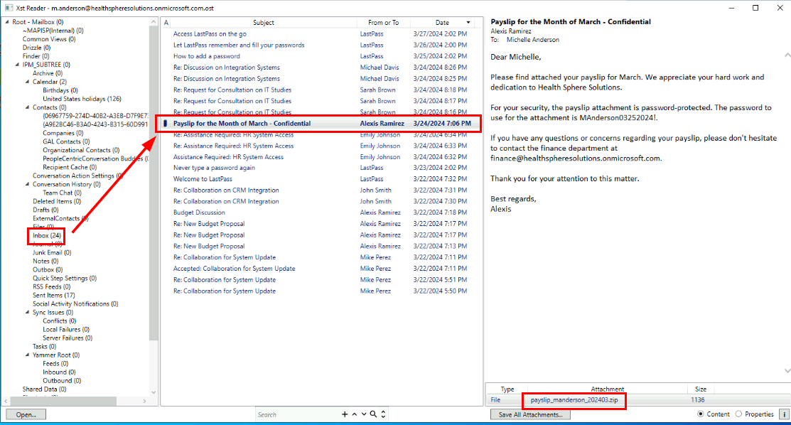

After we opened ost file with XstReader, we can inspect the inbox which we will see that there is only a single email with an attachment and this is the classic case where the attacker sent phishing attachment as payslip, invoice which will leads to user opened it and execute embedded command inside.

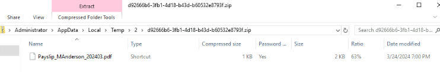

By inspecting the content inside the zip file, we could see that there is no pdf file or image file but a shortcut file.

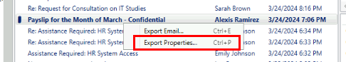

To get the answer of this question, we have to export the property of this email like this.

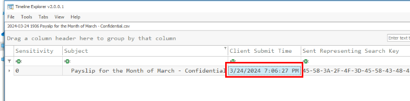

Then we will have the Client Submit Time as the answer of this question right here.

```
03/24/2024 19:06:27
```

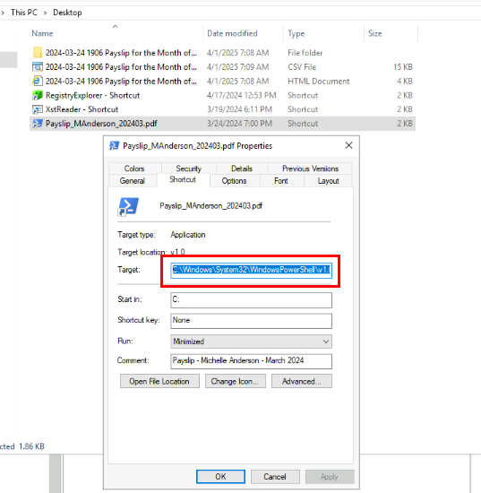

Now we can look a bit more on malicious phishing attachment since we also have the password to unlock the zip file, and by looking at the icon, we already assumed that this file will execute PowerShell script upon open it and if we inspect the property of this file, we can confirm our hypothesis and we could also copy the content inside "Target" field to investigate further.

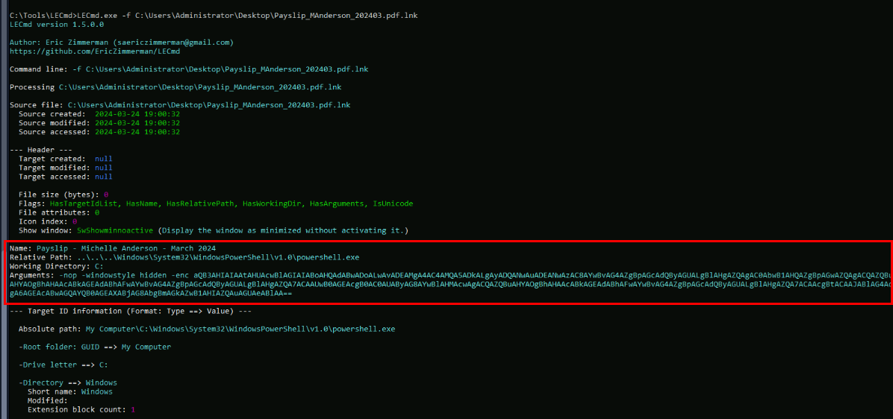

Lets just use the tool with command `LECmd.exe -f C:\Users\Administrator\Desktop\Payslip_MAnderson_202403.pdf.lnk` then we can see another properties that hard to find via Windows Explorer GUI and lets copy this base64 string to decode it and see what it could do.

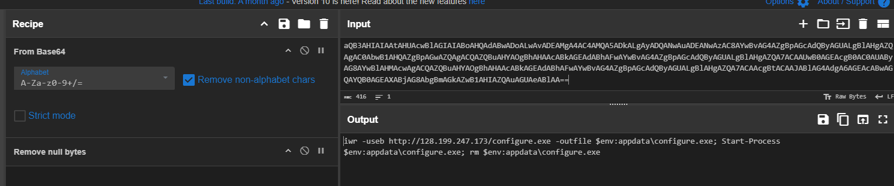

And we can see that this phishing will do the same thing as we found from the persistence run key on database server with the same C2 hosting the same file, all characters are the same.

>When did the victim open the malicious payload? (format: MM/DD/YYYY HH:MM:SS)

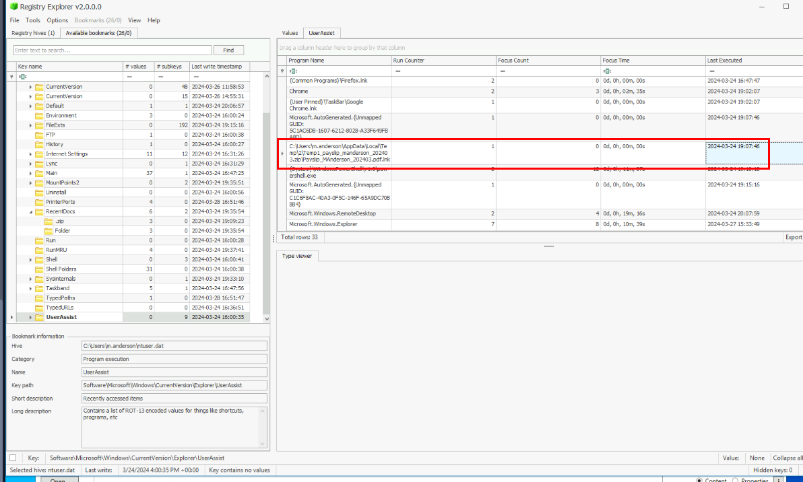

I utilized UserAssist registry key of the victim to find the execution time of shortcut file which we can see that user opened the malicious attachment just 1 minute after the malicious email was sent to user by the attacker.

```
03/24/2024 19:07:46
```

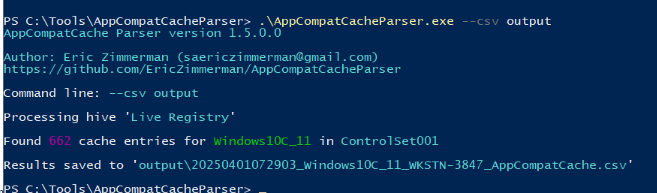

Now lets dig a little bit deeper by parsing Live SYSTEM registry with `.\AppCompatCacheParser.exe --csv output`.

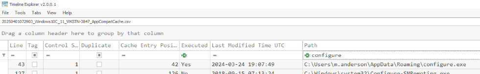

We can see that the malicious binary was executed 3 seconds after shortcut file was opened. 

>When was the malicious persistent implant created? (format: MM/DD/YYYY HH:MM:SS)

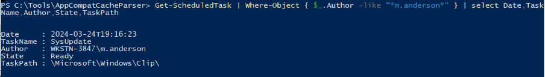

This persistence was very well hidden but since the attacker gained access to the machine as the victim so the attacker probably created the persistence in the manner of the victim so I used `Get-ScheduledTask | Where-Object { $_.Author -like "*m.anderson*" } | select Date,TaskName,Author,State,TaskPath` command to list all scheduled tasks created by the victim which we can see that this task was suspiciously created during the incident timeframe.

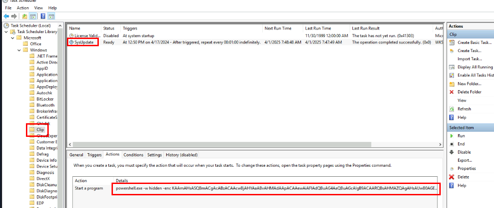

So we can follow the path on Task Scheduler to find the command that was going to be executed, and sure enough, it is another PowerShell command execution.

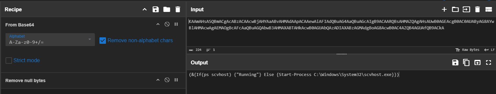

After decoding the base64 string, we can see that this command will check for `scvhost` (mimicking the legitimate `svchost` process) if its running then it will do nothing but if not then it will execute `scvhost.exe` located on the System32 folder of this system.

```
03/24/2024 19:16:23
```

>What is the domain accessed by the malicious implant? (format: defanged)

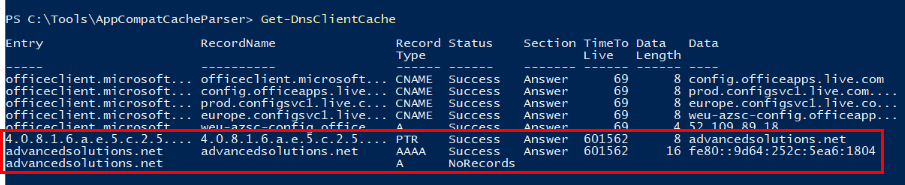

Since there is no sysmon and dns log, I used `Get-DnsClientCache` command to display DNS cache records which we can see the there is 1 domain that is not legitimate/common and its the domain that was reached out by the malicious implant.

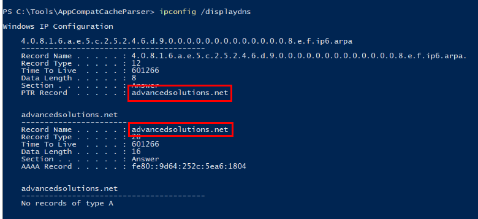

The same could be found with `ipconfig /displaydns` command as well.

```
advancedsolutions[.]net
```

>What file did the attacker leverage to gain access to the database server? Provide the password found in the file.

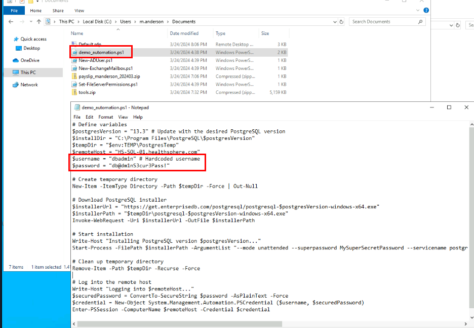

After exploring victim user folders, I found the `demo_automation.ps1` script contains credential of "dbadmin" user so the attacker gained access to this file that hard-coding user credential of dbadmin user which attacker then use it to connect to database server via RDP later on!

```
db@dm1nS3cur3Pass!
```

2 machines done! Lets fire up the last one!

***
## Initial Access: Discovering the Root Cause
The investigation pivoted to a workstation belonging to a user suspected of sending an internal phishing attack after discovering that this malicious activity compromised an IT employee's workstation. The primary aim is to uncover how the sender's Office 365 (O365) account was compromised, initiating the phishing attack.

>When did the victim receive the malicious phishing message? (format: MM/DD/YYYY HH:MM:SS)

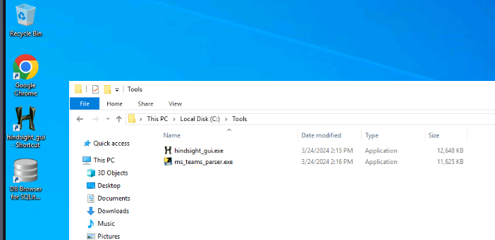

We only have 3 tools on this one, Hindsight for browser forensics, `ms_teams_parser` that can be used to parse communication artefacts from IndexDB file and lastly, we have DB Browser for SQLite with can be used to open SQLite database and inspect the content of it. 

We can learn how to use `ms_teams_parser` from the following URL or just simply read the `--help` manual.
- https://forensics.im/blog/parsing-microsoft-teams-indexeddb/

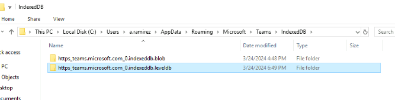

The folder that needed to be parsed with `ms_teams_parser` can be found here so we can copy the file path to use with the tool from there.

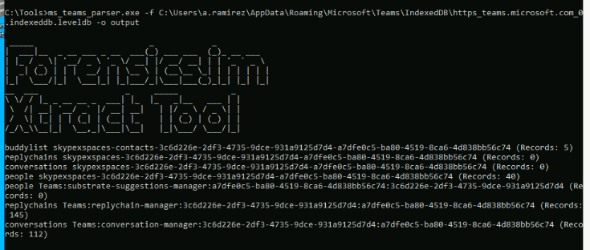

Now we can proceed to use `ms_teams_parser.exe -f C:\Users\a.ramirez\AppData\Roaming\Microsoft\Teams\IndexedDB\https_teams.microsoft.com_0.indexeddb.leveldb -o output.json` to parse the content of communication artefacts to json file.

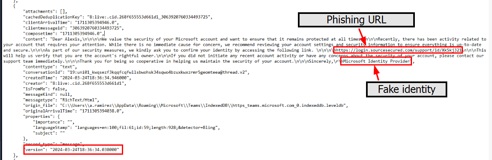

And then by inspecting the output json, we can see that the attacker used the one of old school tricked by faking themselves as Microsoft to send credential captured phishing url to the victim and from the message, it seems like this is the spearphishing attack targeted Alexis and if as you might remember that the sender of the previous scenario has the same name as this one so we can concluded that the attacker successfully phished this user first then managed to access Alexis's email to send malicious phishing attachment and gained access to the second host which also leaded to database server compromised as well.

```
03/24/2024 18:36:34
```

>What is the display name of the attacker?
```
Microsoft Identity Provider
```

>What is the URL of the malicious phishing link? (format: defanged)
```
https[://]login[.]sourcesecured[.]com/support/id/XkSkj321
```

>What is the title of the phishing website?

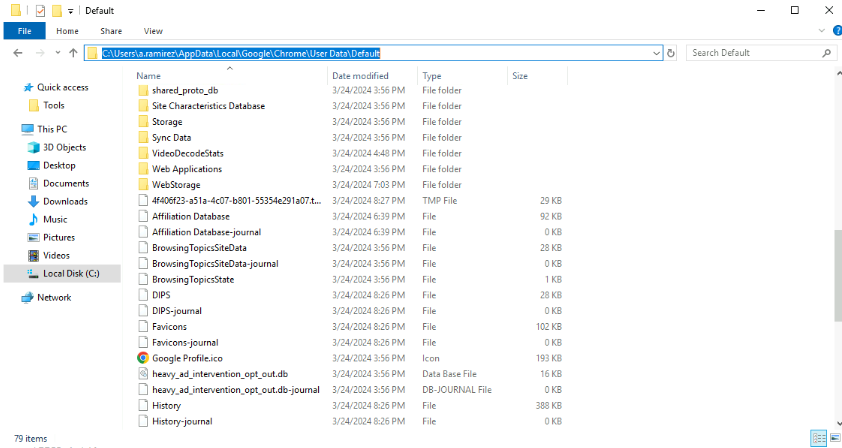

Now we just have to confirm that Alexis really fell for this phishing attack and after explored the user's folder, we found that this user was using Google Chrome so we have to copy this path for our hindsight (`C:\Users\a.ramirez\AppData\Local\Google\Chrome\User Data\Default`) or we can even open History file with DB Browser for SQLite directly since its sqlite database.

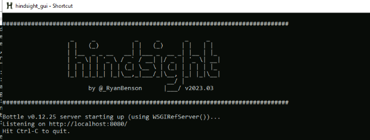

For the sake's of the tool usage, we can start hindsight by just double click it and then we should be able to access the web interface as shown on the terminal

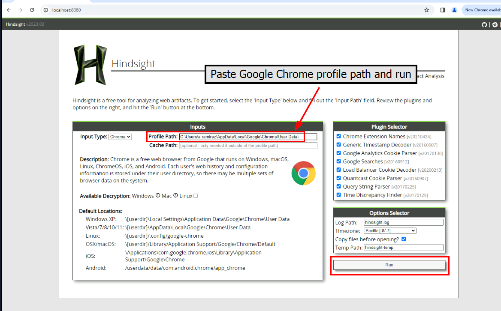

Now we have to put the Google Chrome path right here and run

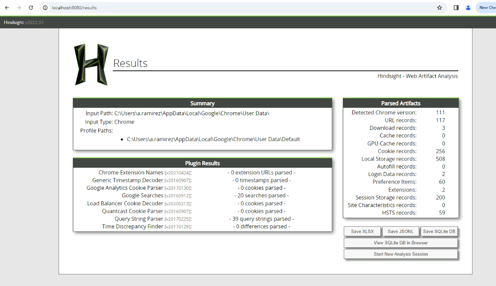

Now we can save output in any shape or form that the tool provides which I went with SQLite for the sake's of tool usage.

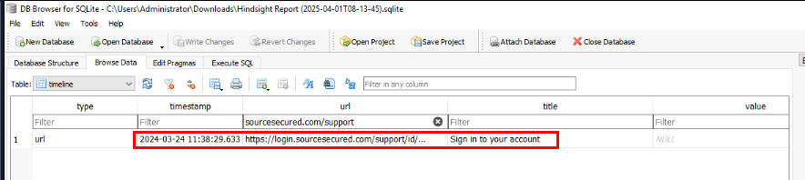

And Do not make the same mistake as me, I forgot adjust the timestamp to UTC +0 which also affected the timestamp displayed on the table like this.

```
Sign in to your account
```

>When did the victim first access the phishing website? (format: MM/DD/YYYY HH:MM:SS in UTC)
```
03/24/2024 18:38:29
```

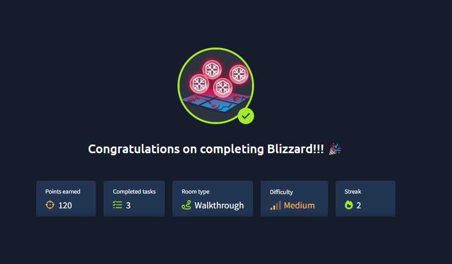

And now we are done!

***