# [TryHackMe - IronShade](https://tryhackme.com/room/ironshade)

***
**Incident Scenario**
Based on the threat intel report received, an infamous hacking group, **IronShade**, has been observed targeting Linux servers across the region. Our team had set up a honeypot and exposed weak SSH and ports to get attacked by the APT group and understand their attack patterns. 

You are provided with one of the compromised Linux servers. Your task as a Security Analyst is to perform a thorough compromise assessment on the Linux server and identify the attack footprints. Some threat reports indicate that one indicator of their attack is creating a backdoor account for persistence.

**Challenge**
Investigate the server and identify the footprints left behind after the exploitation.

***
>What is the Machine ID of the machine we are investigating?

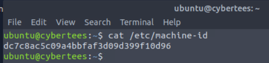

After we started the machine, we can open a terminal and read the file `/etc/machine-id` to get Machine ID of the machine we are investigating.

```
dc7c8ac5c09a4bbfaf3d09d399f10d96
```

>What backdoor user account was created on the server?

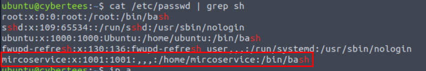

We can take a look at the suspicious user from `/etc/passwd` file which we can see the user with uid 1001 that misspelled from microservice and is the only user that is only beside ubuntu and root so this is the one.

```
mircoservice
```

>What is the cronjob that was set up by the attacker for persistence?

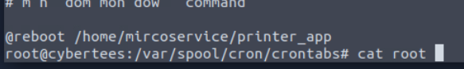

I took a loot at `/var/spool/cron/crontab` directory which I found the cronjob of root that will executed `printer_app` from backdoor user home directory every reboot.

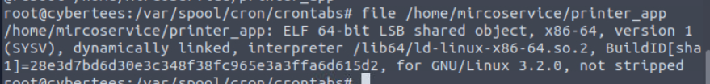

We can see that the file is ELF 64-bit binary and disassembly is out of scope of this room so I'm gonna leave it at that.

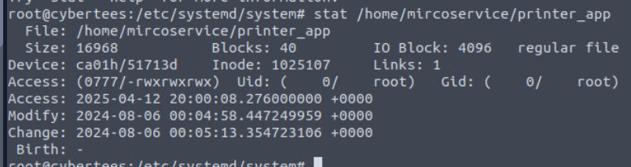

But we also have to check when this file was created on 6th August 2024 so we can use this timestamp as the baseline of our investigation.

```
@reboot /home/mircoservice/printer_app
```

>Examine the running processes on the machine. Can you identify the suspicious-looking hidden process from the backdoor account?

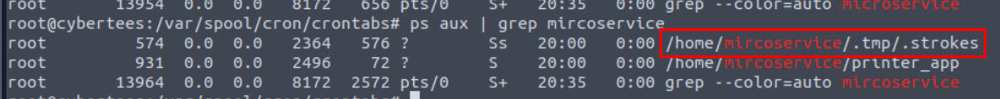

By using `ps aux | grep mircoservice`, we can see 2 binary were executed from home directory of backdoor user and one of them was located on the hidden directory and the file itself was also hidden as well.

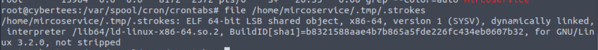

We can see that this file is also ELF 64-bit binary as well.

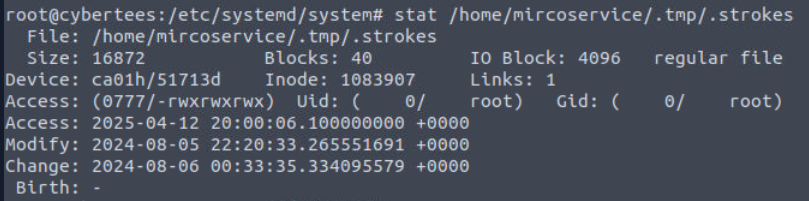

The creation timestamp also within the same date as the first file we found.

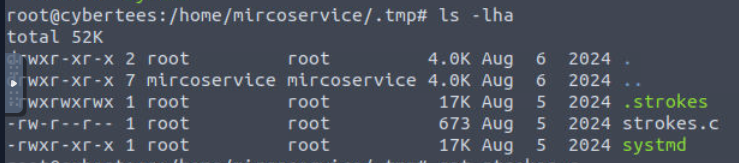

I went to the `.tmp` directory and found another 2 files on this directory, the first one is C script and the other file is another ELF binary.

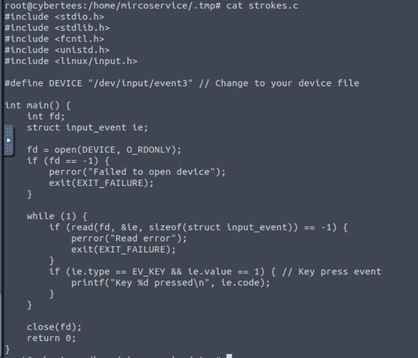

C script just happened to have to same name as the hidden process and we can see that this is simple keylogger but it does not save to a file or send it over a network.

```
.strokes
```

>How many processes are found to be running from the backdoor account’s directory?

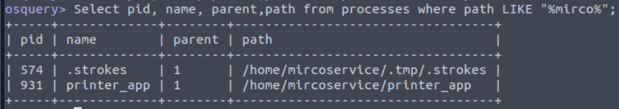

We already know that there are 2 processes running from the backdoor's home directory but we can also use `Select pid, name, parent,path from processes where path LIKE "%mirco%";` on osquery to confirm that as well.

```
2
```

>What is the name of the hidden file in memory from the root directory?

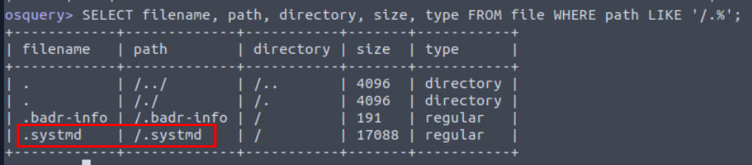

Since we already started osquery then we can proceed with `SELECT filename, path, directory, size, type FROM file WHERE path LIKE '/.%';` to get hidden file which we can see that `.systmd` is really stand out here and it just happened to have the same name as one of the file we found from backdoor user directory as well. 

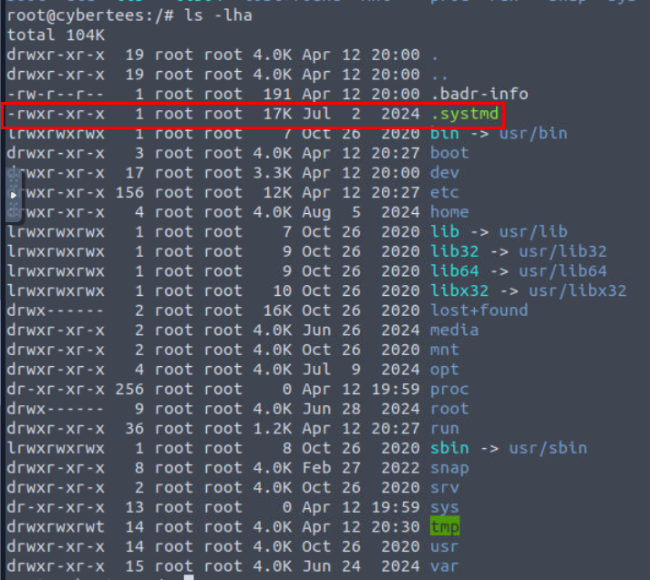

Its also in the root directory so this is the one we are looking for.

```
.systmd
```

>What suspicious services were installed on the server? Format is service a, service b in alphabetical order.

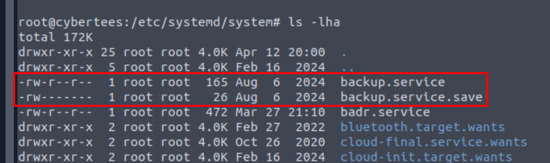

I went to `/etc/systemd/system` directory to find any service that were edited/created on 6th August which I found that `backup.service` is the first one that we will have to check it out.

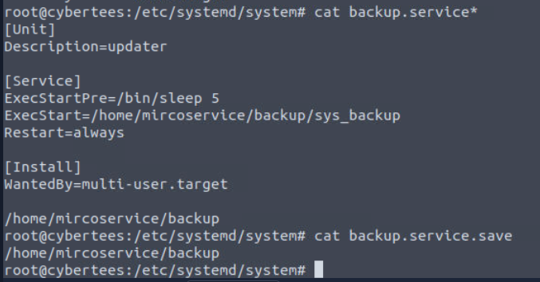

By inspecting this service, we can see that it will execute `sys_backup` from backdoor user directory so this is one of backdoor services we are looking for.

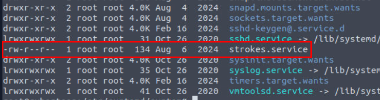

Another one is `strokes.service` which we can see the similar naming convention to `.strokes` binary we found from the running process.

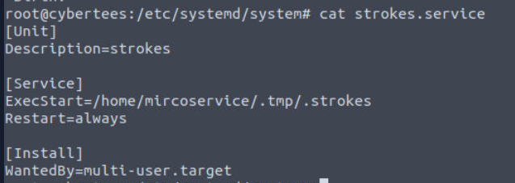

And as we can guess, it will execute `.strokes` from the backdoor user directory and its the service responsible for running process we found as well.

```
backup.service,strokes.service
```

>Examine the logs; when was the backdoor account created on this infected system?

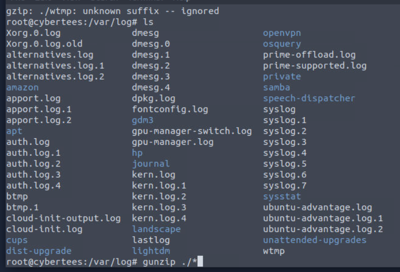

Alright we will now have to check out `/var/log` directory but there are so many log files were compressed so we can use `gunzip ./*` to gunzip it all.

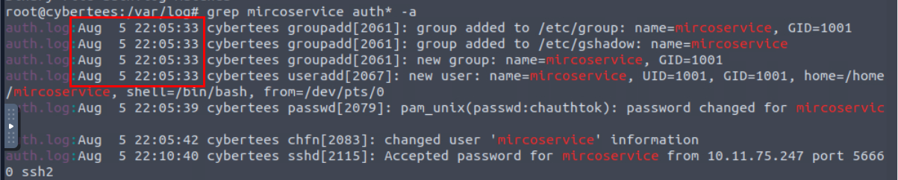

And now we can use grep to search for the trace of this user which we can see that even though we did not find `useradd` binary being used but we can see the first appearance of this user on 5th Auguest, just 1 day before the creation date of those backdoor we discovered.

```
Aug  5 22:05:33
```

>From which IP address were multiple SSH connections observed against the suspicious backdoor account?

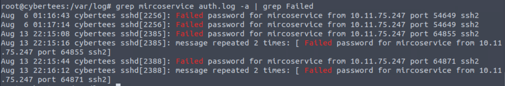

Now we can focus on this user with keyword "Failed" to focus on failed attempts to authenticate as this user which we can see that there is only a single IP trying to authenticate as backdoor user.

```
10.11.75.247
```

>How many failed SSH login attempts were observed on the backdoor account?

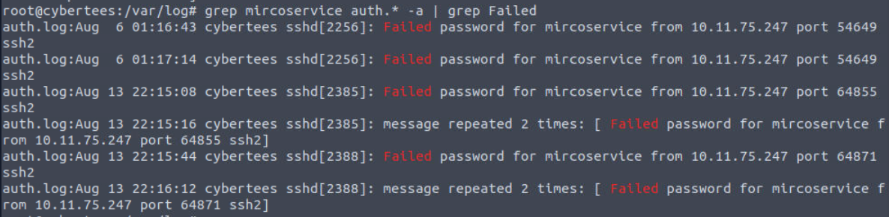

Even though there are only 6 lines return from this but remember that there are another repeated attempt from the same IP address so total attempts to this backdoor account is 8.

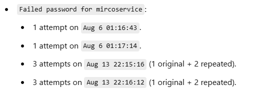

Here the breakdown from ChatGPT.

```
8
```

>Which malicious package was installed on the host?

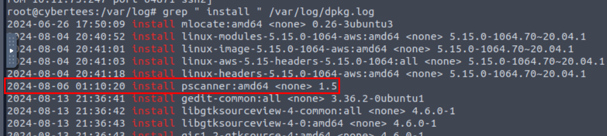

We can use `grep " install " /var/log/dpkg.log` to list all installed packages from dpkg log which we can see that there is only a single package installed on 6th August.

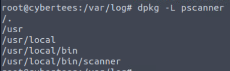

We can use `dpkg -L pscaner` to list binary dropped from this package which we can see that `scanner` is the binary installed from this package.

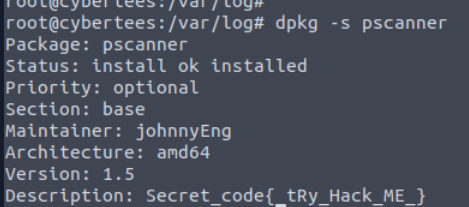

Then we can use `dpkg -s pscanner` to display metadata of this package and we can see the secret code for next question and the one that really stood out is the Maintainer "johnnyEng" (Johnny English) 😆
 
```
pscanner
```

>What is the secret code found in the metadata of the suspicious package?
```
{_tRy_Hack_ME_}
```


And now we are done!
***