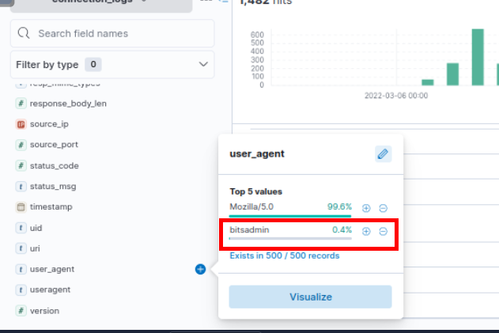

# [TryHackMe - ItsyBitsy](https://tryhackme.com/room/itsybitsy)

***
During normal SOC monitoring, Analyst John observed an alert on an IDS solution indicating a potential C2 communication from a user Browne from the HR department. A suspicious file was accessed containing a malicious pattern `THM:{ ________ }`. A week-long HTTP connection logs have been pulled to investigate. Due to limited resources, only the connection logs could be pulled out and are ingested into the `connection_logs` index in Kibana.

Our task in this room will be to examine the network connection logs of this user, find the link and the content of the file, and answer the questions.
***


After starting the machine, you can either launch the **AttackBox** or directly access the URL http://$IP/app/discover#/ if you're already connected to the TryHackMe VPN. This will take you to the **Discover** page in Elasticsearch/Kibana, where you can begin your investigation.

>How many events were returned for the month of March 2022?


In Kibana, we always need to specify time range and luckily for us that the room already provided the time range for us which we can specify the time range like this and click "Update".


Now we have total of 1482 events during March 2022 which is the answer of this question

```
1482
```

>What is the IP associated with the suspected user in the logs?



While investigating the connection logs, which appear to be web server logs, I focused on identifying any unusual values such as **URIs** or **IP addresses**. During the analysis, I noticed an interesting **user-agent string**: `bitsadmin`.

This user-agent is associated with **Bitsadmin**, a Windows "living-off-the-land" binary (LOLBin) that can be exploited to download files. This discovery might represent a straightforward indicator of suspicious activity—a "low-hanging fruit" in our investigation.


So we can query with `user-agent:bitsadmin` to get event with this user agent then we will have these 2 events sending from 192.166.65.54 to pastebin.com

```
192.166.65.54
```

>The user’s machine used a legit windows binary to download a file from the C2 server. What is the name of the binary?


Bitsadmin is the powerful Windows lolbin that can be used for downloading a file and execute it, more detailed about the abuse of this binary could be found in the Lolbas project right here
- https://lolbas-project.github.io/lolbas/Binaries/Bitsadmin/

```
bitsadmin
```

>The infected machine connected with a famous filesharing site in this period, which also acts as a C2 server used by the malware authors to communicate. What is the name of the filesharing site?


```
pastebin.com
```

>What is the full URL of the C2 to which the infected host is connected?


```
pastebin.com/yTg0Ah6a 
```

>A file was accessed on the filesharing site. What is the name of the file accessed?


Following the full URL —https://pastebin.com/yTg0Ah6a, We can see that this pastebin is hosting a secret file containing a flag which can be submitted to complete the room.

```
secret.txt
```

>The file contains a secret code with the format THM{_____}.
```
THM{SECRET__CODE}
```


And we are done!
***