# [TryHackMe - PS Eclipse](https://tryhackme.com/room/posheclipse)
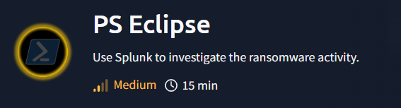
***
You are a SOC Analyst for an MSSP (Managed Security Service Provider) company called **TryNotHackMe** .

A customer sent an email asking for an analyst to investigate the events that occurred on Keegan's machine on **Monday, May 16th, 2022** . The client noted that **the machine** is operational, but some files have a weird file extension. The client is worried that there was a ransomware attempt on Keegan's device. 

Your manager has tasked you to check the events in Splunk to determine what occurred in Keegan's device. 

Happy Hunting!
* * *
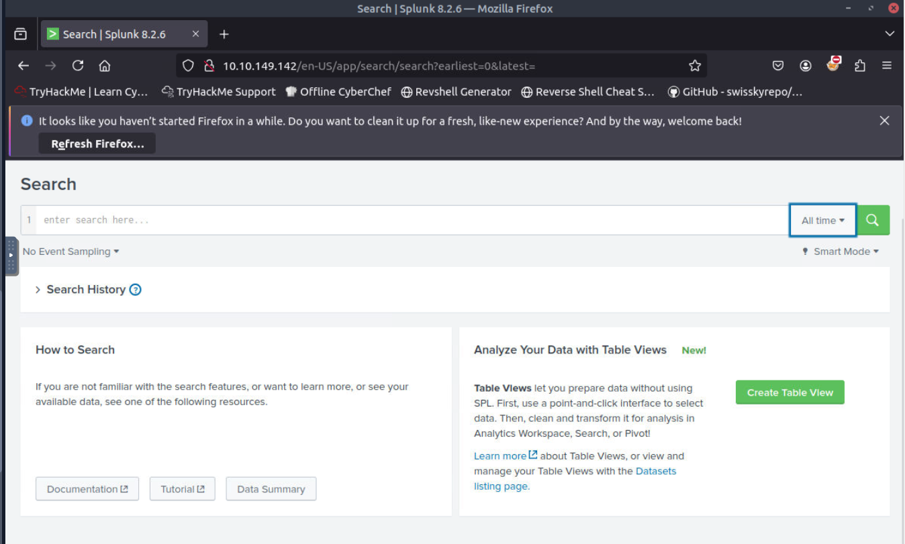

After deploying the machine and attackbox, we can access the Search page of the Splunk web interface on http://$IP/en-US/app/search/search directly.

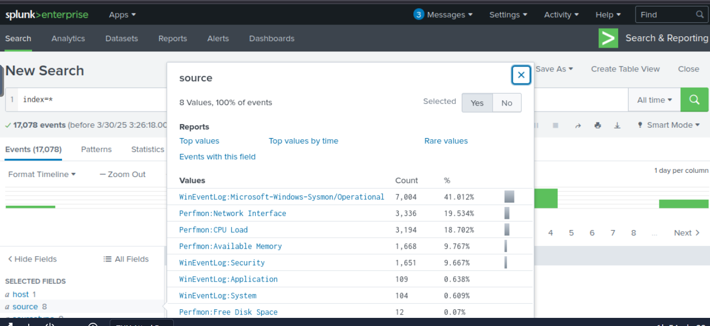

By using `index=*` and query with All Time preset, we can see that we have 8 different log sources on this room and Sysmon just happened to be one of them and now I think we are ready for the investigation.

>A suspicious binary was downloaded to the endpoint. What was the name of the binary?

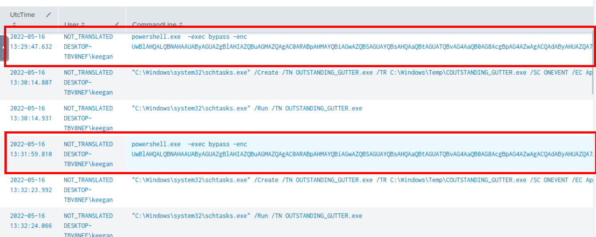

I tried to find for event related to certutil but look like there is none so my next attempt is to find suspicious powershell process with `index=* source="WinEventLog:Microsoft-Windows-Sysmon/Operational" powershell EventCode=1
| sort by UtcTime
| table UtcTime, User, CommandLine` that focused on Sysmon log and any event ID 1 with "powershell" keyword which I found that there are suspicious PowerShell command executed with base64 twice from **DESKTOP-TBV8NEF\keegan** user and following both commands, a schedule task was created to execute `C:\Windows\Temp\COUTSTANDING_GUTTER.exe` as SYSTEM

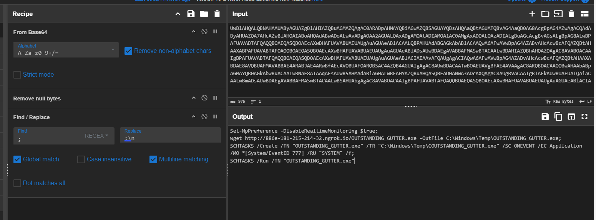

Then I copied Base64 string to decoded which reveals that this command will disable Windows Defender Real time monitoring and will download `OUTSTANDING_GUTTER.exe` from url hosting with ngrok to `C:\Windows\Temp` then it will create schedule task with that look identical to the the executable which will be trigger whenever event ID 777 from **Application** log is logged and this task will be executed as **SYSTEM** and lastly, it will run the task and binary altogether. 

```
OUTSTANDING_GUTTER.exe
```

>What is the address the binary was downloaded from? Add http:// to your answer & defang the URL.

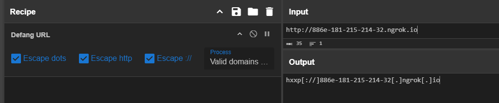

We can use Defang URL recipe from CyberChef to defang the url as shown in the image above.

```
hxxp[://]886e-181-215-214-32[.]ngrok[.]io
```

>What Windows executable was used to download the suspicious binary? Enter full path.

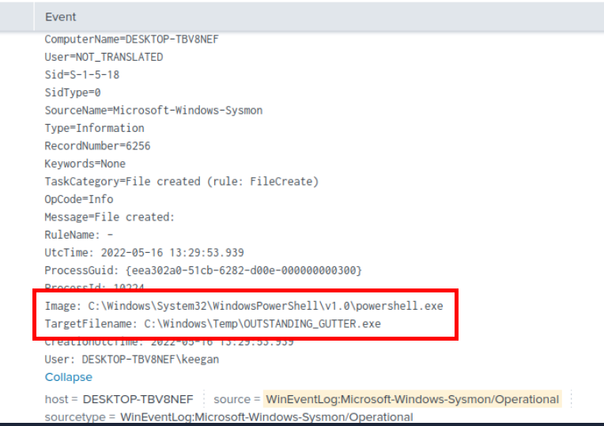

We can use `index=* source="WinEventLog:Microsoft-Windows-Sysmon/Operational" OUTSTANDING_GUTTER.exe EventCode=11
| sort by UtcTime` query to get File Creation event related to suspicious binary file which we can see that PowerShell process is responsible for the creation of this file which matches what we found earlier.  

```
C:\Windows\System32\WindowsPowerShell\v1.0\powershell.exe
```

>What command was executed to configure the suspicious binary to run with elevated privileges?

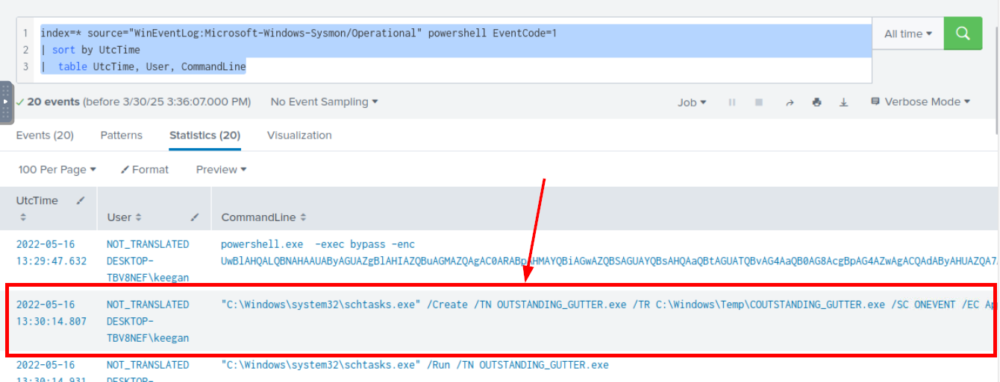

Go back to the first query then we will have this command that was executed after PowerShell base64 encoded command which is the command responsible for schedule task creation.

```
"C:\Windows\system32\schtasks.exe" /Create /TN OUTSTANDING_GUTTER.exe /TR C:\Windows\Temp\COUTSTANDING_GUTTER.exe /SC ONEVENT /EC Application /MO *[System/EventID=777] /RU SYSTEM /f
```

>What permissions will the suspicious binary run as? What was the command to run the binary with elevated privileges? (Format: `User` + `;` + `CommandLine`)

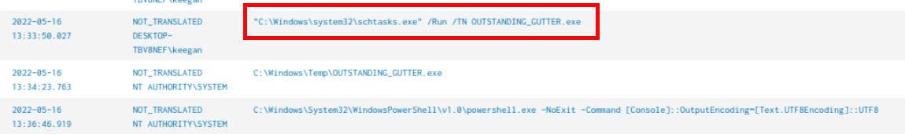

Lets adjust a little bit of our query to `index=* source="WinEventLog:Microsoft-Windows-Sysmon/Operational" OUTSTANDING EventCode=1
| sort by UtcTime
| table UtcTime, User, CommandLine` which make it focus on suspicious binary instead and we can see that the suspicious binary was really executed as root and the commands that triggered this is the schedule task to run schedule task created by PowerShell command we found from first question.

```
NT AUTHORITY\SYSTEM;"C:\Windows\system32\schtasks.exe" /Run /TN OUTSTANDING_GUTTER.exe
```

>The suspicious binary connected to a remote server. What address did it connect to? Add http:// to your answer & defang the URL.

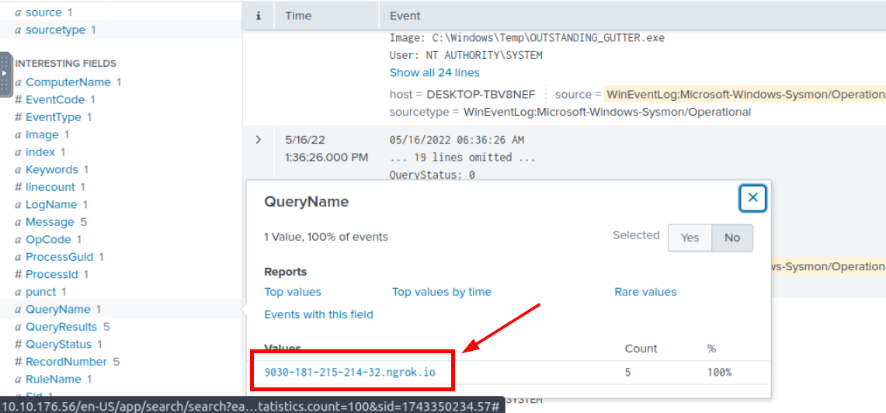

Lets tweak our query again and this time, we want to know which url that was queried/connected and Sysmon has Event ID 22 for DNS query so we will have `index=* source="WinEventLog:Microsoft-Windows-Sysmon/Operational" OUTSTANDING_GUTTER.exe EventCode=22
| sort by UtcTime` query that will get all DNS queries event from suspicious binary and all of them queried the same name which is another ngrok host.

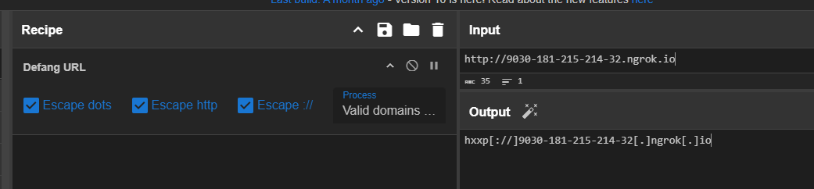

Go back to our goody CyberChef to defang it and answer this question.

```
hxxp[://]9030-181-215-214-32[.]ngrok[.]io
```

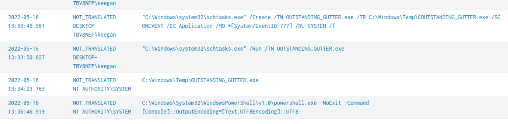

Alright lets dig a little bit deeper since the rest of the question does not cover but as good analyst, we need to know more right? as we could see that another PowerShell was executed minutes after suspicious binary was executed.

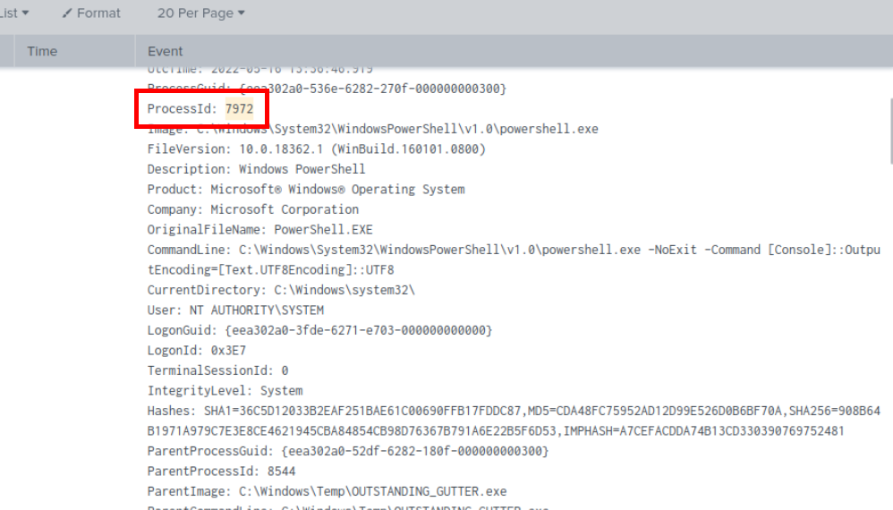

Lets grab the **ProcessID** and see what this process executed after.

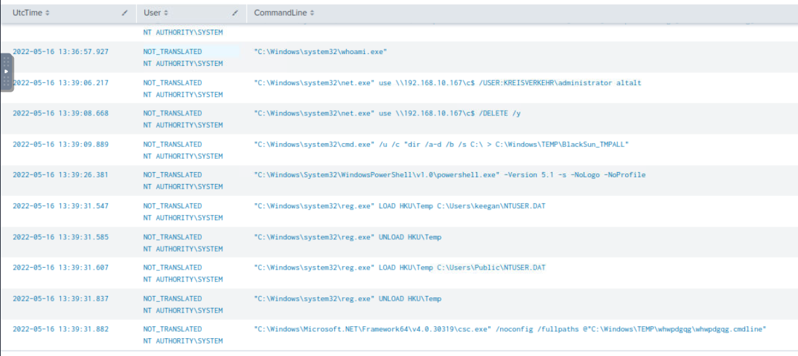

With `index=* source="WinEventLog:Microsoft-Windows-Sysmon/Operational" EventCode=1 7972 | sort by UtcTime   | table  UtcTime, User, CommandLine` query, we can get all child processes from previously found PowerShell process and we could see that there are more reconnaissance being conducted, network drive mapped and deleted, registry loaded and unloaded (Probably for persistence) and code execution using `csc.exe`. 

Now Lets continue to solve other questions.

>A PowerShell script was downloaded to the same location as the suspicious binary. What was the name of the file?

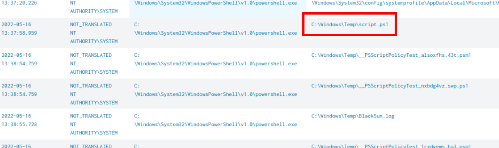

 I suspected that the PowerShell process we found earlier might be the culprit so I used `index=* source="WinEventLog:Microsoft-Windows-Sysmon/Operational" EventCode=11 7972 | sort by UtcTime 
|  table UtcTime,User,Image,TargetFilename` query to hunt for file creation event from the PowerShell process and then we can see that `script.ps1` was dropped to the same location as the suspicious binary and `BlackSun.log` was dropped a minute after this file which leads me think that the script that was dropped is likely to be BlackSun ransomware which is the PowerShell-Based ransomware.

```
script.ps1
```

>The malicious script was flagged as malicious. What do you think was the actual name of the malicious script?

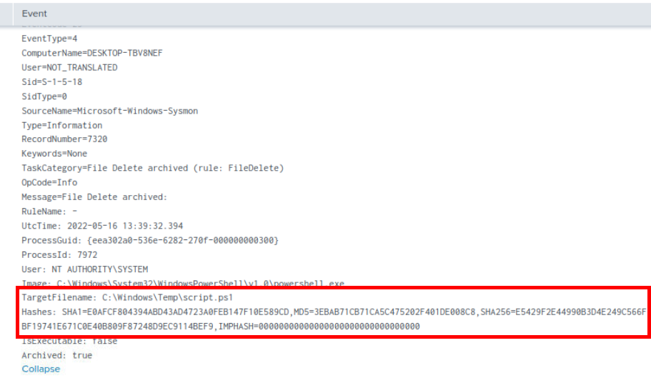

We can filter for event with this name with `index=* script.ps1` which we will have Event ID 23 that logged hash of the script so we can use it to search on Popular Threat Intelligence platform such as VirusTotal.

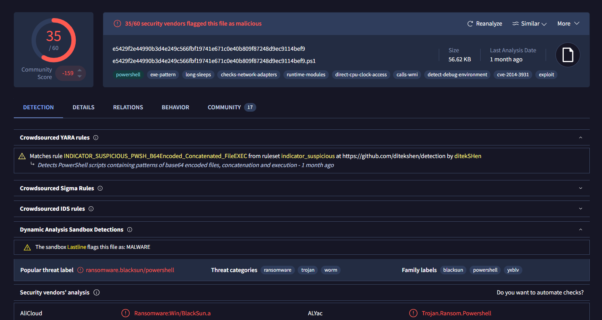

Searching this hash on [VirusTotal](https://www.virustotal.com/gui/file/e5429f2e44990b3d4e249c566fbf19741e671c0e40b809f87248d9ec9114bef9/detection), We can see that this PowerShell script is really the BlackSun ransomware.

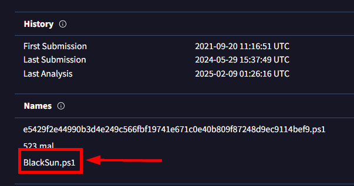

We can now go to "Names" section under "Details" tab to get the actual name of the script right here.

```
BlackSun.ps1
```

>A ransomware note was saved to disk, which can serve as an IOC. What is the full path to which the ransom note was saved?

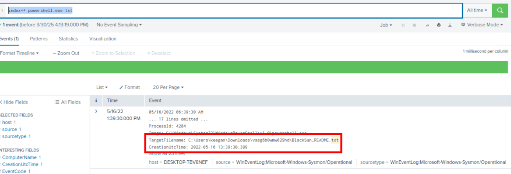

When a ransomware dropped ransomnote on Windows system, It usually dropped a text file that can be opened with notepad right away so I used `index=* powershell.exe txt` to filter for any text file dropped from PowerShell which we can see that there is only 1 event returned from this query and it happened to be the one we are looking for as well.

```
C:\Users\keegan\Downloads\vasg6b0wmw029hd\BlackSun_README.txt
```

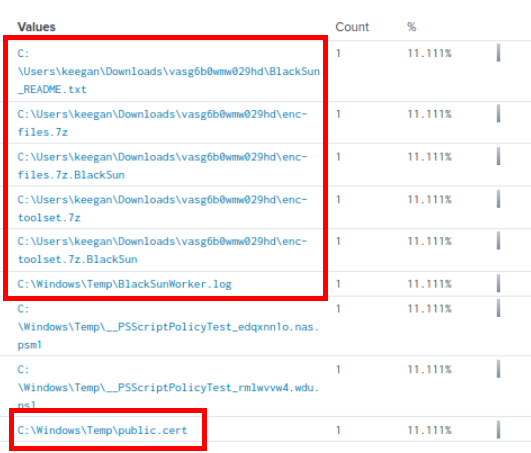

Lets see other files that dropped from the same process with `index=* powershell.exe ProcessId=4284 EventCode=11`, which we can see that it created archive files, log file and certificate file as well.

>The script saved an image file to disk to replace the user's desktop wallpaper, which can also serve as an IOC. What is the full path of the image?

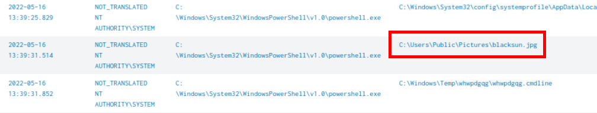

I went back to `index=* source="WinEventLog:Microsoft-Windows-Sysmon/Operational" EventCode=11 7972 | sort by UtcTime 
|  table UtcTime,User,Image,TargetFilename` query which I found that there is an image file was dropped by PowerShell process ID 7972 as well and its happened to be the desktop wallpaper that just got replaced 

```
C:\Users\Public\Pictures\blacksun.jpg
```

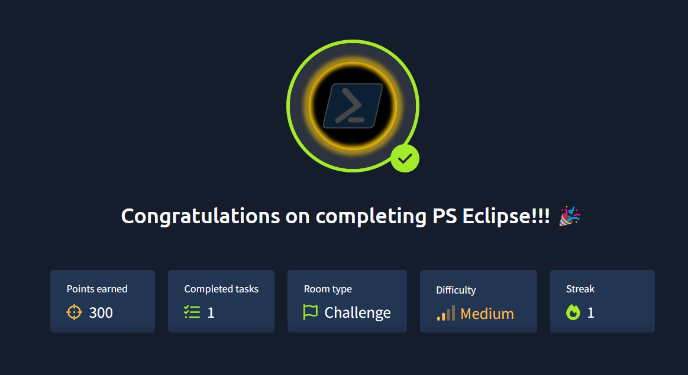

And we're done. No further malware analysis is required but if you want to learn more about BlackSun ransomware then I recommended you to read this article -https://blogs.vmware.com/security/2022/01/blacksun-ransomware-the-dark-side-of-powershell.html

Peace Out~ 🤌
***