# TryHackMe - ParrotPost: Phishing Analysis

Reveal how attackers can craft client-side credential-stealing webpages that evade detection by security tools.
***
Created: 13/08/2024 18:39
Last Updated: 13/08/2024 21:38
***
While working as a SOC Analyst for *Flying-Sec*ม you receive an incoming report from senior executive Paul Feathers. Paul recently received an email from ParrotPost, a legitimate company email tool, asking him to log into his account to resolve an issue with his account information.
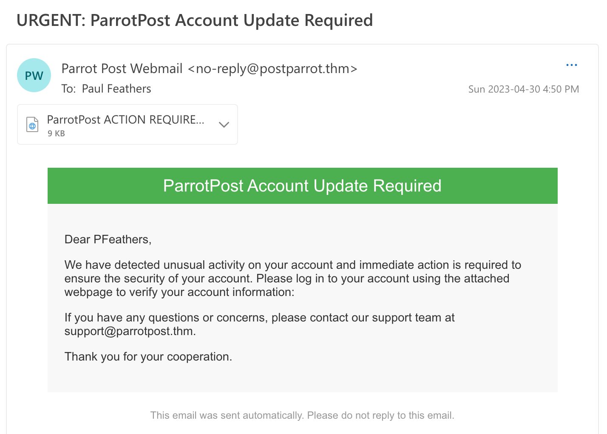
Your task is to investigate the email and determine whether it is a legitimate request or a phishing attempt. 

## Email Headers
Let's talk about analyzing email files. Emails are comprised of several components, including the header, body, and, if applicable, any attachments. The standard that emails generally follow is defined by the *Internet Engineering Task Force (IETF)*, specifically in [RFC 5322](https://datatracker.ietf.org/doc/html/rfc5322), which specifies the syntax and semantics of email messages, and the [RFC 2045-2049](https://datatracker.ietf.org/doc/html/rfc2045) series, which defines the *Multipurpose Internet Mail Extensions (MIME)* standard for email messages on the Internet.

**Email Headers**
The email headers are a great place to start when manually investigating a suspicious email. Email headers contain important metadata and information such as the sender and recipient's email addresses, the date and time the email was sent, and the path the message took to reach its intended destination. Investigating email headers can provide valuable insights into an email's origin and potential security concerns.

**Viewing Email Headers**
The process for viewing an email's headers can vary depending on the email client or service you are using. Sometimes in the specific email's context or view menu, there will be an option to view the headers directly or to download the original message as a file. In our case, we already have a copy of the email Paul received in `.eml` format. The `.eml` file format is in plaintext, meaning it can be read and edited using a basic text editor like Notepad, TextEdit, or Sublime Text.

To investigate this email further, open up `URGENTParrotPostAccountUpdateRequired.em`l in Sublime Text. You can optionally copy the file's contents and paste it into an email headers analyzer tool, such as [MXToolbox](https://mxtoolbox.com/EmailHeaders.aspx) or [Message Header Analyzer](https://mha.azurewebsites.net/). These client-side web tools provide a more graphical view of the email headers.

**Common Email Headers**
You are probably used to seeing several standard email headers, as most email clients (like Gmail, Outlook, Yahoo, and others) will display these headers by default:

1. **Subject** - This provides a topic or summary of the email's content
2. **From** - This identifies the sender of the email message (this can easily be spoofed!)
3. **To** - This identifies the primary recipient(s) of the email
4. **Date** - Indicates the date and time when the email message was sent

Below, visually locate where these headers are mapped to in Paul's email client, as seen from the Outlook on the Web (OWA) app.
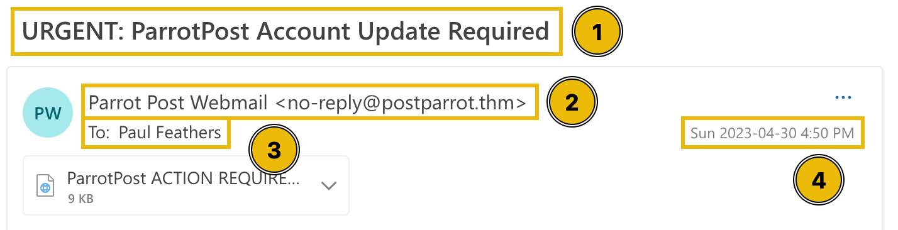
Most email headers will not be visible directly from an email client, so we need a text editor to view the complete email header information.

It's also important to understand that any line in an email can be forged or spoofed. However, there are some headers that you can trust more than others when conducting analysis. For example, the "Received" headers are added by each email server that processes the email, and they can offer a record of the email's path from source to destination.

**Identifying the Source**
Because email headers are so easily spoofed, it can be challenging to determine the originating sender or source of an email. As mentioned earlier, the "Received" headers are added by email servers to show the path the email took. The sender's IP address is typically listed in the first "Received" header (look at the date/times!).
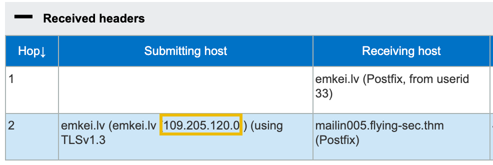
Once you have identified the source IP address, you can use an IP lookup tool to find out more information about the sender, such as their ISP (Internet Service Provider) or the geographic location of their IP address. Several free tools are available online, such as [iplocation.io](https://iplocation.io/) and [iplocation.net](https://www.iplocation.net/ip-lookup).

**Custom Email Headers**
Email headers starting with "X-" are custom headers the sender can add. The "X-" prefix is typically used to denote that the header is not an official or standardized header defined by the IETF. These custom headers often provide additional information or metadata about the email, such as tagging the email for spam filtering or sorting purposes or adding information specific to a particular organization or system.

>According to the IP address, what country is the sending email server associated with?

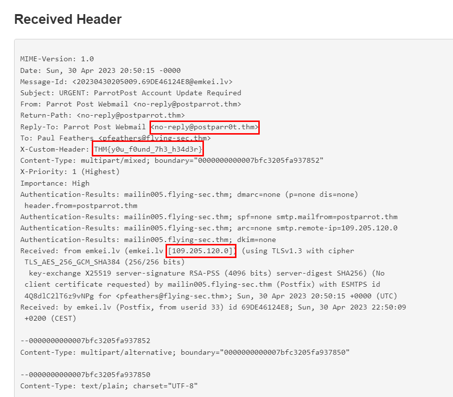

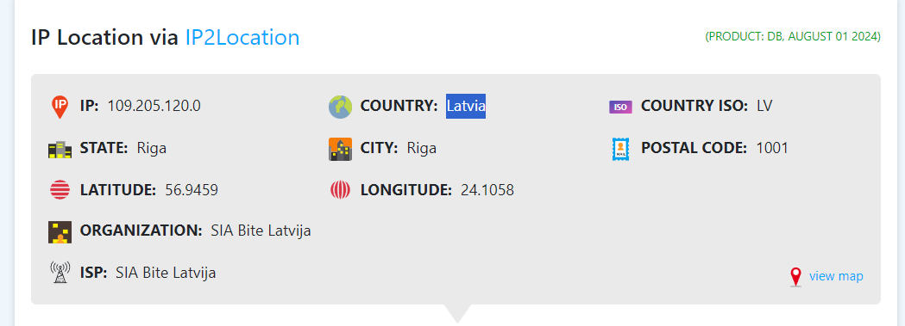

```
Latvia
```

>If Paul replies to this email, which email address will his reply be sent to?
```
no-reply@postparr0t.thm
```

>What is the value of the custom header in the email?
```
THM{y0u_f0und_7h3_h34d3r}
```

## Email Attachment Analysis
As we discovered by looking at the `.eml` file in a text editor, the email Paul received contains an embedded attachment named "*ParrotPostACTIONREQUIRED.htm.*" Based on this file type and the listed **Content-Type**, this is an HTML (Hypertext Markup Language) file used to create a web page or document that can be viewed in a web browser.
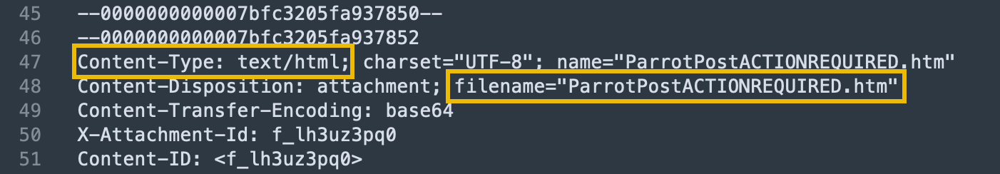
Some email filters or security systems may be configured to block or quarantine certain file types, such as HTML files. By using alternatives like HTM or SHTM file extensions instead of HTML, attackers may be able to bypass these filters and increase the chances of their email reaching the intended recipient. A `.htm` file is the most common alternative to HTML and is similarly used to represent web pages written in HTML code.

You may think receiving an HTML document attached to an email is inherently suspicious. While uncommon, there are valid reasons why a legitimate service may do so, such as including interactive forms or dynamic content. For example, secure mail platforms (like Cisco Secure Email Encryption Service) may also attach HTML documents to enhance the user experience with advanced features like encryption and authentication.

**Content Transfer Encoding**
In the attachment metadata section of the .eml file, "Content-Transfer-Encoding" is a header that indicates how the attachment's content is encoded. Base64 encodes binary data (such as images, audio files, or other content) into ASCII characters that can be sent via email or other text-based channels.

You will notice a large section of base64 encoded text at the end of the .eml file. This is the encoded contents of the embedded HTM file, which we can extract and manually decode, but typically attachments can be extracted through any modern email client.

The attachment has been extracted and separated from the email to simplify this task.

**Analyzing the File**
Since *ParrotPostACTIONREQUIRED.htm* is a plaintext file, we can also open this up in Sublime Text. By doing so, we uncover the markup of this webpage, which seemingly is another wall of encoded text!

*Tip: Turn on **Word Wrap** in Sublime Text under View > Word Wrap*
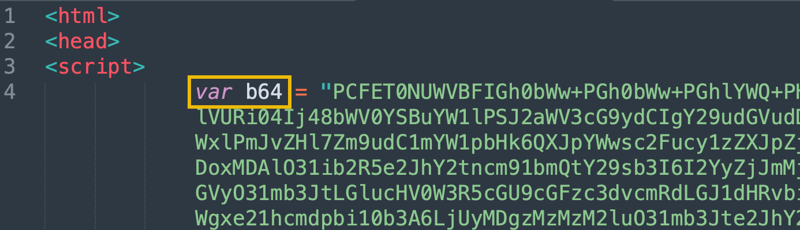
The creator of this file uses encoding to obfuscate the true nature of the webpage. Between this and the suspicious file extension, the original sender may have nefarious intentions and is actively trying to evade detection.

This HTML document declares a variable called `b64` which is set to another long string of seemingly encoded data. Aside from the telling variable name, base64-encoded data typically includes the characters A-Z, a-z, 0-9, +, /, and padding characters (=). If you see these characters in a string of text, there is a good chance it may be base64-encoded.

**atob()**

After declaring the encoded string, the browser will execute the following line of JavaScript:

`document.write(unescape(atob(b64)));`

To break down this nested function:
1. The `atob()` is a built-in JavaScript function to decode a base64-encoded string. This function passes in the `b64` variable that was previously declared as its input.
2. The `unescape()` function converts any escaped characters in the decoded string into their original form. This is necessary because base64-encoded strings may contain special characters that must be appropriately formatted before being displayed on a webpage.
3. The `document.write()` function displays the decoded and unescaped string on the webpage where the code is executed.

The encoded variable likely contains the actual website content rendered at runtime. Because of this, we will need to go another layer deeper and decode the variable to find out what this webpage consists of.

**Base64 Decoding**
There are many ways to decode base64 data, and a very common method is to use CyberChef, which is a powerful web-based application that provides tools for encoding, decoding, analyzing, and manipulating data in various formats. It can be found pre-installed on the AttackBox (navigate to http://localhost:7777), or it can be accessed on the Internet here: https://gchq.github.io/CyberChef/

To uncover the contents of the b64 variable, copy the entire base64 string (everything between the opening and closing quotation marks) and paste it into the **Input** field of CyberChef. From there, we can select the **From Base64** operation on the left-hand side of the page and drag it into the **Recipe** pane.
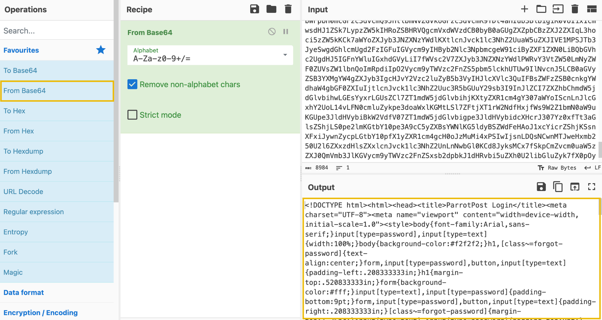
If successful, you should see the decoded data under the **Output** pane. Copy that entire output and save it as a new HTML file named "decoded_webpage.html."

>What encoding scheme is used to obfuscate the web page contents?
```
base64
```

>What is the built-in JavaScript function used to decode the web page before writing it to the page?
```
atob()
```

>After the initial base64 decoding, what is the value of the leftover base64 encoded comment?

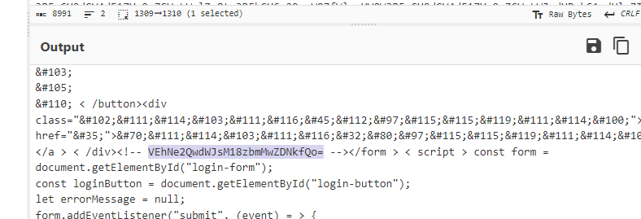

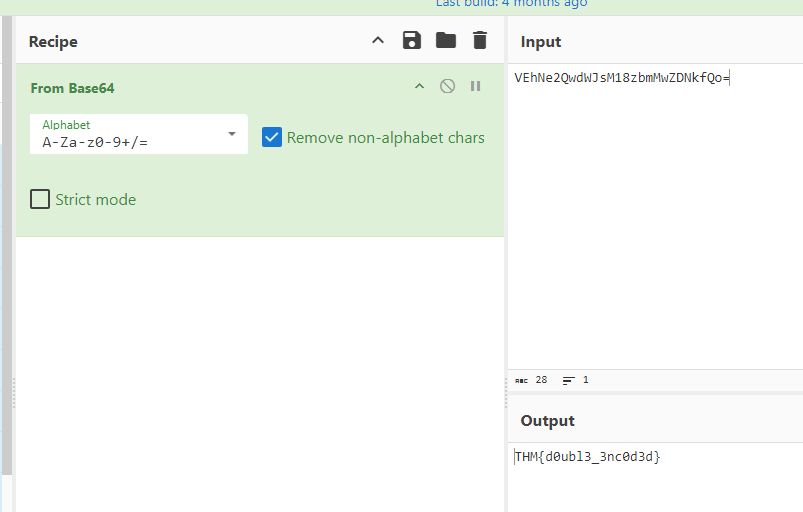

```
THM{d0ubl3_3nc0d3d}
```

## HTML Obfuscation
**HTML Entity Decoding**
Analyzing our "decoded_webpage.html" file is a little daunting as this file isn't made to be human-readable. This is because it's been compressed into a minified form, which means that all unnecessary characters, such as spaces, line breaks, and some comments, have been removed to reduce the file size. Minified code is often used in web development to reduce the loading time of web pages since smaller files can be loaded faster. However, it can make the code harder to read and understand for humans.

We will work on making the code more human-readable shortly, but first, there appears to still be some encoding in the HTML. If you locate the` <h1>` tag, you will notice a long string of seemingly random characters followed by semicolons. Ex: `<h1>&#80;&#97;&#114;&#114;&#111;&#116;`

This is known as **HTML Entity Encoding** and is another trick that the author of this file is using to throw us off. HTML entities are special sequences of characters used to represent reserved characters and other special characters in HTML. Fortunately, CyberChef can handle the decoding process of HTML Entity characters.

Copy everything from the opening `<h1>` tag to the closing `</form>` tag and paste it into the **Input** field of CyberChef. From there, search for "HTML Entity" in the **Operations** search bar and drag the **From HTML Entity** into the **Recipe** pane.
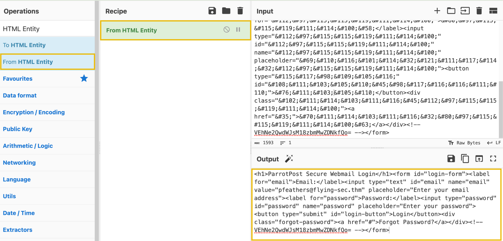

*Tip: Make sure you click **Clear Recipe** (trashcan icon) before this step so you do not attempt to base64 decode again as well!*

Great! Now we can copy the **Output** contents and paste them into the "decoded_webpage.html" file in place of all the HTML Entity characters we originally copied. This is also an excellent time to add line breaks to clarify what we've decoded. Your file should look something like this:
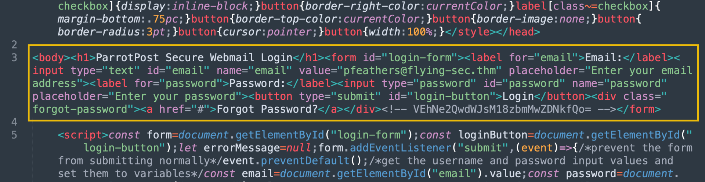
It is still unclear, but we can make out the HTML elements now. Looking into it more, it is a login page. Some input elements prompt the user for an email and password, with a login submit button.

>After decoding the HTML Entity characters, what is the text inside of the `<h1>` tag?
```
ParrotPost Secure Webmail Login
```

## CSS Obfuscation
CSS (Cascading Style Sheets) is a web language used for declaring the visual design of a web page written in HTML. CSS allows web developers to separate the presentation of a document from its content, making it easier to create and maintain visually appealing web pages. CSS can also be embedded directly into an existing HTML document using the `<style>` element.

In our file, the CSS stylesheet makes up a good portion at the beginning of the document and is contained within the opening `<style>` and closing `</style>` tags. The CSS has also gone through a **Minifier** to remove unnecessary whitespace, comments, and other characters that are not needed for the browser to interpret and display the styles correctly. If we wanted to understand the stylesheet more, we could copy and paste it into a **CSS Beautify** tool to make it more readable. [CyberChef](https://gchq.github.io/CyberChef/) can perform CSS Beautify and CSS Minify operations. However, another good example is https://www.cleancss.com/css-beautify/.
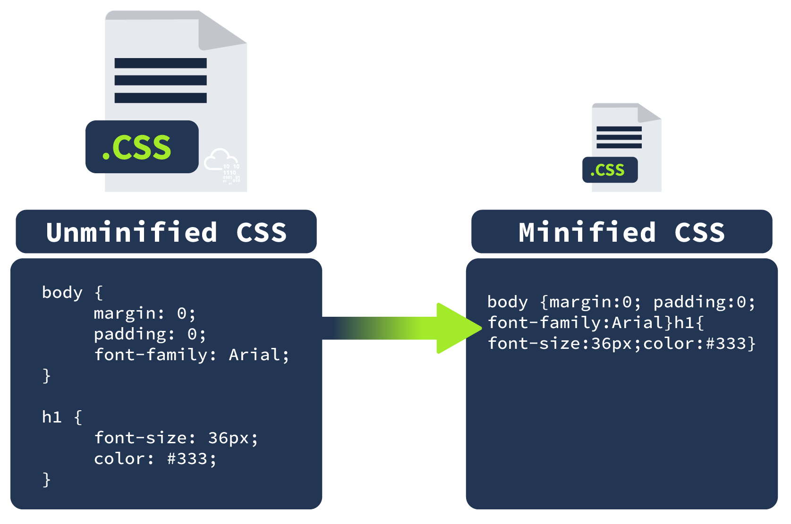
The stylesheet has been run through a CSS Obfuscator tool. Like a minimizer, a CSS obfuscator transforms the CSS code to make it difficult to read and understand without affecting its functionality. It is typically used to protect the intellectual property of the code, making it difficult for others to copy, modify or reverse-engineer it.

Often, in the case of phishing and credential capture webpages, attackers will directly copy the CSS stylesheets from known trusted websites (think of the Google or Microsoft sign-in page). By obfuscating the copied stylesheets, it makes it harder for antivirus engines and sandboxing agents to detect the stolen stylesheet.

This section was covered for the sake of thoroughness. However, we can effectively ignore everything before the closing `</style>` tag and add some line breaks to separate things visually.

>What is the reverse of CSS Minify?
```
CSS Beautify
```

## JavaScript Obfuscation
So far, we have uncovered that the attached .htm file renders an HTML login form, and an inline stylesheet is used to define the webpage's design. However, where is the login form sending its captured data? And what happens after we submit credentials? To find these answers, we must look at the final piece of this file inside the `<script>` tag.

JavaScript is often used in login forms to perform client-side form validation asynchronously and to send the user's credentials to the server for authentication. As a running theme with this file, there are some hoops we need to jump through first to make it readable.

**JavaScript Beautify**
This JavaScript code has been minified, removing any unnecessary characters and whitespace. Fortunately, we can "beautify" this code by copying everything between the opening `<script>` and closing `</script>` tags, pasting it into the input of [Beautifier.io](https://beautifier.io/) and clicking **Beautify Code**. Alternatively, we can leverage [CyberChef](https://gchq.github.io/CyberChef/)'s "JavaScript Beautify" operation to accomplish the same result.
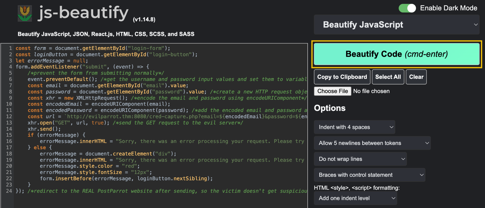

We can then copy and replace the output in our file with the original JavaScript code we copied. Now that we have readable code, the author accidentally left over some verbose comments that help us understand what each statement is doing. Use this and some external JavaScript research to answer the questions below.

>What is the URL that receives the login request when the login form is submitted?

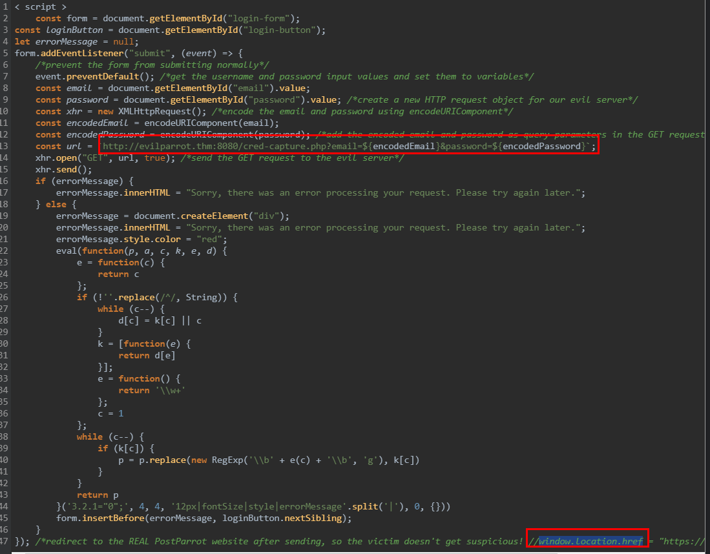

```
http://evilparrot.thm:8080/cred-capture.php
```

>What is the JavaScript property that can redirect the browser to a new URL?

```
window.location.href
```

## Putting It All Together
Through our investigation, we manually decoded and inferred the true nature of this webpage. To summarize, this is a login page that impersonates the legitimate ParrotPost website to capture user credentials for malicious purposes. The JavaScript code listens for the login form submission event and sends an HTTP GET request to another URL location, which is clearly not the actual ParrotPost login endpoint.

**Detonating the Form**
Interacting with this malicious webpage isn't something you usually want to do (unless you are in a controlled sandbox environment), but let's demonstrate what happens when a victim falls for this phishing website! This will help us study the behaviour of the document and its potential impact on a real system (and victim) without actually infecting or harming any systems.

First, click **Start Machine** at the top of this task. This will open up the VM in a split-screen browser window. If the VM is not visible, click the blue **Show Split View** button at the top-right of the page. Once you are brought to the desktop, open the original `ParrotPostACTIONREQUIRED.htm` document in the VM's web browser (right-click, and select **Open With Firefox Web Browser**).
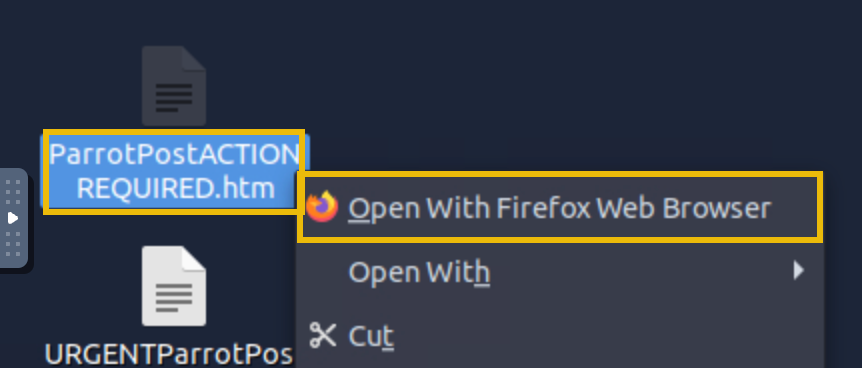
**Note**: For this task, please ensure you are using the VM attached to this task, rather than the AttackBox.

You should be directed to the following HTML page in your browser:
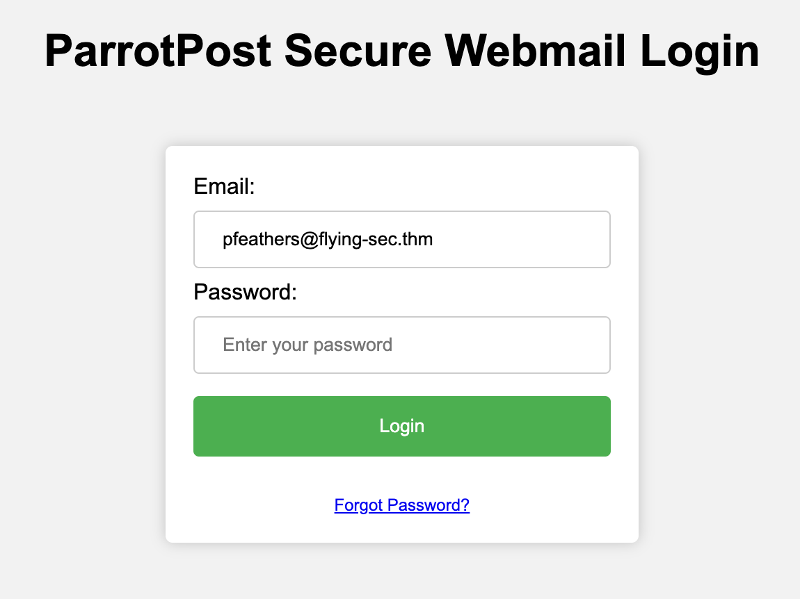
As suspected, this is a credential capture login page, and it appears Paul's email address has already been filled in under the **Email** field. This is a common familiarity tactic to have a victim think a site has remembered or cached their username, helping to create trust. It also reveals that this is likely a targeted phishing campaign, and since Paul is a senior executive, this may specifically be a [Whaling attack](https://www.ncsc.gov.uk/guidance/whaling-how-it-works-and-what-your-organisation-can-do-about-it).

Let's change the value of the **Email** and **Password** fields to represent fake credentials, as this will probably be logged on the attacker's server. Then, click **Login**.
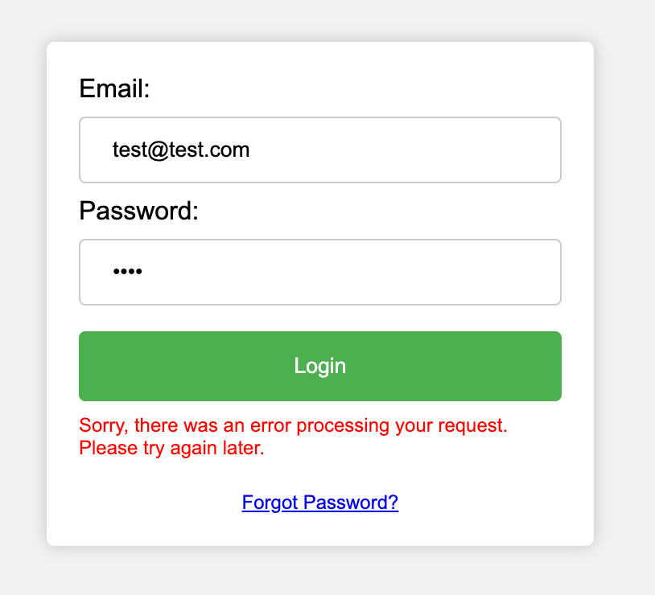

Upon submitting our phony credentials, the website returns an error message claiming an error processing our login request. However, that might not be the case; this may be a "fake" error message that attackers use to ease suspicion, whereas, in reality, our request containing credentials did go through in the background (through the beauty of asynchronous JavaScript).

**Check the Network Requests**
By checking the **Network** tab in the browser's **Developer Tools**, we can quickly determine whether submitting the form sent a successful HTTP GET request. To open the Developer Tools menu, right-click on the page and select **Inspect**. Once the tab is open, click on the **Network** tab.
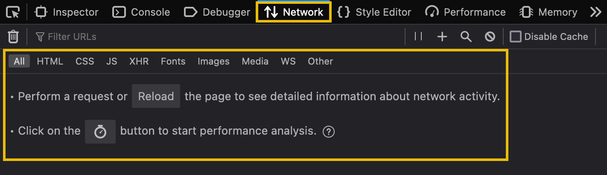

From here, we only need to click the **Login** button to submit the form again. You should suddenly see a GET request appear!
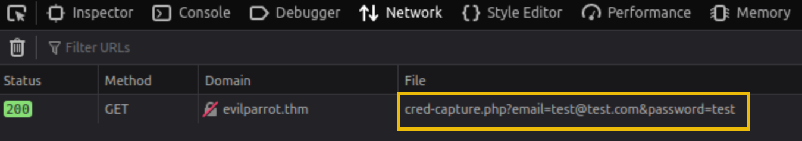

Our browser successfully established the connection to the `evilparrot.thm` web server and included our credentials as query parameters in the GET request to `/cred-capture.php`.

Clicking on the listed request will give us more details in the right-hand panel. We can navigate between different tabs to view information, such as the request and response headers. The **Response** tab will show any response content, such as the HTML, JSON, or XML response body. Sometimes this can give us more information about how the web server handles the request, depending on how verbose the server-side code is designed.
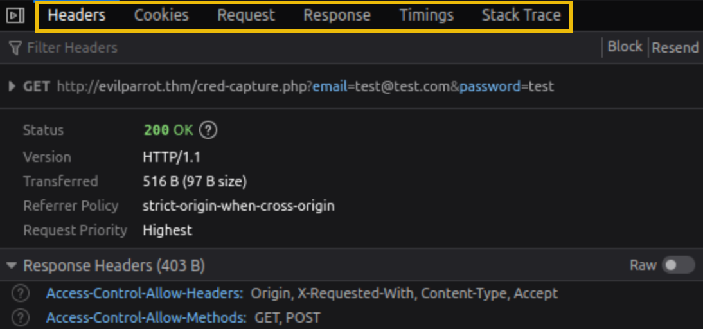
Play around by testing a request and analyzing the response. You may find some interesting information to help answer the questions below.

>What is the flag you receive after sending fake credentials to the /cred-capture.php endpoint?

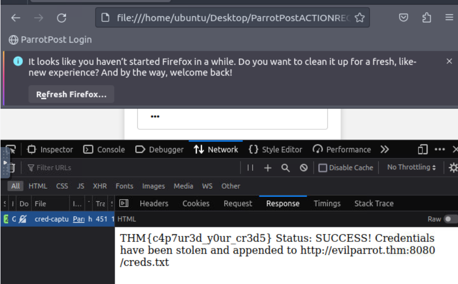

```
THM{c4p7ur3d_y0ur_cr3d5}
```

>What is the path on the web server hosting the log of captured credentials?
```
/creds.txt
```

>Based on the log, what is Chris Smith's password?

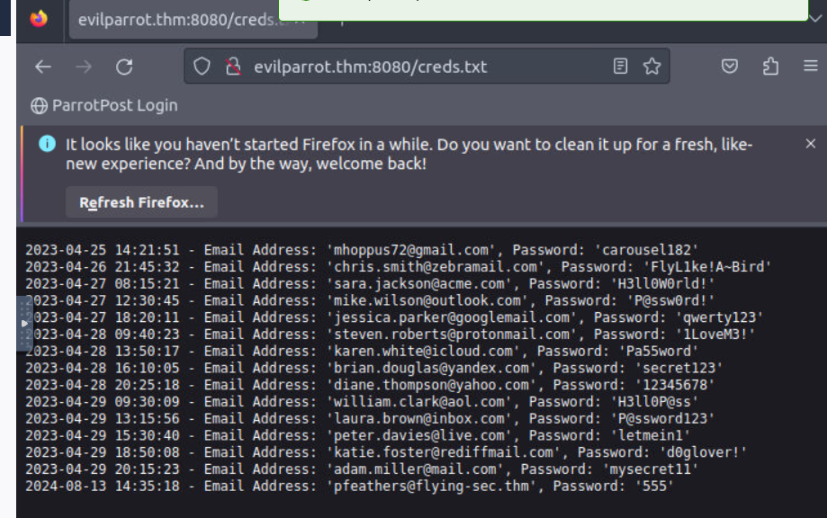
```
FlyL1ke!A~Bird
```
***