# [TryHackMe - Phishing Analysis Tools (Phishing Case 1-3)](https://tryhackme.com/room/phishingemails3tryoe)
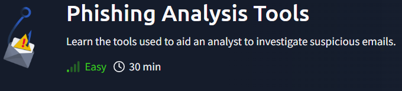
***
[toc]
***
## Phishing Case 1
**Scenario**: You are a Level 1 SOC Analyst. Several suspicious emails have been forwarded to you from other coworkers. You must obtain details from each email for your team to implement the appropriate rules to prevent colleagues from receiving additional spam/phishing emails. 

**Task**: Use the tools discussed throughout this room (or use your own resources) to help you analyze each email header and email body. 

>What brand was this email tailored to impersonate?

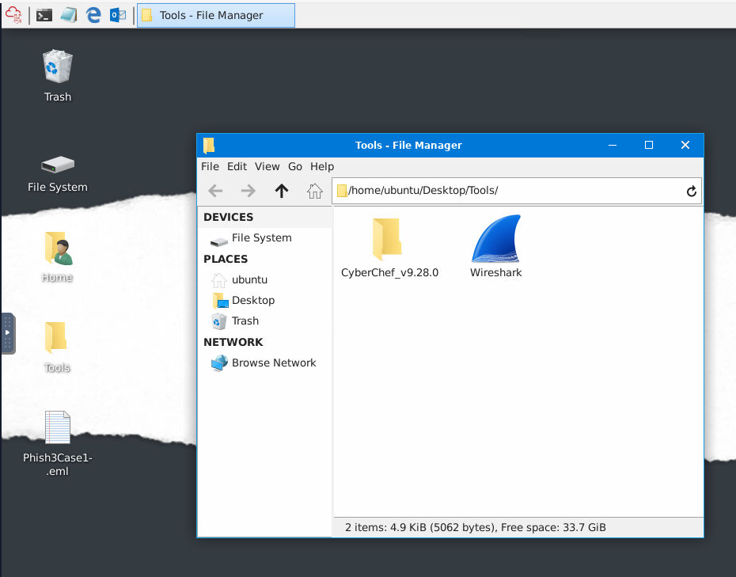

We will have to start the attackbox on this one and we can see that there is an email that we have to investigate on the Desktop and we have Wireshark and CyberChef on the Tools folder.

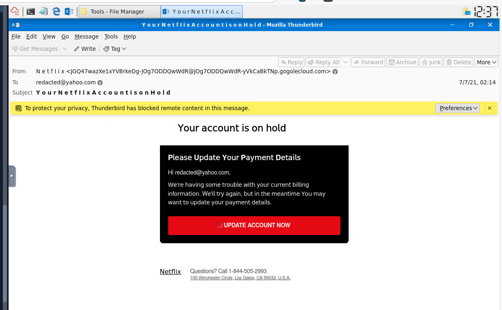

We can double click eml file which will automatically started Thunderbird and display an email like this, we can see that the attacker was trying to imitate Netflix to get user to click a link embedded on that red button by manipulate an emotion such as panick or afraid to lose the account.

```
Netflix
```

>What is the From email address?

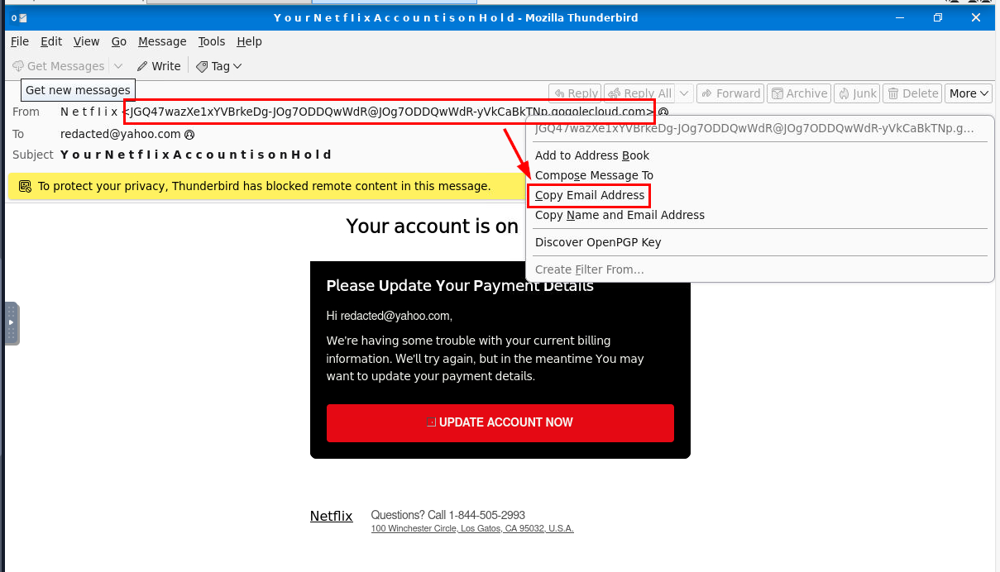

We have quite long email sender and look we do not have to look at the source of this email to answer this question and we can easily copy this sender email by clicking on it and select "Copy Email Address". one thing to notice here is the sender email is very suspicious and its less likely that the actual netflix will send an email without the @netflix.com domain.

```
JGQ47wazXe1xYVBrkeDg-JOg7ODDQwWdR@JOg7ODDQwWdR-yVkCaBkTNp.gogolecloud.com
```

>What is the originating IP? Defang the IP address. 

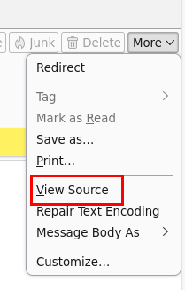

Its time to dig into the source by clicking the "More" button at top right and select "View Source".

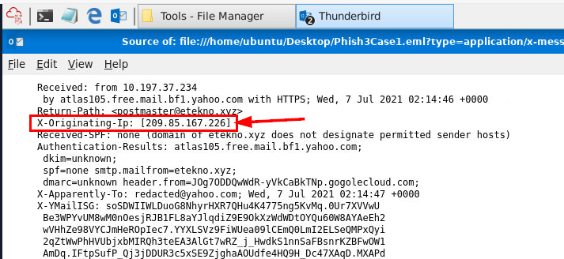

Now we can see that the **X-Originating-Ip** header is the header that stores the actual sender IP of this email.

```
209[.]85[.]167[.]226
```

>From what you can gather, what do you think will be a domain of interest? Defang the domain.

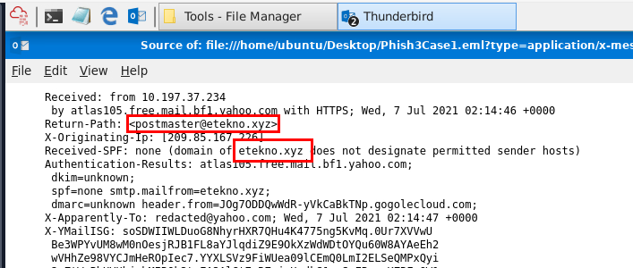

Then we can see that **Return-Path** header and SPF header has specific domain that is not associated with netflix at all and this is likely to be the actual email that was sent by the phisher.

```
etekno[.]xyz
```

>What is the shortened URL? Defang the URL.

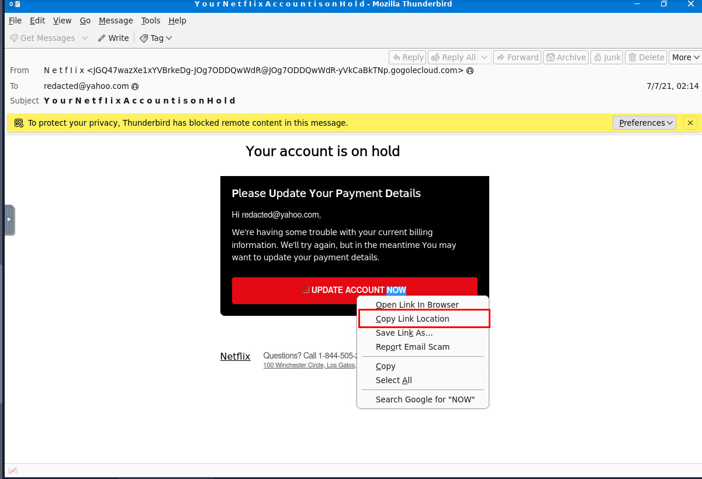

There are so many HTML code on the source so we can come back to rendered email, right click on the red button and copy the location/url

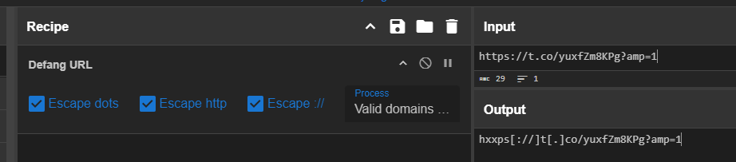

Now we paste it in CyberChef to defang and now we get the answer.

```
hxxps[://]t[.]co/yuxfZm8KPg?amp=1
```
***
## Phishing Case 2
**Scenario**: You are a Level 1 SOC Analyst. Several suspicious emails have been forwarded to you from other coworkers. You must obtain details from each email for your team to implement the appropriate rules to prevent colleagues from receiving additional spam/phishing emails. 

A malicious attachment from a phishing email inspected in the previous Phishing Room was uploaded to Any Run for analysis. 

**Task**: Investigate the analysis and answer the questions below. 

**Link**: https://app.any.run/tasks/8bfd4c58-ec0d-4371-bfeb-52a334b69f59

>What does AnyRun classify this email as?

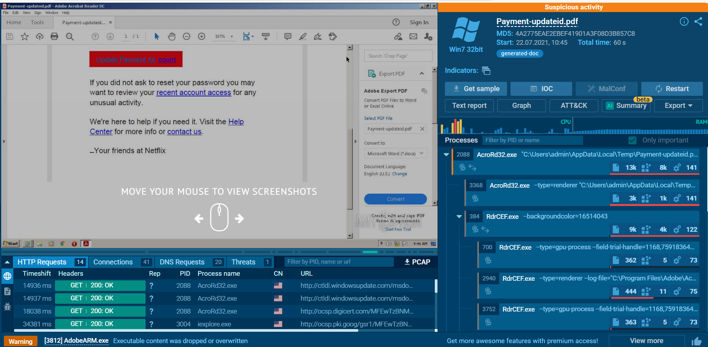

Alright first thing we noticed after opened any.run report is the filename and classification that was marked by any.run itself which is Suspicious Activity.

```
Suspicious Activity
```

>What is the name of the PDF file?
```
Payment-updateid.pdf
```

>What is the SHA 256 hash for the PDF file?

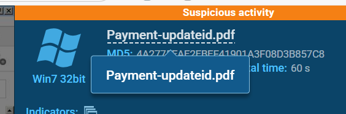

First way we can get file hashes is by clicking the filename right here.

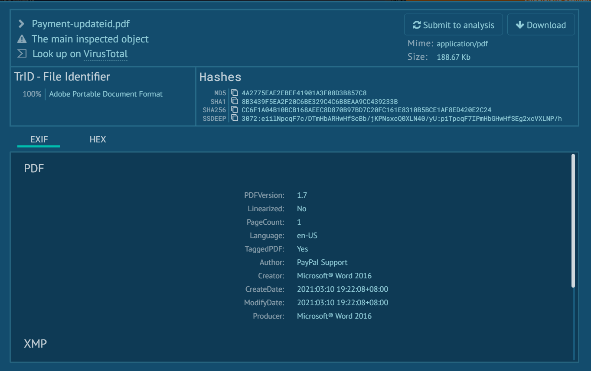

Which will display another window that we can look up the result on VirusTotal, look at the metadata of the file and also 4 different types of hash including the fuzzing hash (SSDEEP)

```
cc6f1a04b10bcb168aeec8d870b97bd7c20fc161e8310b5bce1af8ed420e2c24
```

>What two IP addresses are classified as malicious? Defang the IP addresses. (answer: **IP_ADDR**,**IP_ADDR**)

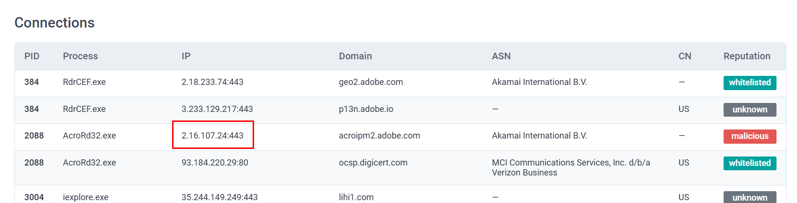

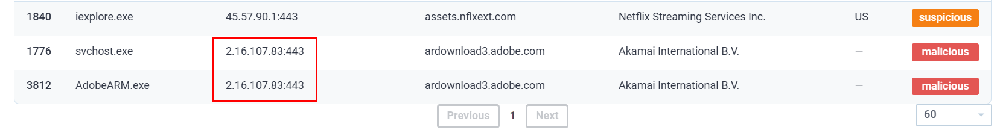

I could not find any IP address flagged as malicious on any.run interactive report so I opened [the text report](https://any.run/report/cc6f1a04b10bcb168aeec8d870b97bd7c20fc161e8310b5bce1af8ed420e2c24/8bfd4c58-ec0d-4371-bfeb-52a334b69f59) which we can see that on the "Connections" section there are 2 IP addresses belong to Akamai that flagged as Malicious on this report.

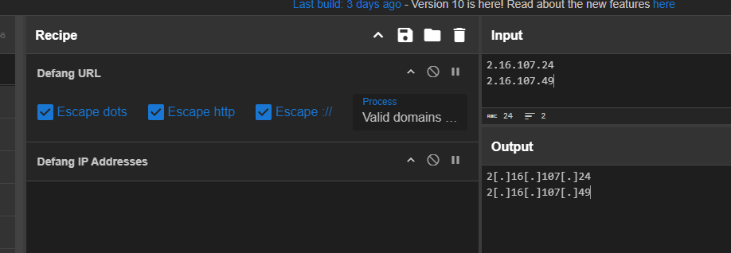

Defang it real quick to get the answer.

```
2[.]16[.]107[.]24,2[.]16[.]107[.]49
```

>What Windows process was flagged as **Potentially Bad Traffic**?

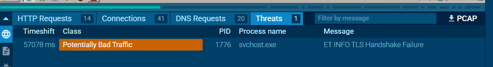

We can go back to interactive report to find the which process was flagged as **Potentially Bad Traffic** from the "Threats" section right there.

```
svchost.exe
```
***
## Phishing Case 3
**Scenario**: You are a Level 1 SOC Analyst. Several suspicious emails have been forwarded to you from other coworkers. You must obtain details from each email for your team to implement the appropriate rules to prevent colleagues from receiving additional spam/phishing emails. 

A malicious attachment from a phishing email inspected in the previous Phishing Room was uploaded to Any Run for analysis. 

**Task**: Investigate the analysis and answer the questions below. 

**Link**: https://app.any.run/tasks/82d8adc9-38a0-4f0e-a160-48a5e09a6e83

>What is this analysis classified as?

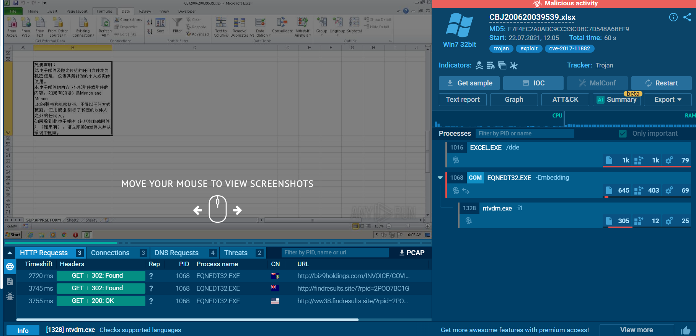

Upon opening this report, I noticed several things from the classification as Malicious, file type that indicate that this is the malicious document (maldoc) and the "EQNEDT32.EXE" process that spawned under "EXCEL.EXE" which likely indicates CVE-2017-11882

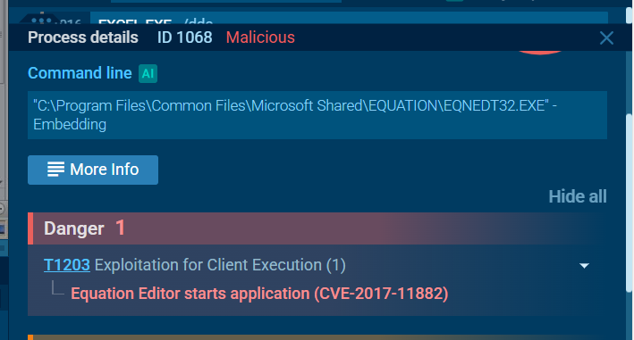

And It really is!, this is well-known vulnerable to get remote code execution on the vulnerable Microsoft Office application. 

```
Malicious activity
```

>What is the name of the Excel file?
```
CBJ200620039539.xlsx
```

>What is the SHA 256 hash for the file?

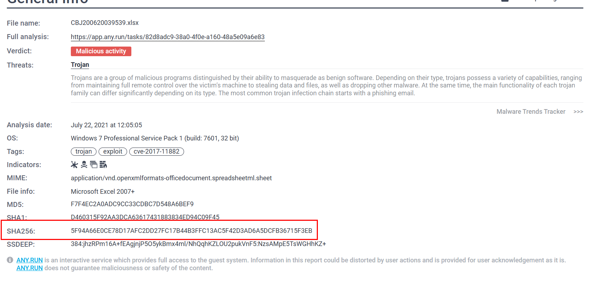

We can also get file hash from the [Text report](https://any.run/report/5f94a66e0ce78d17afc2dd27fc17b44b3ffc13ac5f42d3ad6a5dcfb36715f3eb/82d8adc9-38a0-4f0e-a160-48a5e09a6e83) as well

```
5F94A66E0CE78D17AFC2DD27FC17B44B3FFC13AC5F42D3AD6A5DCFB36715F3EB
```

>What domains are listed as malicious? Defang the URLs & submit answers in alphabetical order. (answer: **URL1**,**URL2**,**URL3**)

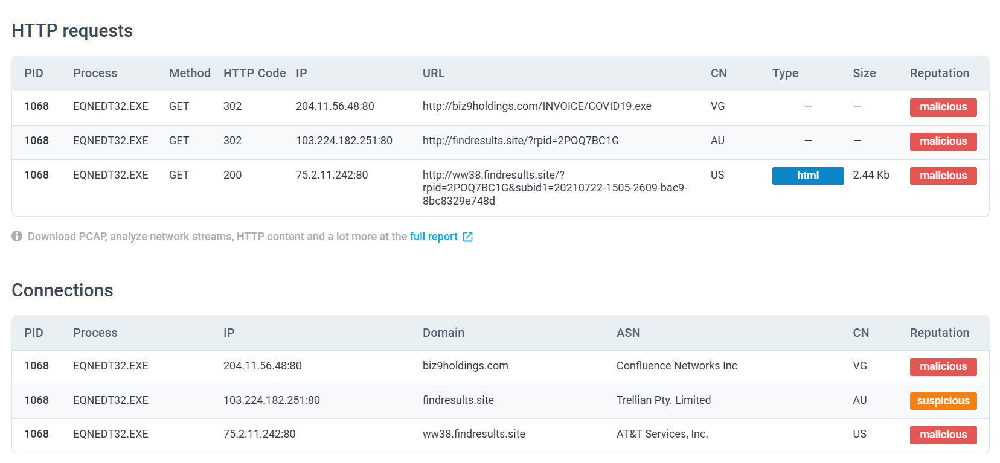

On the text report, we can see that 3 different domain/url were contacted and all of them are flagged as malicious.

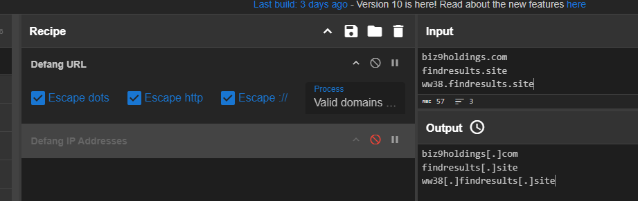

Defang them with CyberChef and we can copy this to answer the question and we will do the same for the next question as well.

```
biz9holdings[.]com,findresults[.]site,ww38[.]findresults[.]site
```

>What IP addresses are listed as malicious? Defang the IP addresses & submit answers from lowest to highest. (answer: **IP1**,**IP2**,**IP3**)
```
75[.]2[.]11[.]242,103[.]224[.]182[.]251,204[.]11[.]56[.]48
```

>What vulnerability does this malicious attachment attempt to exploit?

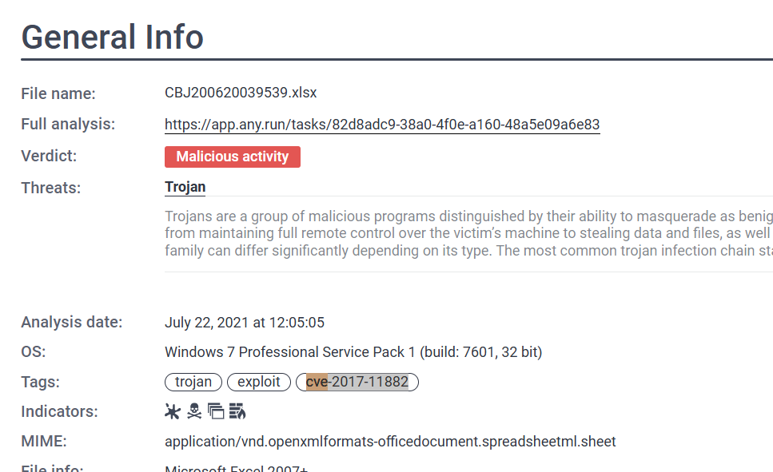

We already know that this file aims to exploit CVE-2017-11882.

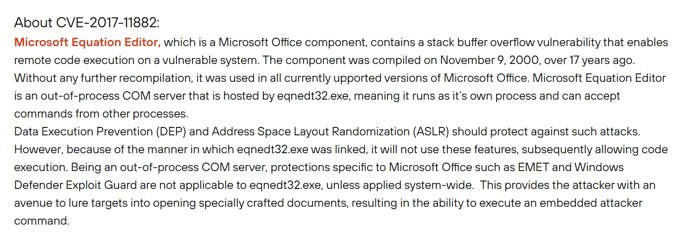

Which is the Buffer Overflow RCE on Microsoft Equation Editor of Microsoft Office which will serve as an initial point of compromised upon opening the file just like malicious macro but this time it has no macro, just buffer overflow code
- https://unit42.paloaltonetworks.com/unit42-analysis-of-cve-2017-11882-exploit-in-the-wild/

```
CVE-2017-11882
```

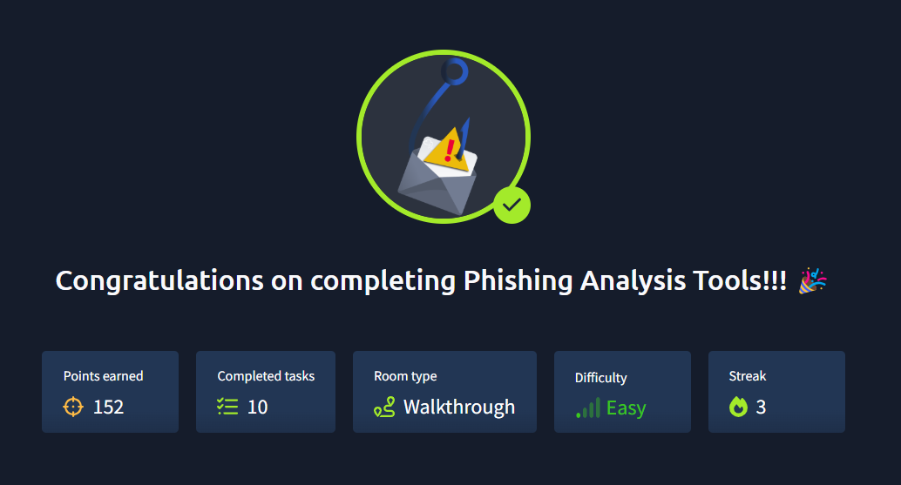
***