# [TryHackMe - Retracted](https://tryhackme.com/room/retracted)
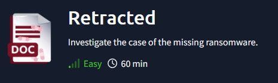
***
## Introduction
**A Mother's Plea**

**"Thanks for coming. I know you are busy with your new job, but I did not know who else to turn to."**

**"So I downloaded and ran an installer for an antivirus program I needed. After a while, I noticed I could no longer open any of my files. And then I saw that my wallpaper was different and contained a terrifying message telling me to pay if I wanted to get my files back. I panicked and got out of the room to call you. But when I came back, everything was back to normal."**

**"Except for one message telling me to check my Bitcoin wallet. But I don't even know what a Bitcoin is!"**

**"Can you help me check if my computer is now fine?"**

> I'll handle it,  Mom.

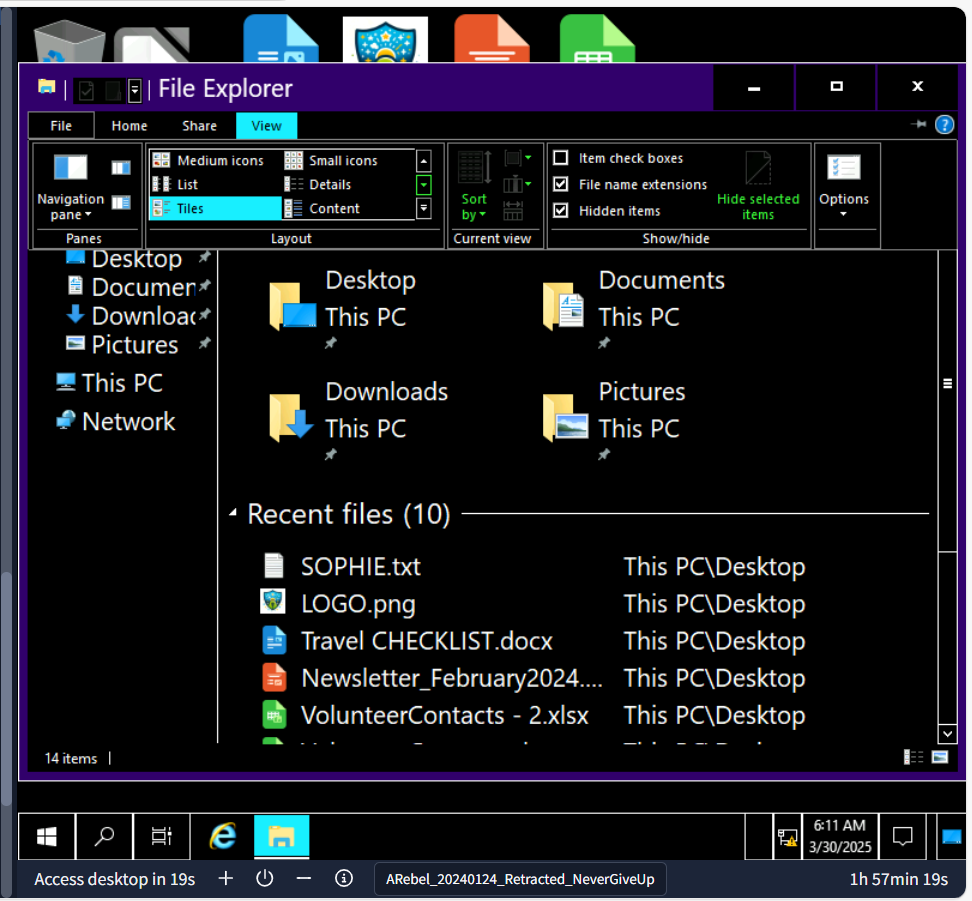

On this room, We will have to investigate live environment that already executed a malware and the first thing I always do when access new Windows environment is to enable "**File name extensions**" and "**Hidden items**" view as you can see from the image above, and now we are ready to investigate.
* * *
## The Message 
**"So, as soon as you finish logging in to the computer, you'll see a file on the desktop addressed to me."**

**"I have no idea why that message is there and what it means. Maybe you do?"**

> What is the full path of the text file containing the "message"?

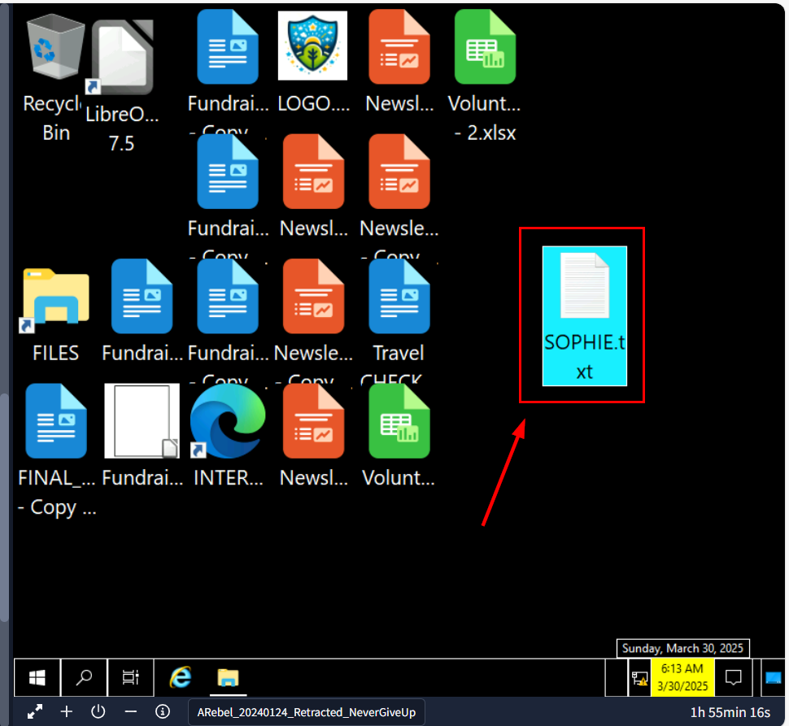

On the desktop, we can see a text file named `SOPHIE.txt` on the desktop right here. 

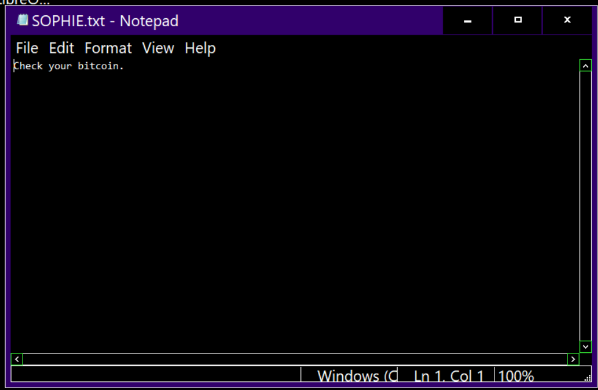

We can see the "message" once we opened a file and since we logged on as SOPHIE user which mean the file is located in `C:\Users\Sophie\Desktop` 

  
Answer

<pre><code>C:\Users\Sophie\Desktop\SOPHIE.txt</code></pre>

> What program was used to create the text file?

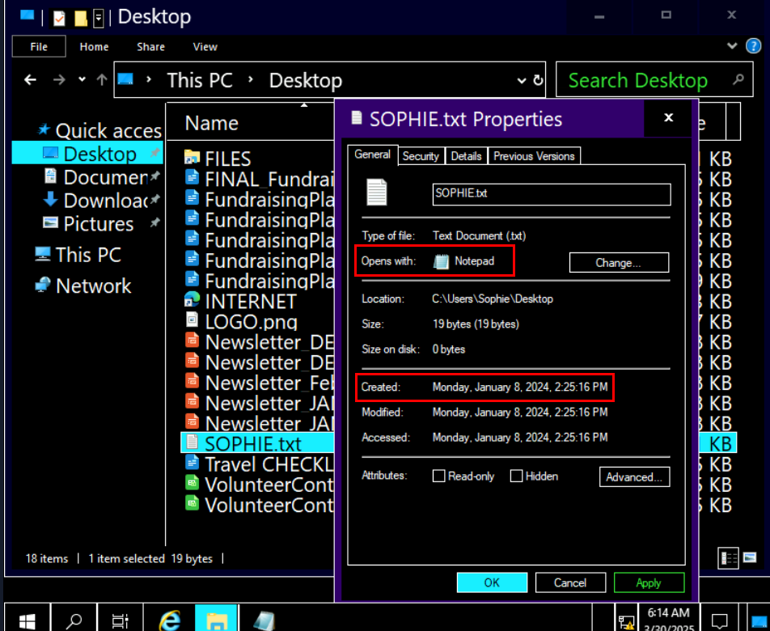

Next, we can see that this file was created on **January 8,2024** and the default program that can be used to open this file is notepad but lets check if there is any log that we could use to dig a little bit deeper.

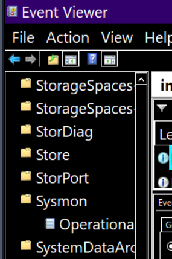

Luckily for us, We got **SYSMON** log which we can open it from Event Viewer so we can use this log to investigate further how this incident occurred and what happened after Sophie executed fake antivirus.

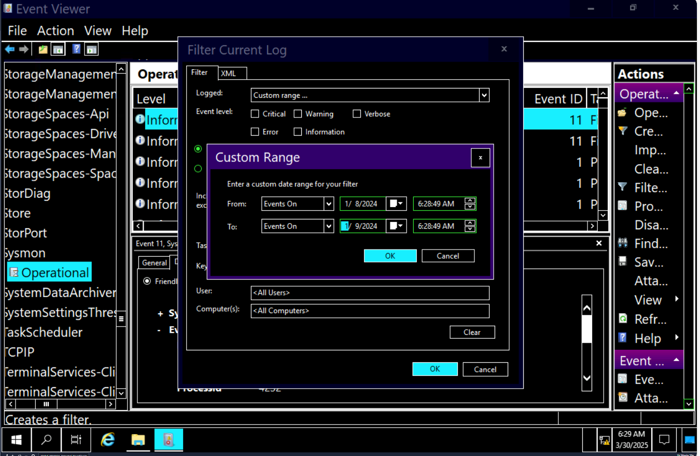

First, Lets scope for the timeline that we know that the text file was created which I filtered for any events that happened between 2024-01-08 to 2024-01-09 then after scope this, I saved this fitler as custom view so I don't have to filter again if I went to other logs.

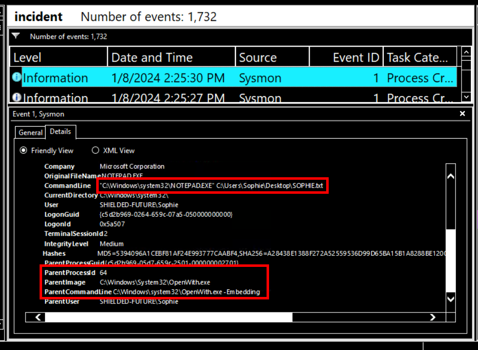

We know that the text file was created around 02:25 PM so we can look up the log around there which we will can see that the text file was created / opened using `notepad.exe` and the parent process is `openwith.exe` indicates that the one who created this file just right-click on the file and select option "open with" to open a file with notepad.

  
Answer

<pre><code>notepad.exe</code></pre>

> What is the time of execution of the process that created the text file? Timezone UTC (Format YYYY-MM-DD hh:mm:ss)

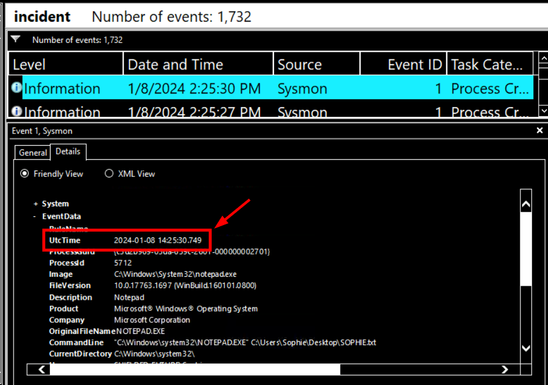

We can copy the UtcTime of this event right here

  
Answer

<pre><code>2024-01-08 14:25:30</code></pre>

***
## Something Wrong
**"I swear something went wrong with my computer when I ran the installer. Suddenly, my files could not be opened, and the wallpaper changed, telling me to pay."**

**"Wait, are you telling me that the file I downloaded is a virus? But I downloaded it from Google!"**

> What is the filename of this "installer"? (Including the file extension)

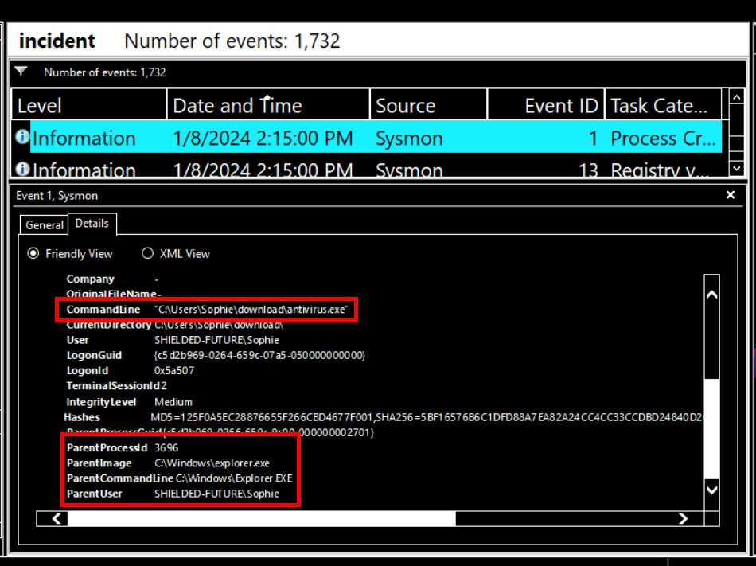

After tracing back, I found several Microsoft Edge processes before 14:15:00 and then a suspicious file named `antivirus.exe` was executed by `explorer.exe` which indicates that user SOPHIE executed this file herself which aligns with the scenario that user downloaded installer for antivirus and executed it.

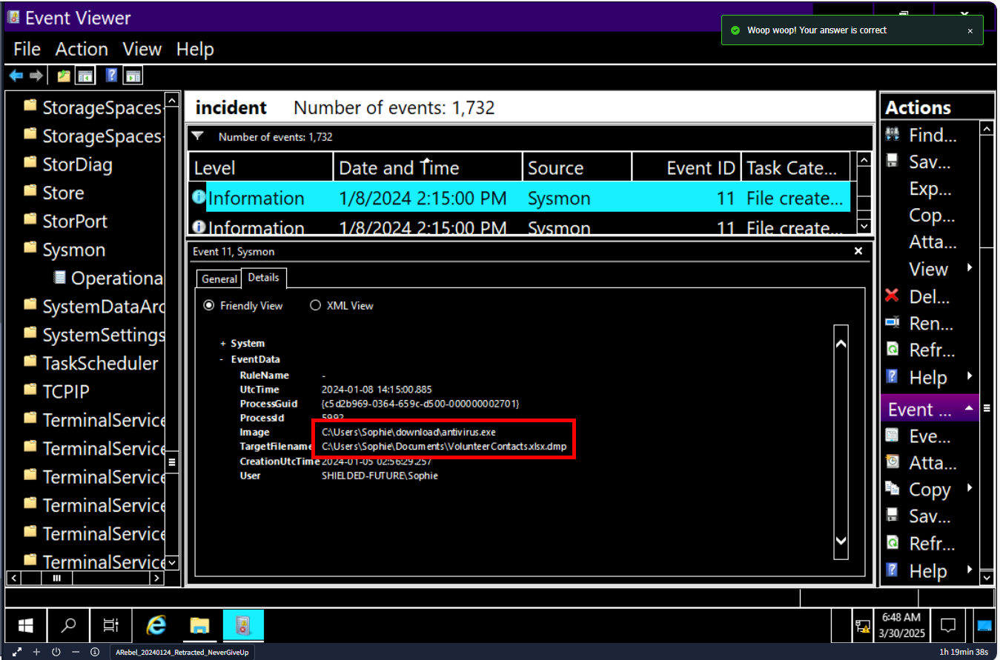

After that, several files was renamed with `.dmp` extension which indicates ransomware behavior by encrypting sensitive files on infected system.

  
Answer

<pre><code>antivirus.exe</code></pre>

> What is the download location of this installer?

  
Answer

<pre><code>C:\Users\Sophie\Download</code></pre>

> The installer encrypts files and then adds a file extension to the end of the file name. What is this file extension?

  
Answer

<pre><code>.dmp</code></pre>

> The installer reached out to an IP. What is this IP?

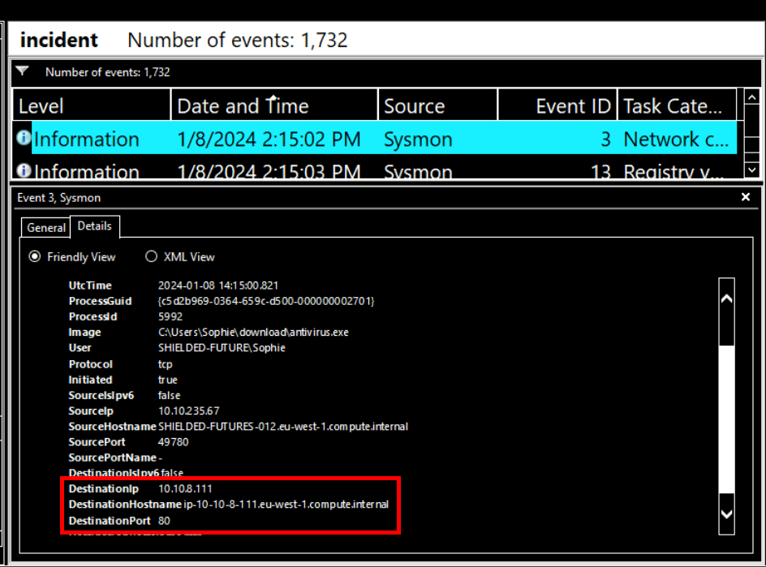

After encrypted files, Noticed that there is network connection to another IP address by antivirus process on port 80.

  
Answer

<pre><code>10.10.8.111</code></pre>

***
## Back to Normal
**"So what happened to the virus? It does seem to be gone since all my files are back."**

> The threat actor logged in via RDP right after the “installer” was downloaded. What is the source IP?

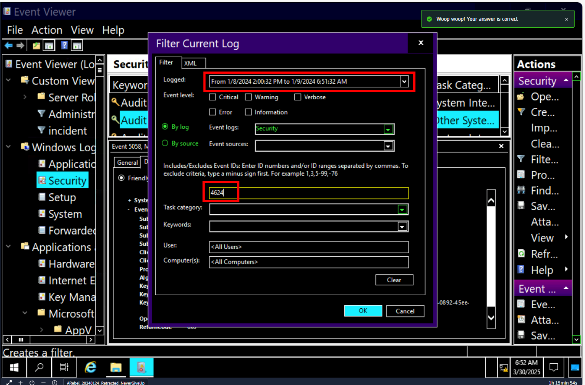

To find out which IP address logged in to this machine, I filtered for Event ID 4624 (Logon successfully) from Security log and do not forget to scope the time range the incident occurred on January 8, 2024 

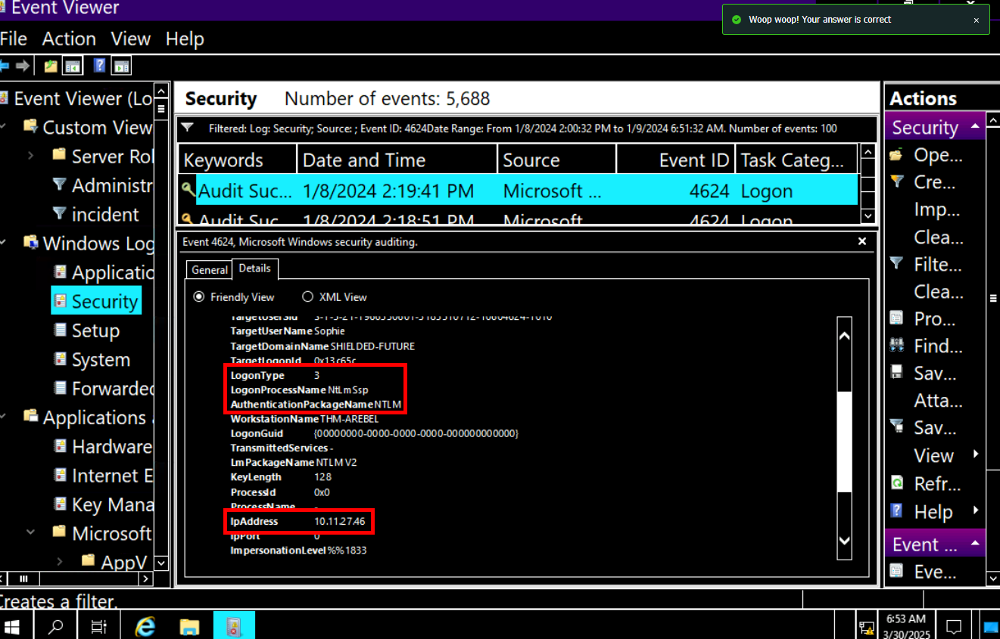

Then we can see that at 14:19:41, there is logon success event from 10.11.27.46 to this machine but the Logon Type is not matched what Logon Type via RDP is so I dug a little bit deeper

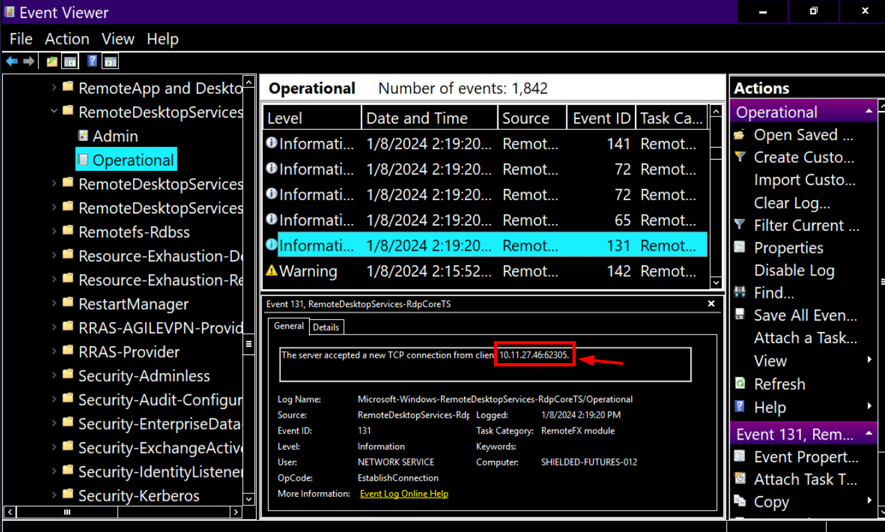

Next, I found there is an RDP event was logged in RemoteDesktopServices-RdpCoreTS and the IP address is matches what we found on Security log as well.

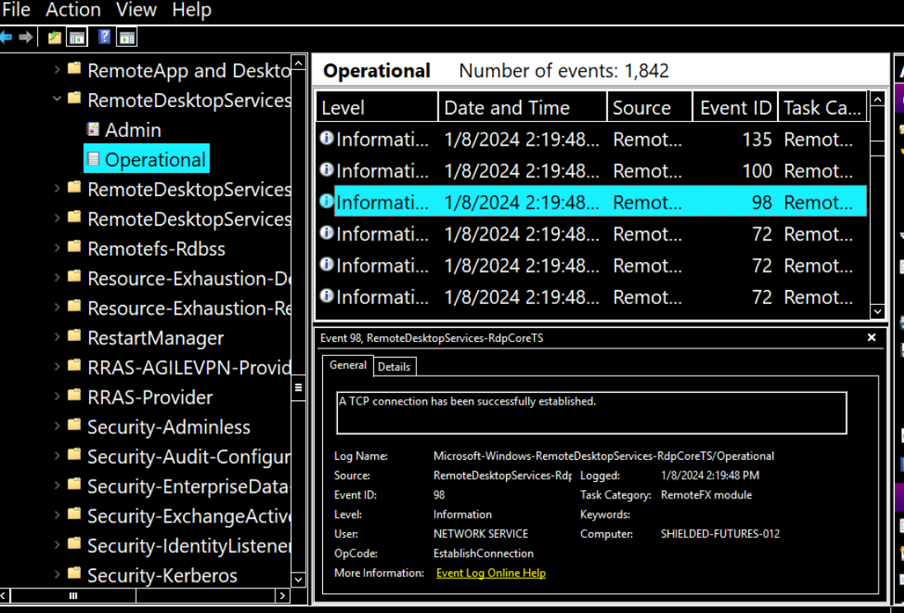

Looking a bit further, we can see that RDP connection was established at 14:19:48 from the previous IP we found earlier.

  
Answer

<pre><code>10.11.27.46</code></pre>

> This other person downloaded a file and ran it. When was this file run? Timezone UTC (Format YYYY-MM-DD hh:mm:ss)

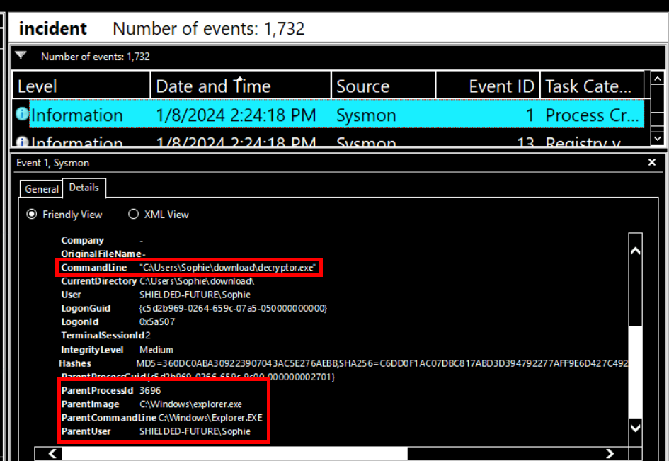

Going back to Sysmon, I noticed that `decrypter.exe` was downloaded via Microsoft Edge and executed by user Sophie at 2024-01-08 14:24:18 which happened before text file was created.

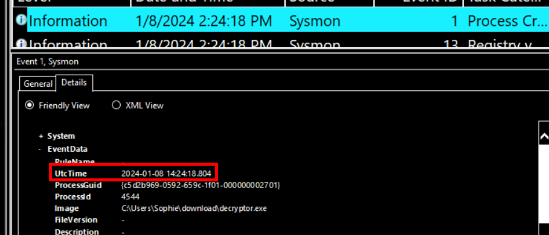

Easily copy timestamp right here.

  
Answer

<pre><code>2024-01-08 14:24:18</code></pre>

***
## Doesn't Make Sense
**"So you're telling me that someone accessed my computer and changed my files but later undid the changes?"**

**"That doesn't make any sense. Why infect my machine and clean it afterwards?"**

**"Can you help me make sense of this?"**

**Arrange the following events in sequential order from 1 to 7, based on the timeline in which they occurred.**

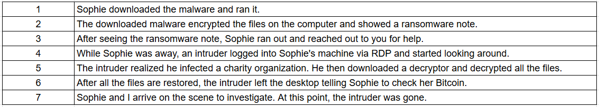

From the incident, we can arrange the timeline as seen in the above image and its pretty much summed up the incident and what we needed to know to complete the room.

***
## Conclusion
**"Adelle from Finance just called me. She says that someone just donated a huge amount of bitcoin to our charity's account!"**

**"Could this be our intruder? His malware accidentally infected our systems, found the mistake, and retracted all the changes?"**

**"Maybe he had a change of heart?"**

>Yeah, possibly.

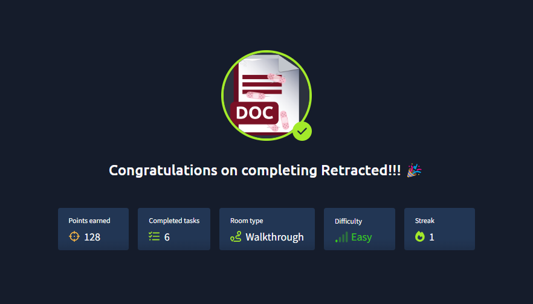
***