# [TryHackMe - Snapped Phish-ing Line](https://tryhackme.com/room/snappedphishingline)

***
**An Ordinary Midsummer Day...**

As an IT department personnel of SwiftSpend Financial, one of your responsibilities is to support your fellow employees with their technical concerns. While everything seemed ordinary and mundane, this gradually changed when several employees from various departments started reporting an unusual email they had received. Unfortunately, some had already submitted their credentials and could no longer log in.

You now proceeded to investigate what is going on by:
1. Analysing the email samples provided by your colleagues.
2. Analysing the phishing URL(s) by browsing it using Firefox.
3. Retrieving the phishing kit used by the adversary.
4. Using CTI-related tooling to gather more information about the adversary.
5. Analysing the phishing kit to gather more information about the adversary.
***
>Who is the individual who received an email attachment containing a PDF?


After gaining access to the machine, we can see that we have 5 different emails on the `phish_emails` directory and we only have CyberChef and Thunderbird available on this host if not counting grep and other binary.

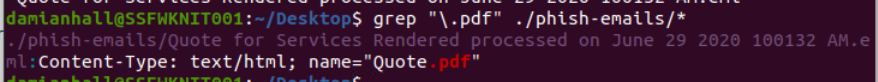

We can open each email with Thunderbird to find if any of these emails came with pdf attachment but we can also use `grep "\.pdf" ./phish_emails/*` to find the name of an attachment and the file that contains it from the command line and as we can see on the image above that we only have 1 email with pdf attachment.

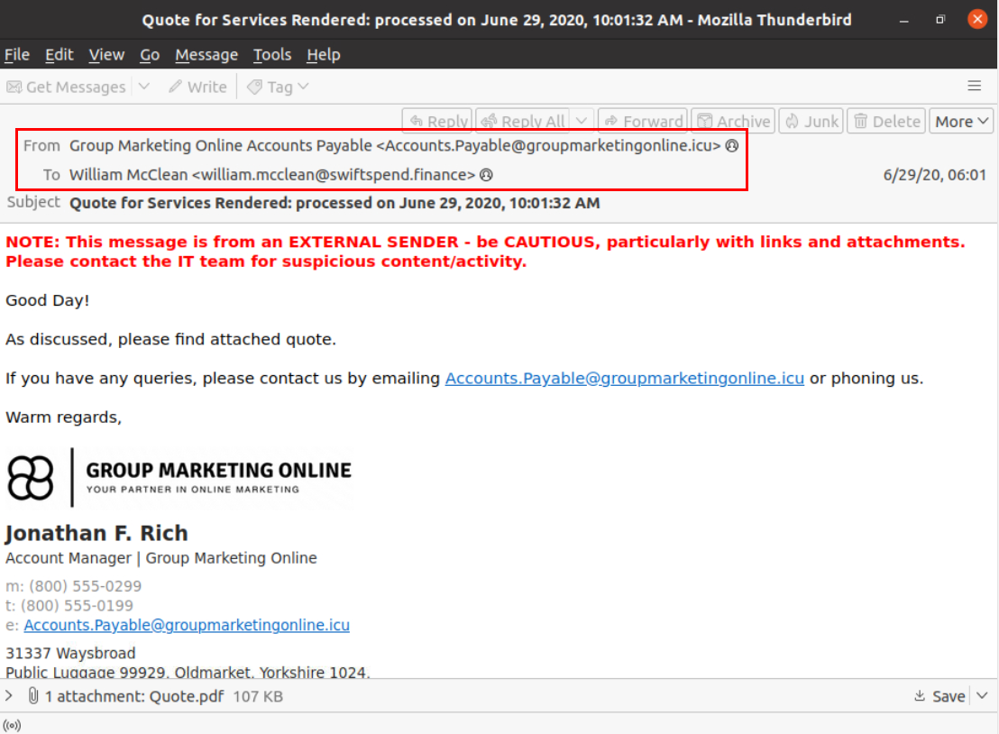

Now we can open this email with Thunderbird to find out the sender and receiver of this email.  

```
William McClean
```

>What email address was used by the adversary to send the phishing emails?
```
Accounts.Payable@groupmarketingonline.icu
```

>What is the redirection URL to the phishing page for the individual Zoe Duncan? (defanged format)

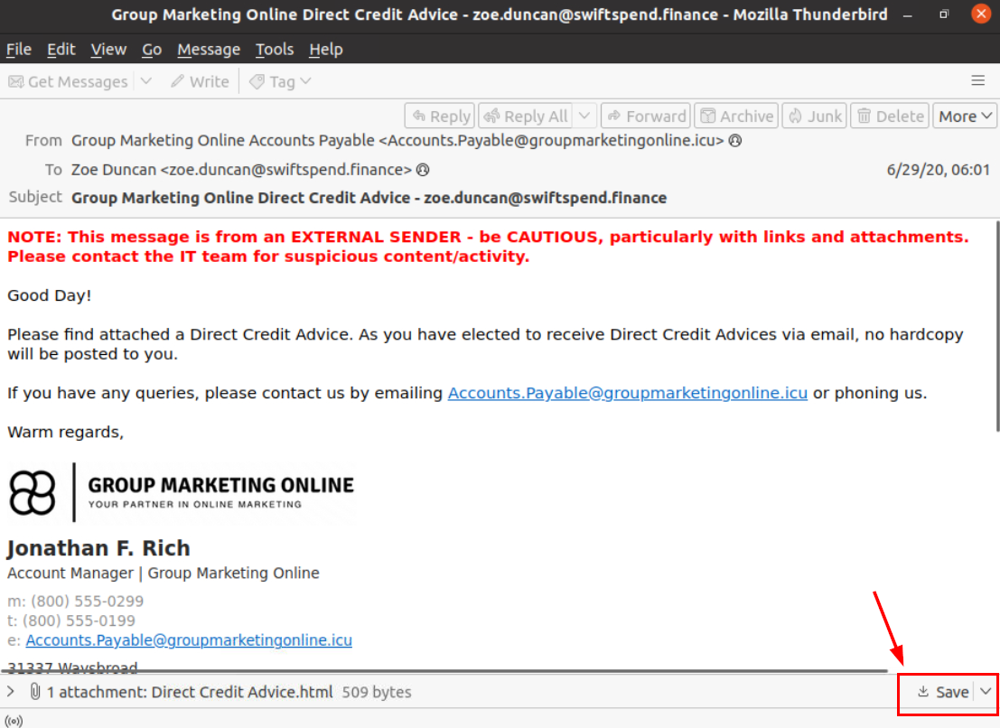

There is only 1 email sent to Zoe Duncan so we can open it with Thunderbird and we can see that there is 1 html attachment from this email and beside that we can also see that the sender of this email matches the one we found with pdf attachment earlier, now we can save this attachment with "Save" button.

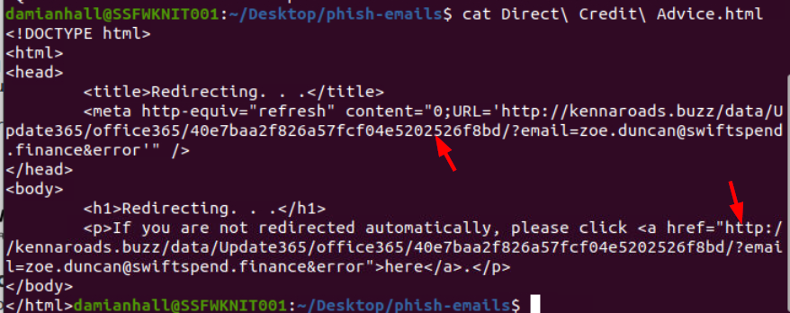

Upon inspecting this HTML file, we can see that it designed to redirect user to phishing site with on the `kennaroads.buzz` domain 

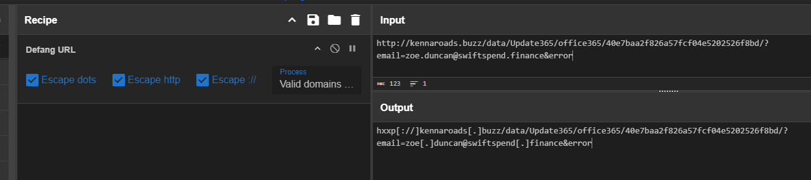

We can use CyberChef to quickly defang this url and submit as an answer of this question.

```
hxxp[://]kennaroads[.]buzz/data/Update365/office365/40e7baa2f826a57fcf04e5202526f8bd/?email=zoe[.]duncan@swiftspend[.]finance&error
```

>What is the URL to the .zip archive of the phishing kit? (defanged format)

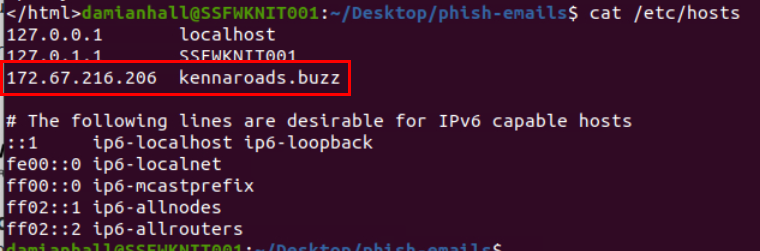

Upon inspecting hosts file for dns resolver, we can see that this domain was already mapped with an IP address but this is not localhost email so this phishing site is running on the other system within this network.

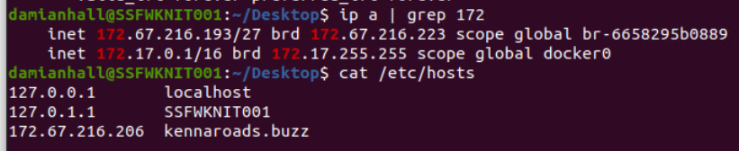

We can confirm with `ip a | grep 172` that our investigation machine does not have the same IP address that mapped to phishing site domain.


Upon accessing this domain without any appending path, we can see that this is just a wordpress website.

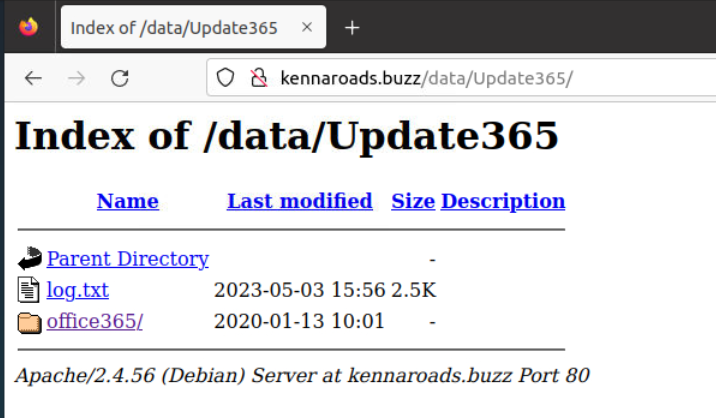

But if we removed the appending URL that was designed to trick specific user (to `http://kennaroads.buzz/data/Update365`) then we can see that this server is also hosting some files. 

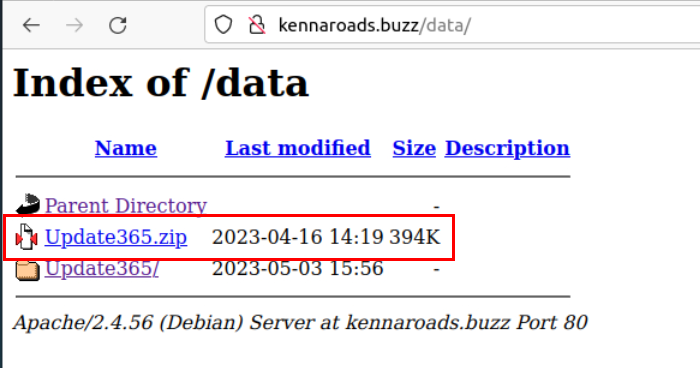

Go back a little bit to `/data` when we can see that there is a phishing kit leak on this website so we can download it to analyze later.

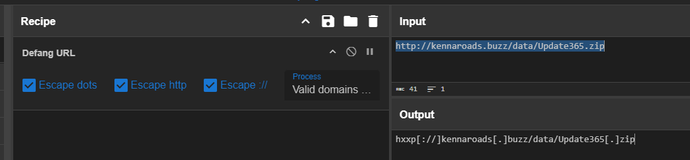

Using CyberChef to defang the url real quick.

```
hxxp[://]kennaroads[.]buzz/data/Update365[.]zip
```

>What is the SHA256 hash of the phishing kit archive?

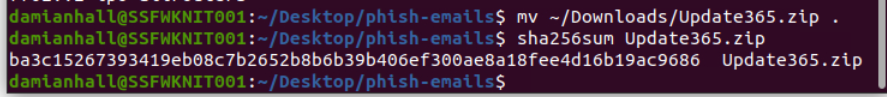

Generate SHA256 hash with `sha256sum`

```
ba3c15267393419eb08c7b2652b8b6b39b406ef300ae8a18fee4d16b19ac9686
```

>When was the phishing kit archive first submitted? (format: YYYY-MM-DD HH:MM:SS UTC)

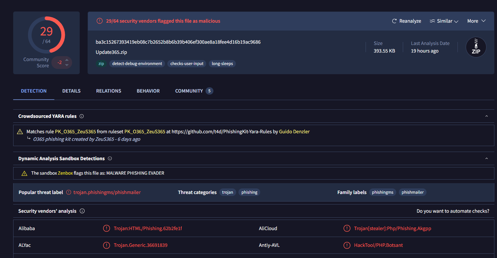

Now we can use the hash that we got to submit it to VirusTotal which confirm that this is indeed a phishing kit

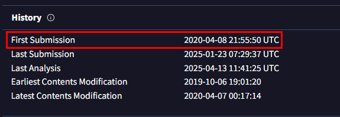

Go to History section under [Details](https://www.virustotal.com/gui/file/ba3c15267393419eb08c7b2652b8b6b39b406ef300ae8a18fee4d16b19ac9686/details) tab, then we can see that first submission of this phishing kit to VirusTotal.

```
2020-04-08 21:55:50 UTC
```

>When was the SSL certificate the phishing domain used to host the phishing kit archive first logged? (format: YYYY-MM-DD)

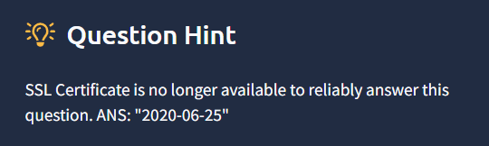

I did not see any certificate on the website so I checked the hint which reveal that its no longer there so we just submit provided answer to this question.

```
2020-06-25
```

>What was the email address of the user who submitted their password twice?

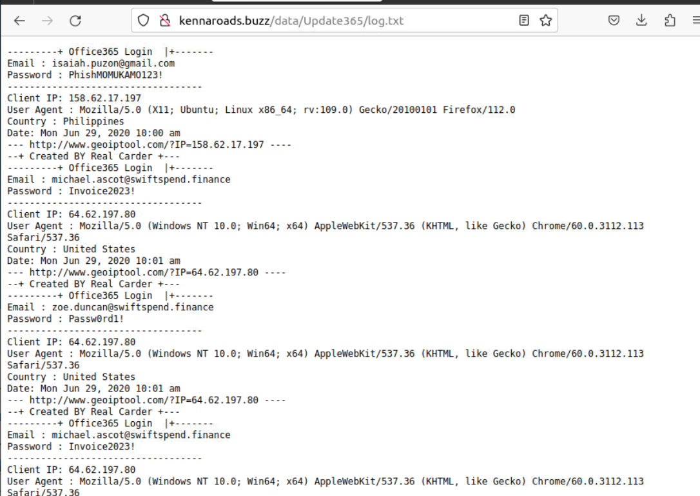

Go back to `/data/Update365` then we can see that `log.txt` contains information of the victim that fell for the phishing.

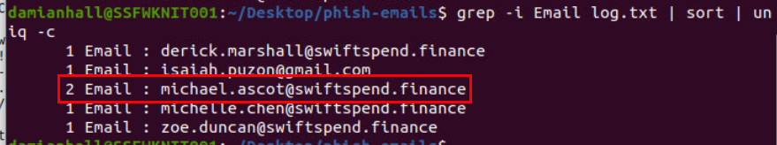

Use `wget` to download file and `grep -i Email log.txt | sort | uniq -c` to find out which email was submitted the phishing form twice which reveals `Michael Ascot` email with the number 2 as shown in the image above.

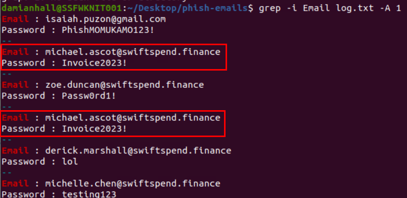

We can see `grep -i Email log.txt -A 1` to see password of each victim which reveals that the same user submitted to same password to phishing form.

```
michael.ascot@swiftspend.finance
```

>What was the email address used by the adversary to collect compromised credentials?

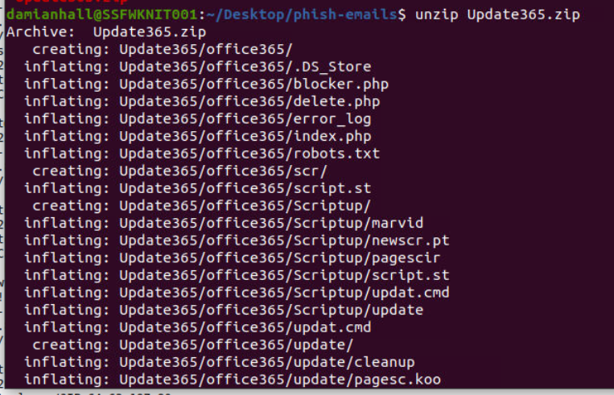

Lets unzip the phishing kit and find out which file responsible for sending information to the adversary.

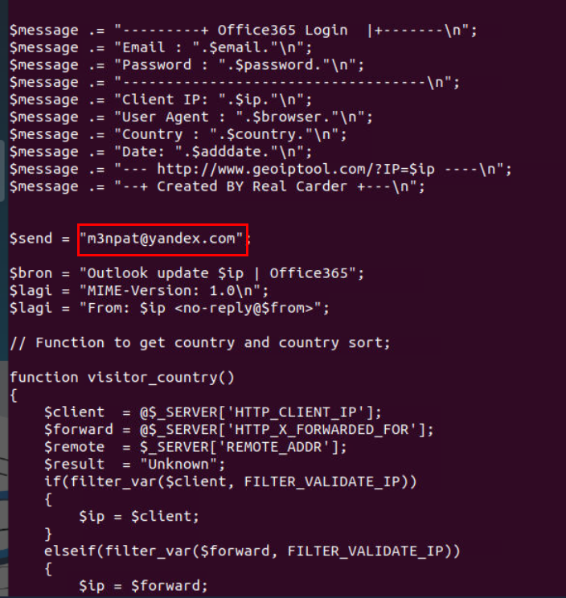

Which I found the `Update365/office365/Validation/submit.php` is the one responsible for submit button which will send email to m3npat@yandex.com

```
m3npat@yandex.com
```

>The adversary used other email addresses in the obtained phishing kit. What is the email address that ends in "@gmail.com"?

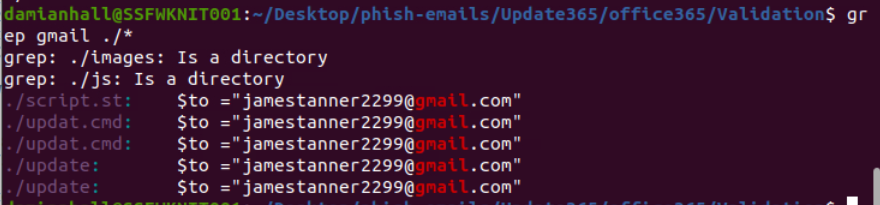

For a quick search, we can utilized grep to find for gmail.com domain which reveals the same email across 3 different files and this email is assigned to `$to` variable.

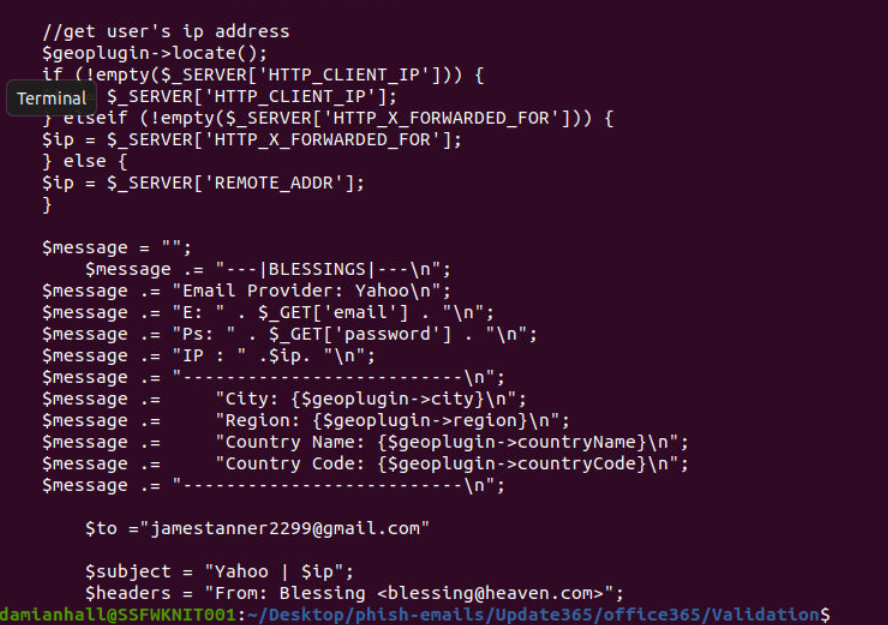

We can see that this phishing kit also send email to this email address as well so this might be the initial email used to get the phishing kit from other adversary before changing it to yandex.

```
jamestanner2299@gmail.com
```

>What is the hidden flag?

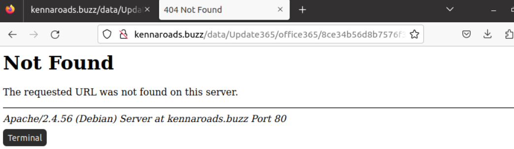

I tried to access `/data/update365/office365` which the autogenerated endpoint will be redirect us to so we will need to get the exact filename.

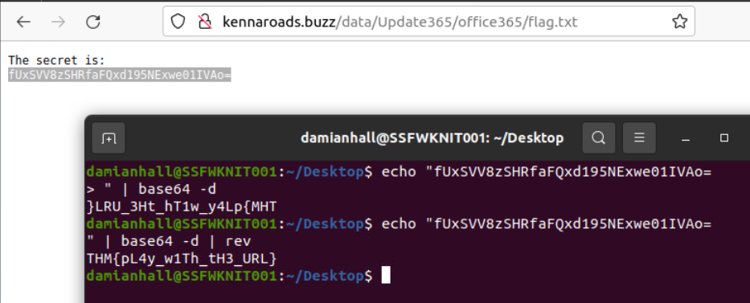

Since there is no directory fuzzing tool such as gobuster, dirb, dirsearch and ffuf then I started my guess with `flag.txt` which reveals that `flag.txt` is really hosting on this server and the flag is encoded with base64 and reverse.

```
THM{pL4y_w1Th_tH3_URL}
```


And now we are done!
***